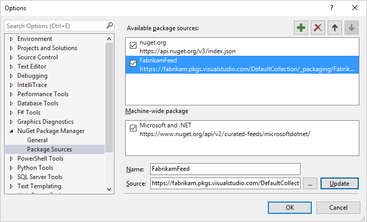
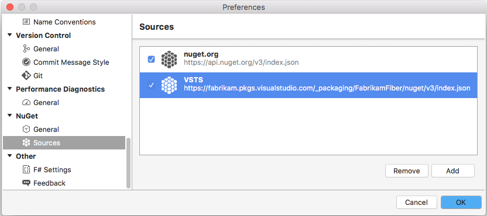

To consume NuGet packages from a feed, add the feed's NuGet endpoint as a package source in Visual Studio.

[!INCLUDE [Azure Artifacts and Visual Studio 2015](vs2015.md)]

### Get your feed's NuGet package source URL

[!INCLUDE [get a NuGet URL](nuget-consume-endpoint.md)]

### Windows: Add the feed to your NuGet configuration

1. On the **Tools** menu, select **Options...**.
1. Expand **NuGet Package Manager** and select **Package Sources**.
1. Click the **green plus** in the upper right corner.
1. At the bottom of the dialog, enter the feed's name and the URL you got in the last step.
1. Select **Update**.
1. If you enabled the [nuget.org upstream source](../../nuget/upstream-sources.md), uncheck the **nuget.org** package source.
   
1. Select **OK**.
1. [Click here to continue](#consume-packages).

### macOS: Add the feed to your NuGet configuration

1. Get a [Personal Access Token](../../../organizations/accounts/use-personal-access-tokens-to-authenticate.md) (PAT) and make a note of it.
1. Open the Preferences dialog from the **Visual Studio** menu in the menu bar.
1. Select **NuGet** -> **Sources**.
1. Select **Add** then enter your feed's name, URL, any username, and your PAT as the password.
1. Select **OK**.
1. If you enabled the [nuget.org upstream source](../../nuget/upstream-sources.md), uncheck the **nuget.org** package source.
1. Select **OK** again.

   

### Consume packages

You can now discover and use packages in this feed. To add a package reference to a project:

1. Find your project in Solution Explorer.
1. Right-click **References**.
1. Select **Manage NuGet Packages...**.
1. In the **Package source** dropdown, select your feed.
1. Look for your package in the list.

   

If you're using [upstream sources](../../nuget/upstream-sources.md), package-versions in the upstream source that haven't yet been saved into your feed (by using them at least once) won't appear in the NuGet Package Manager search. To install these packages:

1. On the upstream source (e.g. nuget.org), copy the `Install-Package` command.
1. In Visual Studio, open the Package Manager Console from Tools > NuGet Package Manager.
1. Paste the `Install-Package` command into the Package Manager Console and run it.

### Use symbols to debug

Symbol servers enable debuggers to automatically retrieve the correct symbol files for packages without knowing product names, build numbers or package names. If [symbols have been published](/azure/devops/pipelines/symbols/index) for your packages, [connect Visual Studio to the Symbol Server in Azure Artifacts](../../symbols/debug-with-symbols-visual-studio.md) to use symbols as you debug your packages.

<!-- TODO can we make this an FAQ bit at the end, so it's out of the way? -->

### Using Visual Studio 2013 or earlier

You'll need to get a [Personal Access Token](../../../organizations/accounts/use-personal-access-tokens-to-authenticate.md). When you're prompted for a username and password, use any username and your PAT as the password.