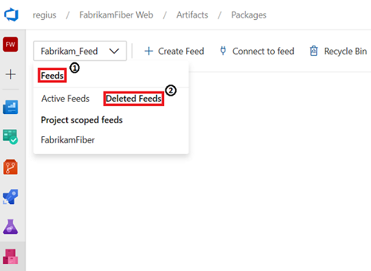

# What are feeds?

**Azure DevOps Services** | **TFS 2018** | **TFS 2017**

In Azure Artifacts, packages are stored in *feeds*. Feeds are an organizational construct that allow you to group packages and control who has access to them with [permissions](../feeds/feed-permissions.md).

Feeds are not package type dependent. You can store every package type (npm, NuGet, Maven, Python, and Universal) in a single feed.

::: moniker range="azure-devops"

## Project-scoped feeds vs. Organization-scoped feeds

Until now, all feeds were scoped to an organization, they could be viewed and accessed in the Azure Artifacts hub from any project within an organization. With the introduction of public feeds, we also introduced **project-scoped feeds**, which live inside the project that they were created in, and can only be seen when accessing the Azure Artifacts hub within that project. 

Only project-scoped feeds can be made public, see the following section on [public feeds](#public-feeds). [Learn more](../feeds/project-scoped-feeds.md) about the differences between project-scoped and organization-scoped feeds.

## Public feeds

Public feeds can be used to share your packages publicly, with anyone on the Internet; these users don't have to be a member of your organization or enterprise, or even have an Azure DevOps account at all. 

Public feeds are **project-scoped feeds** that live inside a public project. The feed will follow the visibility of the project it lives in— if the project is private, the feed will be private; if the project is public, the feed will be public.

There some important things to note regarding public feeds:
* Public feeds can only be created inside of public projects
* Public feeds aren't intended as a replacement for existing registries of record (NuGet.org, npmjs.com, etc.)
* Public feeds can't have upstream sources
* Public users cannot currently download universal packages. All other package protocol types are supported for public access.

## Restoring a deleted feed

If you accidentally delete a feed, Azure Artifacts gives you the opportunity to recover the feed and return it to original state without side effects. The deleted feed will be available to recover for 30 days and then permanently deleted. During this time, the feed name will be reserved and unable to reuse. Also, packages cannot be downloaded from the feed and write access is suspended (you can't delete, promote, push etc...).

You can view your your feeds pending deletion in your **Feeds** dropdown under the **Deleted Feeds** sub header.

1. In the feed pending deletion, click **Feed Settings**

2. Select **Restore feed**

## Permanently deleting a feed

A feed pending deletion will still use storage space. If you want to permanently delete your feed before the pending period is up, you can do this in the pending feeds settings. 

1. In the feed pending deletion, click **Feed Settings**

2. Select **Permanently delete** and confirm the deletion

Once the feed is permanently deleted, the feed and all of its packages cannot be viewed or restored. The feed name will be available for reuse fifteen minutes after permanent deletion.

::: moniker-end
