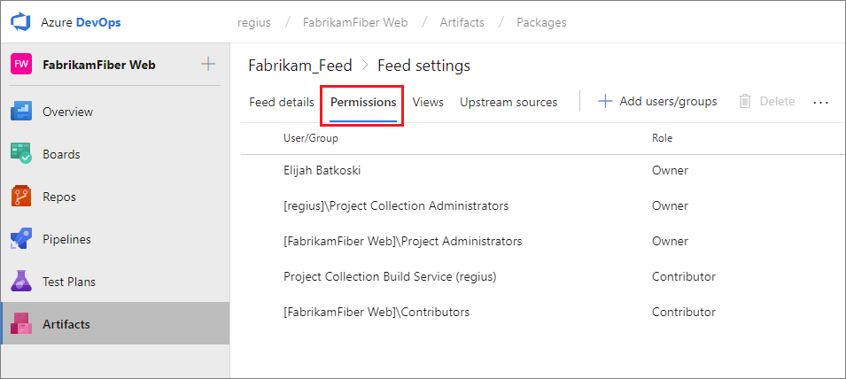

# Secure and share packages using feed permissions

**Azure DevOps Services | TFS 2017**

Packages you host in Azure Artifacts are stored in a **feed**. Setting permissions on the feed allows you to share your packages with as many or as few people as your scenario requires.

## Feed permissions overview

Feeds have four levels of access: Owners, Contributors, Collaborators, and Readers. Owners can add any type of identity-individuals, teams, and groups-to any access level.

| Permission | Reader | Collaborator | Contributor | Owner |
| ---------- | ------ | ------------ | ----------- | ----- |
| List and restore/install packages             | &#x2713; | &#x2713; | &#x2713; | &#x2713; |
| Save packages from upstream sources           |          | &#x2713; | &#x2713; | &#x2713; |
| Push packages                                 |          |          | &#x2713; | &#x2713; |
| Unlist/deprecate packages                     |          |          | &#x2713; | &#x2713; |
| Delete/unpublish package                      |          |          |          | &#x2713; |
| Edit feed permissions                         |          |          |          | &#x2713; |

By default, the Project Collection Build Service is a Contributor and your project team is a Reader.

## Editing permissions for a feed

[!INCLUDE [edit-feed](../includes/edit-feed.md)]

Select **Permissions**.

::: moniker range=">= azure-devops-2019"

> [!div class="mx-imgBorder"] 
>

::: moniker-end

::: moniker range="<= tfs-2018"

::: moniker-end

::: moniker range=">= tfs-2017 < azure-devops"

::: moniker-end

In the edit feed dialog:

- Choose to make each person or team an Owner, Contributor, Collaborator, or Reader.
- When you're done, select **Save**.

## Package permissions in Azure Pipelines

To use packages from a feed in Azure Pipelines, the appropriate build identity must have permission to your feed. By default, the **Project Collection Build Service** is a Contributor. If you've changed your builds to run at [project scope](../../pipelines/build/options.md#build-job-authorization-scope), you'll need to add the project-level build identity as a Reader or Contributor, as desired. The project-level build identity is named as follows:

`[Project name] Build Service ([Organization name])` (e.g. FabrikamFiber Build Service (codesharing-demo)) 

## Sharing packages with everyone in your organization

If you want to make the packages in a feed available to all users in your organization, create or select a [view](views.md) that contains the packages you want to share and ensure its visibility is set to **People in my organization**.

::: moniker range="azure-devops"

## Sharing packages publicly with anonymous users

You can also make your packages available to anonymous users with limited access by [creating a public feed](../tutorials/share-packages-publicly.md).

::: moniker-end
