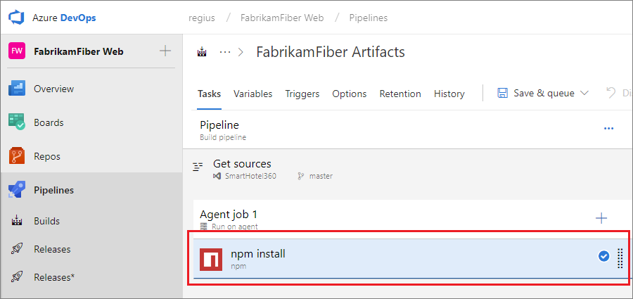
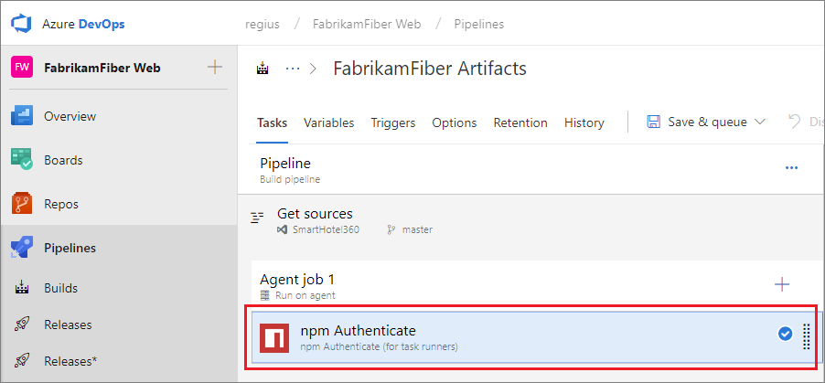
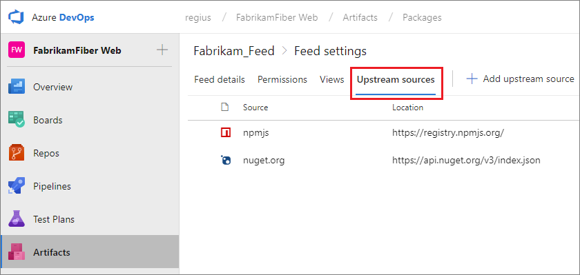

# Quickstart: Use npm to store JavaScript packages in Azure DevOps Services or TFS

**Azure DevOps Services** | **TFS 2018** | **TFS 2017**

This tutorial is an end-to-end guide on using npm to store JavaScript packages using Azure DevOps Services or Team Foundation Server. It covers installation, license assigning, and setup.

## Step 1: License the Azure Artifacts extension

::: moniker range=">= tfs-2017 < vsts" 

### Install Azure Artifacts in TFS

Azure Artifacts is installed by default for TFS 2017 customers.  You must upgrade to TFS 2017 in order to use Azure Artifacts.

> If the Azure Artifacts extension has been removed, you can install it from the [Marketplace page for Azure Artifacts](https://marketplace.visualstudio.com/items?itemName=ms.feed).

::: moniker-end

::: moniker range="vsts" 

### Assign Artifacts in Azure DevOps Services

Each organization gets five (5) free licenses. If you need more than 5 licenses, go to the [Marketplace page for Azure Artifacts](https://marketplace.visualstudio.com/items?itemName=ms.feed) and select **Get**. Click **Buy** and purchase the additional licenses you need.  

You will need to assign your licenses by following the instructions below:

# [New navigation](#tab/new-nav)

1. Go to your organization, select **Admin settings** in the bottom left of the UX.
2. Select **Users**.
3. Select the user or users you wish to assign the Azure Artifacts extension to, and choose **Manage extensions**.
4. If selecting multiple users, click **Assign extensions** and choose the Azure Artifacts extension. If only selecting one user, check the Azure Artifacts box under _Extensions_ and select **Save changes**.

If you have a Visual Studio Enterprise license, you already have access to Package Management and don't need to be assigned a license, just ensure that you've been assigned the "Visual Studio Enterprise" access level.

# [Previous navigation](#tab/previous-nav)

1. Go to your account, navigate to the **Users** page, and select Package Management.
2. Select **Assign**, type the users you want to assign licenses to, then select **Ok**.

If you have a Visual Studio Enterprise license, you already have access to Package Management and don't need to be assigned a license, just ensure that you've been assigned the "Visual Studio Enterprise" access level.

---

::: moniker-end

::: moniker range=">= tfs-2017 < vsts" 

### Assign licenses in TFS

Each organization gets five (5) free licenses. If you need more than 5 licenses, go to the [Marketplace page for Azure Artifacts](https://marketplace.visualstudio.com/items?itemName=ms.feed) and select **Get**. Click **Buy** and purchase the additional licenses you need.  If you aren't sure, you can click **Start 30 day free trial** and every user in your organization will be granted access to Azure Artifacts for 30 days.  After the 30-day trial period your organization will revert back to five (5) entitled users and you must assign licenses to individual users.  If you need additional licenses at this point, you may purchase them from this same dialog in the Marketplace.

> If you selected **Start 30 day free trial** and are still in the trial period, every user is granted access and licenses do not need to be assigned until the trial period has ended. 

1. From any collection in TFS, hover over the settings menu and select the **Users** page. Then select **Package Management**.

   

1. Select **Assign**, type the user(s) you want to assign licenses, then select **Ok.**

   * Users with Visual Studio Enterprise subscriptions get Azure Artifacts for free.  [Ensure that your Visual Studio Enterprise subscribers are assigned VSE access level](../organizations/security/change-access-levels.md).

   * Users using an instance of TFS disconnected from the internet (and thus unable to purchase licenses from the marketplace) can still assign licenses purchased through an enterprise agreement.

::: moniker-end

## Step 2: Create a feed

On your first visit to **Azure Artifacts**, you'll be welcomed with an image telling you to create a new feed, click the **+ New feed** button.

In the dialog:
* Give the feed a name.
* **Visibility**: Choose who can read and contribute (or update) packages in your feed.  An organization visible feed is created with permissions that allow all users in the organization to see/use your feed (recommended).  A private feed is created with permissions such that only you have access.
* **Upstream sources**: Clicking _Use packages from public sources through this feed_ will add both the public NPM (registry.npmjs.org) and NuGet (packages.nuget.org) as upstreams to your feed.  When upstreams are enabled your client (i.e. npm and nuget) will be able to fetch packages from the public registry through your private feed and your private feed will cache those packages for you.  If you select _Use packages published to this feed_ your feed will be created without connectivity to public registries. You can connect them at a later date if you desire.
* When you're done, choose _Create_.

::: moniker range="vsts"

# [New navigation](#tab/new-nav)
> [!div class="mx-imgBorder"] 
>
> 

# [Previous navigation](#tab/previous-nav)


---

::: moniker-end

::: moniker range=">=tfs-2017 < vsts"


::: moniker-end

You can change these settings later by [editing the feed](./feeds/edit-feed.md).

## Step 3: Set up your npmrc

All Azure Artifacts feeds require authentication, so you'll need to store credentials for the feed before you can install or publish packages. npm uses [.npmrc configuration files](https://docs.npmjs.com/files/npmrc) to store feed URLs and credentials.

### Where are my **_.npmrc_** files?

It is recommended to use two **_.npmrc_** files:

1.	One **_.npmrc_** should live at the root of your git repo adjacent to your project's **_package.json_**.  It should contain a "registry" line for your feed and it should not contain credentials since it will be checked into git.  You can find the registry information for your feed from the _Connect to Feed_ button:

    ::: moniker range="vsts"

    1. From **Azure Artifacts**, click _Connect to Feed_

        # [New navigation](#tab/new-nav)
        > [!div class="mx-imgBorder"] 
        >
        > 

        # [Previous navigation](#tab/previous-nav)
        

        ---

    2. Copy the "registry" text:

        # [New navigation](#tab/new-nav)
        > [!div class="mx-imgBorder"] 
        >
        > 

        # [Previous navigation](#tab/previous-nav)
        

        ---
        
    ::: moniker-end

    ::: moniker range=">= tfs-2017 < vsts"

    1. From your **Packages** page, click _Connect to Feed_

        

    2. Copy the "registry" text:

        

    ::: moniker-end

        
2.	On your development machine, you will also have a **_.npmrc_** in $home for Linux or Mac systems or $env.HOME for win systems.  This **_.npmrc_** should contain credentials for all of the registries that you need to connect to.  The NPM client will look at your project's **_.npmrc_**, discover the registry, and fetch matching credentials from $home/.npmrc or $env.HOME/.npmrc.  Credential acquisition will be discussed in the next section.

This enables you to share project's **_.npmrc_** with the whole team while keeping your credentials secure.

### Set up authentication on your dev box
At this point you should have a project specific **_.npmrc_** containing only your Feed's registry information that you discovered from the "Connect to Feed" dialog.  There should be no credentials in this file and the file itself is usually adjacent to your project's **_package.json_**.

> **IMPORTANT:** There can only be a single "registry=" line in your **_.npmrc_**.  Multiple registries are possible with [scopes](npm/scopes.md) and our new upstream feature (discussed here).

#### Windows
If you are developing on Windows, we recommend that you use `vsts-npm-auth` to fetch credentials and inject them into your **_~/.npmrc_** on a periodic basis.  The easiest way to set this up is to install `vsts-npm-auth` globally (i.e. `npm install -g vsts-npm-auth`) and then add a run script in your project's **_package.json_**.

```json
"scripts": {
    "refreshVSToken": "vsts-npm-auth -config .npmrc"
}
```

#### Linux or Mac
If you are developing on Linux or Mac, `vsts-npm-auth` is not supported and we recommend generating a token in the following manner for your **_$HOME/.npmrc_**

[!INCLUDE [](./_shared/npm/npmrc.md)]

### Set up authentication in a build task

There are two options for setting up authentication in a build task:
* [Without a task runner](#without-a-task-runner)
* [With a task runner (e.g. gulp)](#with-a-task-runner-eg-make-gulp-work)

#### Without a Task Runner
To set up **npm** authentication in a build task _without_ a task runner, follow the directions below.

1. Add a build pipeline in Azure DevOps Services under the **Pipelines** page.

    ::: moniker range="vsts"

    # [New navigation](#tab/new-nav)
    > [!div class="mx-imgBorder"] 
    > 
    >

    # [Previous navigation](#tab/previous-nav)
    

    ---

    ::: moniker-end

    ::: moniker range=">=tfs-2017 < vsts"

    

    ::: moniker-end

1. Choose your source **Project**, **Repository**, and **Default branch** and select _Continue_

1. Select _Empty job_ at the top of the form

1. Add a task to **Agent job 1** of your build pipeline by clicking the **"+"**:

    ::: moniker range="vsts"

    # [New navigation](#tab/new-nav)
    > [!div class="mx-imgBorder"] 
    > 
    >

    # [Previous navigation](#tab/previous-nav)
    

    ---

    ::: moniker-end

    ::: moniker range=">=tfs-2017 < vsts"

    

    ::: moniker-end

1. Select **Package** or search for _npm_ in the search bar, select **npm** and select _Add_:

    

1. Select the **npm install** task underneath **Agent job 1**:

    ::: moniker range="vsts"

    # [New navigation](#tab/new-nav)
    > [!div class="mx-imgBorder"] 
    > 
    >

    # [Previous navigation](#tab/previous-nav)
    

    ---

    ::: moniker-end

    ::: moniker range=">=tfs-2017 < vsts"

    

    ::: moniker-end
    

1. Browse to and select your **Working folder with package.json**:

    

1. Expand **Custom registries and authentication**, here you have a few options: 

    * Registries in my **_.npmrc_**

        

        > You can choose credentials to authenticate to outside of your current organization/collection by setting up [service connections.](../pipelines/library/service-endpoints.md#sep-npm)

    * Registry I select here

        

        When you choose this option, the task will create a temporary **_.npmrc_** with credentials for the registry you've selected and it will override the project's **_.npmrc_**. This is useful when you want to publish to a specific feed. 


#### With a Task Runner (e.g. make gulp work)

When using a task runner, you'll need to add the **npm Authenticate** build task at the beginning of your build pipeline. This will inject credentials into your proejct's **_.npmrc_** and persist them for the lifespan of the build. This allows subsequent build steps to use the credentials in the **_.npmrc_**.

1. Add a build pipeline in Azure DevOps Services under **Pipelines** page.
    
    ::: moniker range="vsts"

    # [New navigation](#tab/new-nav)
    > [!div class="mx-imgBorder"] 
    > 
    >

    # [Previous navigation](#tab/previous-nav)
    

    ---

    ::: moniker-end

    ::: moniker range=">=tfs-2017 < vsts"

    

    ::: moniker-end

1. Choose your source **Project**, **Repository**, and **Default branch** and select _Continue_

1. Select _Empty process_ at the top of the form

1. Add a task to **Agent job 1** of your build pipeline by clicking the **"+"**:

    ::: moniker range="vsts"

    # [New navigation](#tab/new-nav)
    > [!div class="mx-imgBorder"] 
    > 
    >

    # [Previous navigation](#tab/previous-nav)
    

    ---

    ::: moniker-end

    ::: moniker range=">=tfs-2017 < vsts"

    

    ::: moniker-end

1. Select **Package** or search for _npm_ in the search bar, select **npm Authenticate** and select _Add_:

    

1. Select the **npm Authenticate** task underneath **Agent job 1**:

    ::: moniker range="vsts"

    # [New navigation](#tab/new-nav)
    > [!div class="mx-imgBorder"] 
    > 
    >

    # [Previous navigation](#tab/previous-nav)
    

    ---

    ::: moniker-end

    ::: moniker range=">=tfs-2017 < vsts"

    

    ::: moniker-end
    

1. Browse to and select your **.npmrc file to authenticate**:

    

    > You can choose credentials to authenticate to outside of your current organization/collection by setting up [service connections.](../pipelines/library/service-endpoints.md#sep-npm)

1. After setting up your **npm Authenticate** task, you can add other build task(s) for your task runner like **Gulp**.

## Step 4: Use packages from npmjs.com

In addition to packages you publish, you can use packages from [www.npmjs.com](https://www.npmjs.com/) through this feed via *upstream sources*. Because this feed was created with public registries enabled (see [Step 2](#step-2-create-a-feed)), you should be able to use packages from an upstream source. To try it out, just run an `npm install` command (e.g. `npm install lodash`) in a shell opened to your project's folder. Learn more about upstream sources on the [upstream sources concepts page](concepts/upstream-sources.md).

You can choose to enable or disable upstream sources in the _Settings_ -> _Upstream sources_ tab:

::: moniker range="vsts"

# [New navigation](#tab/new-nav)
> [!div class="mx-imgBorder"] 
> 
>

# [Previous navigation](#tab/previous-nav)


---

::: moniker-end

::: moniker range=">=tfs-2017 < vsts"


::: moniker-end

## Step 5: Build your project

At this point your project should have a **_package.json_** and an **_.npmrc_** that are adjacent to each other.  You should run `npm install` from the directory that contains both of these files. Npm will discover your feed in the **_.npmrc_** in the current working directory and will fetch credentials from your home directory's **_.npmrc_** that you configured in [Step 2](#step-2-create-a-feed).


## Step 6: Publish an npm package

If you have followed all of the steps up to this point, you can publish by:
0. Navigating to the directory that contains your package's **_package.json_** file
0. Run `npm publish`

>`npm publish` will work because of the credentials you acquired in [Step 3](#step-3-set-up-your-npmrc).

If you have followed all of the steps up to this point package publishing should simply work.  There are, however, some important considerations:
- If you have npmjs.com configured as an upstream and the package name/version exists in the public registry then you will be blocked from publication.  We do not support overriding packages that exist on the public registry.


