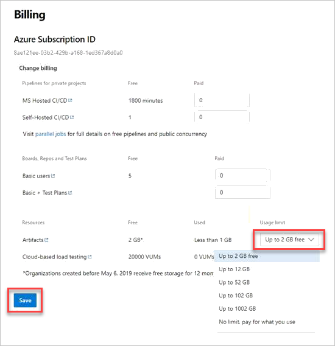

# Sign up for Azure Artifacts

[!INCLUDE [version-vsts-only](../_shared/version-vsts-only.md)]

This article guides you through the sign-up process for Azure Artifacts. Azure Artifacts is a service where you can create package feeds to publish and consume Maven, npm, NuGet, Python, and universal packages. Azure Artifacts is billed on a consumption basis, and is free up until 2GB of storage. In the case that your organization needs more storage, you need to set up billing.

## Prerequisites

Ensure that the following is true:

- [Billing is set up for your organization](../organizations/billing/set-up-billing-for-your-organization-vs.md)
- You have [Project Collection Administrator or organization Owner permissions](../organizations/accounts/faq-add-delete-users.md#find-owner)

## Billing and free monthly usage

Azure Artifacts includes a free usage tier of 2 GB. Any usage below this level isn’t billed to your subscription. Above this limit, we charge you for your actual usage. The usage limit allows you to control the maximum volume of storage that you are billed for. Once the maximum usage limit is reached, you can no longer upload artifacts. For more information on usage tiers, see the [Azure Artifacts pricing page](https://azure.microsoft.com/en-us/pricing/details/devops/azure-devops-services/).

## View storage used

See and manage what your overall storage use is for Azure Artifacts.
 
1. Sign in to your organization (```https://dev.azure.com/{yourorganization}```). 
 
2. Select  **Organization settings**. 
 
    
 
3. Select **Billing**. 
 
   
 
4. Find Artifacts and review your current usage.

   

## Pay for Artifacts

Each organization gets Azure Artifacts for free, up until they hit 2GB of storage. If you need more than that, complete the following steps to set up billing.

1. Sign in to your organization (```https://dev.azure.com/{yourorganization}```). 
 
2. Select  **Organization settings**. 
 
   
 
3. Select **Billing**. 
 
   
 
4. Find Artifacts, under Resources, and increase the usage limit above the free tier, by selecting from the dropdown menu. Then, select **Save**. You are only charged for the storage you use, up to the limit. 

   

> [!NOTE]
> If you have reached your storage limit and are blocked from making additional uploads, it can take up to 1 hour after increasing your limit for uploads to be re-enabled. 

## FAQs

### Q: Which artifacts count towards my storage total?

A: Currently, the following get counted towards your storage total:
* All npm, NuGet, Python, Maven, and universal packages (including those stored from upstream sources)
* All symbols

Pipeline Artifacts, Build Artifacts, and Pipeline Caching are included in Azure Pipelines and do not count towards your storage total in Azure Artifacts as of today. 

### Q: Why do I see 0GB of storage, even though I am storing artifacts?

A: Currently, the billing page only shows integers of storage (0GB, 1GB, 2GB, etc.). It is likely that even though you have artifacts stored, you haven't gotten to 1GB yet, which is our lowest granularity right now.

### Q: How can I control how long artifacts are stored?

A: Azure Artifacts retention is controlled by feed retention policy settings. Symbols also contribute to Azure Artifacts storage usage. Symbols retention is controlled by build retention policy.

For more information on how to set the feed retention policy, see how to [automatically delete old package versions with retention policies](how-to/delete-and-recover-packages.md#automatically-delete-old-package-versions-with-retention-policies).

### Q: How long does it take for deleted artifacts to affect the amount of used storage?

A: Deletion of artifacts doesn't register immediately. It can take up to 24 hours for the usage level to be updated. If you're blocked from uploading artifacts, you can temporarily increase your usage level to continue publishing artifacts, and then reduce the level once the storage metrics are updated.

Usage is updated once per day, so when you delete Artifacts, it may not reflect immediately.
For more information, see [Delete and recover packages in Azure Artifacts](how-to/delete-and-recover-packages.md).

### Q: What happens if I remove my Azure Subscription from my Azure DevOps organization?

A: If you remove your Azure Subscription from your Azure DevOps organization, you will only have access to the free tier of storage (< 2GB). If you have above 2GB of storage used, you will be able to read packages but will no longer be able to push until you either get your usage below 2GB, or reconnect an Azure Subscription to your organization and increase your storage tier appropriately.

### Q: What about customers who were using Artifacts before May 6, 2019 under the previous per user model?

A: Customers before May 6, 2019 won’t be charged for Artifacts storage until May 6, 2020. These customers can opt in to the new storage model by setting a paid limit above the amount of storage they are currently using. Then, starting on May 6, 2020, you’re charged under the new storage model.
