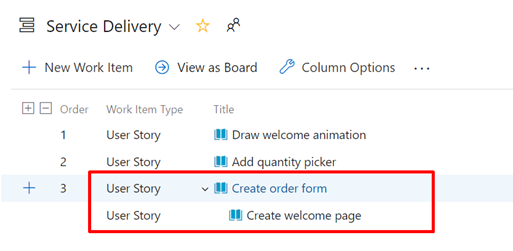
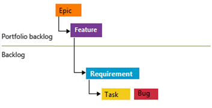
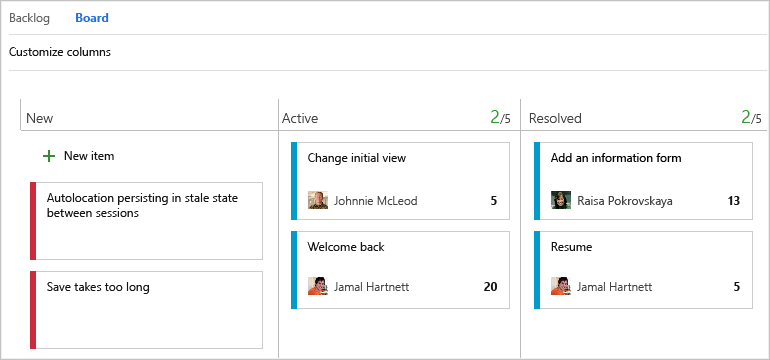

# Fix re-ordering and nesting issues 

[!INCLUDE [temp](../includes/version-vsts-tfs-all-versions.md)]

<!--- Supports FWLINK https://go.microsoft.com/fwlink/?linkid=529135 --> 

When a product, portfolio, or sprint backlog contains same-category nested work items, the system cannot properly reorder work items. The system disables the drag-and-drop reorder feature and not all items display under these circumstances&mdash;as described in the section later in this article, [How backlogs and boards display hierarchical (nested) items](#leaf-nodes).  

In addition to the information provided in this article, you may find the following articles helpful as well:

- [Set up your Backlogs and Boards](set-up-your-backlog.md)  
- [About Boards and Kanban, Limitations of multi-team Kanban board views](../boards/kanban-overview.md#limits-multi-team)  
- [Tasks supported by Backlogs, Boards, Taskboards, and Plans](backlogs-boards-plans.md)  
- [Best tool to add, update, and link work items ](../work-items/best-tool-add-update-link-work-items.md)

## Fix same-category nesting issue

Same-category links are parent-child links among work items of the same type, such as bug-bug, or between work items that appear on the same backlog level. The category a work item belongs to is determined by your process backlog levels and your team's bug behavior. To understand more about same-category hierarchy, see the section [Recommended configuration](#recommended).

### Error message specifies work item IDs 
You may see an error message similar to "You cannot reorder work items and some work items may not be shown. See work item(s) 7 to either remove the parent to child link or change the link type to 'Related'." or "Work item 3 can't be reordered because its parent is on the same category". 

To fix this, take the following action: 

1. Open the work item listed in the error message.

2. Look for a parent or child link of the same-category. This is a link of the same type, or another type that appear on the same backlog level. Depending on your team's bug behavior setting, bugs may appear with requirements or tasks. 

3. Remove the problem parent-child link. If you would like to keep these items associated, use 'Related' link type instead. 

### Error message doesn't specify work item IDs 

You may see an error message such as "You cannot reorder work items and some work items may not be shown." 

To fix this, take the following actions: 

1. Open your Backlog.

2. Review the list of items to determine which items of the same type are nested.  
    For example, the following shows that a user story is a child of another user story. 

	> [!div class="mx-imgBorder"]  
	>   
	
	As another example, the following shows that a bug is a child of a user story. Because the team has configured their backlog to display user stories and bugs at the same level (Requirements category), this corresponds to a nested item that disables the ordering feature.

	> [!div class="mx-imgBorder"]  
	>   
	
3.	Remove all parent-child links that exist among nested items of the same work item type or same category, or change the link to 'Related'

4.	Refresh your Backlog.

The issue should now be resolved.

## Recommended configuration

While you can create a hierarchy of backlog items, tasks, and bugs&mdash;we don't recommend that you create same-category hierarchies. That is, don't create parent-child links among work items of the same type, such as story-story, bug-bug, task-task, or issue-issue. The reason is that the Backlog, Board, and Sprints experiences don't support reordering for same-category hierarchy. Since ordering is executed by hierarchy level, same-category hierarchy introduces confusion by ordering a work item that doesn't belong on that level. 

Instead of nesting requirements, bugs, and tasks, we recommend that you maintain a flat list. In other words, only create parent-child links one level deep between items that belong to a different category. 

Use the Feature work item type when you want to group user stories (Agile), issues (Basic), product backlog items (Scrum), or requirements (CMMI). You can [quickly map product backlog items to features](organize-backlog.md), which creates parent-child links in the background.

 

## Track bugs as requirements or tasks  

As mentioned previously, [each team can choose how they want to track bugs](../../organizations/settings/show-bugs-on-backlog.md) to behave like requirements, or tasks, or as neither. 

If you choose to track bugs as requirements, bugs should only be nested under the Feature level.

> [!div class="mx-imgBorder"]  
>   

If you choose to track bugs as tasks, bugs should only be nested under the requirements level.

> [!div class="mx-imgBorder"]  
>   

  

## How backlogs and boards display hierarchical (nested) items

For TFS 2018 and earlier versions, the Kanban board only shows the last node with nested items of a same-category hierarchy. For all versions, sprint backlogs and taskboards only show the last node in a same-category hierarchy, called the leaf node. 

::: moniker range="tfs-2018"

> [!NOTE]
> For TFS 2018.2 and later versions, Kanban boards display all work items of nested same-category work items.  

::: moniker-end

::: moniker range="<= tfs-2018"

### Product backlog and Kanban boards

For example, if you link items within a same-category hierarchy that is four levels deep, only the items at the fourth level appear on the Kanban board, sprint backlog, and taskboard.

As shown in the following images, the third user story, *Interim save on long form*, has a child bug, *Save takes too long*. The child bug, *Save takes too long*, appears on the Kanban board, but not the parent user story.  

**All bugs and requirements appear on the backlog**  

  

**Only leaf nodes appear on the Kanban board**  

  

::: moniker-end

### Sprint backlogs and taskboards

When you choose to have bugs appear in the backlog with tasks, linking tasks and bugs to their parent requirements groups them accordingly on the sprint backlog and taskboard.  
However, if you create parent-child links between a requirement and a bug, and the bug and a task, as shown here, the task will appear on the sprint backlog and taskboard, but not the bug. 

**Hierarchy of items assigned to a sprint backlog**  

   

**Only leaf nodes appear on sprint backlogs**  

  

**Only leaf nodes appear on taskboards**   
  
Is there a workaround to display intermediate nodes within a hierarchy?  Not at this time. You can always check the entire list of items assigned to a sprint by using the **Create Query** link. 

## Related articles

- [Backlogs, boards, and plans](backlogs-boards-plans.md) 

