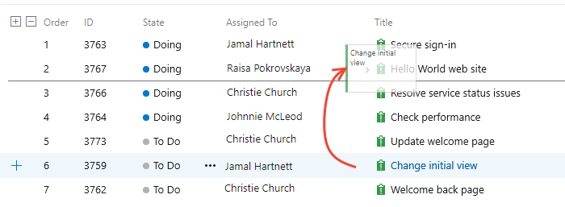
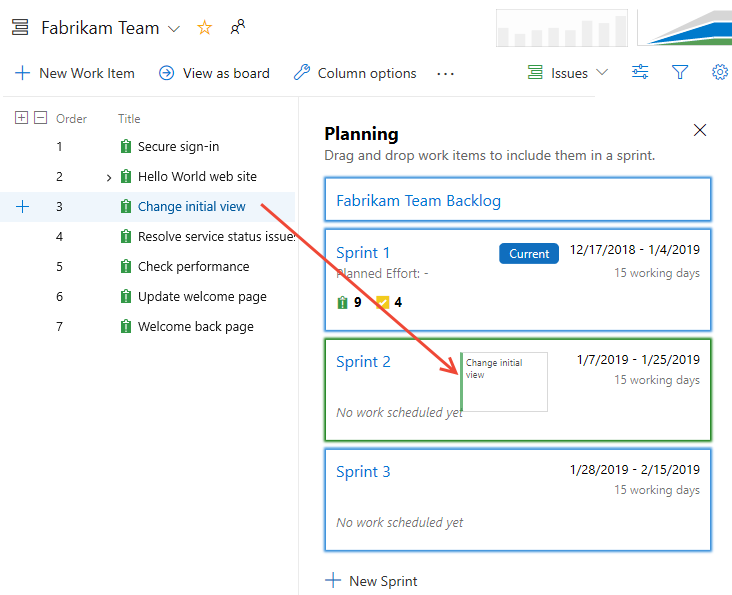

# What is Azure Boards and the Basic process?

[!INCLUDE [temp](../_shared/version-vsts-only.md)]

With Azure Boards, you can quickly and easily start tracking tasks, features, and bugs associated with your project. You do this by adding one of three work item types&mdash;epics, issues, and tasks&mdash;that the Basic process provides. As works progresses from not started to completed, you update the State workflow field from **To Do**, **Doing**, and **Done**.

>  [!div class="mx-tdCol2BreakAll"]  
> |  Work item types  | Workflow |
> |------|---------|
> | |  

When you add an issue, task, or epic, you create a work item. Each work item represents an object stored in the work item data store. Each work item is assigned an identifier. The IDs are unique within your projects. 

Add epics to track significant features or requirements. Use issues to track user stories, bugs, or other smaller items of work. And, use tasks to track even smaller amounts of work for which you want to track time either in hours or days. 

> [!IMPORTANT]  
> **Select the version that meets your location and process**:
> We are experimenting with a new acquisition model which is 
> currently available for users located in the United States and that sign up through [azure.com/boards](https://azure.microsoft.com/en-us/services/devops/boards/?nav=min). This model supports a new Basic process.  
> For International users and others who sign up through another method, the Agile process is used. Select your version of this article based on your location and process used.
> - [**Basic process**](what-is-azure-boards-basic-process.md?toc=/azure/devops/boards/get-started/toc.json&bc=/azure/devops/boards/get-started/breadcrumb/toc.json)  
> - [**Agile process**](what-is-azure-boards.md?toc=/azure/devops/boards/get-started-agile/toc.json&bc=/azure/devops/boards/get-started-agile/breadcrumb/toc.json)  

## Track work, implement Kanban

- Quickly add and update the status of work you track from **To Do**, **Doing**, and **Done** using the Kanban board. Add tasks as child items to issues. Learn more: [Track issues and tasks](track-issues-tasks.md).  
- Assign work to team members, tag with labels to support queries and filtering, or share information through descriptions, attachments, or links to network shared content.  
- Prioritize work through drag-and-drop on your team backlog. Learn more: [Create your backlog](../backlogs/create-your-backlog.md).  

**Update the status of issues**  
> [!div class="mx-imgBorder"]  
>   

**Prioritize your backlog of issues**  
> [!div class="mx-imgBorder"]  
>   

## Collaborate 
- Collaborate with others through the **Discussion** section of the work item form, using **@mention**s and **#ID** controls to quickly include others in the conversation or link to other work items. Learn more: [Discussion section](track-issues-tasks.md#discussion).  
- Create dashboards that track status and trends of work being accomplished. Learn more: [Add and manage dashboards](../../report/dashboards/dashboards.md).  
- Set notifications to get alerted when an issue is created or changed. Learn more: [Set personal notifications](../../notifications/howto-manage-personal-notifications.md).  
- Elect to follow specific issues to get alerted when they are updated. Learn more: [Follow a work item](../work-items/follow-work-items.md).  

**Get updated when a work item is updated**   
> [!div class="mx-imgBorder"]  
>   

## Work in sprints, implement Scrum   

- Plan sprints by assigning work to current or future sprints. Learn more: [Assign work to sprints](../sprints/assign-work-sprint.md).   
- Forecast work that can get completed based on effort estimates: Learn more: [Forecast work](../sprints/forecast.md).  
- Determine how much work can be done within a sprint.  Learn more: [Set team capacity](../sprints/set-capacity.md).  
- Bulk assign issues and tasks to team members and sprints. Learn more: [Bulk modify work items](../backlogs/bulk-modify-work-items.md).  

**Assign backlog items to a sprint**   
> [!div class="mx-imgBorder"]  
>   

## Work effectively 

- Organize work into a hierarchy by grouping issues under epics, and tasks under issues. Learn more: [Organize your backlog](../backlogs/organize-backlog.md).    
- Create queries and quickly triage issues and tasks. Learn more: [View and run queries](../queries/view-run-query.md) and [Triage work](../queries/triage-work-items.md).   
- Create work item templates to help contributors quickly add and define open meaningful issues and tasks. Learn more: [Use work item templates](../backlogs/work-item-template.md).  
- Quickly find work items assigned to you or pivot or filter work items based on other criteria, such as work items that you follow, that you're mentioned in, or that you viewed or updated. Learn more: [View and add work items](../work-items/view-add-work-items.md).  

**Group items to create a hierarchy**  
> [!div class="mx-imgBorder"]   
>  

## Connect with GitHub 

If you use Azure Boards connected with GitHub, you can also do the following:   
- From GitHub, use #AB to link GitHub commits and pull requests to your issues and tasks
- From Azure Boards issues and tasks, link to GitHub commits and pull requests.

Learn more: [GitHub & Azure Boards](../github/index.md).  

## Best tool for the job
Azure Boards provides the following main interactive lists and signboards. Each tool provides a filtered set of work items. All tools support viewing and defining work items. To learn more about effective use of these tools, see  [Best tool to add, update, and link work items](../work-items/best-tool-add-update-link-work-items.md).   

- [**Boards**](../boards/kanban-quickstart.md): Boards present work items as cards and support quick status updates through drag-and-drop. The feature is similar to sticky notes on a physical whiteboard. Use to implement Kanban practices and visualize the flow of work for a team. 
- [**Backlogs**](../backlogs/create-your-backlog.md): Backlogs present work items as lists. A product backlog represents your project plan and a repository of all the information you need to track and share with your team. Portfolio backlogs allow you to group and organize your backlog into a hierarchy. Use to plan, prioritize, and organize work.  
- [**Sprints**](../sprints/assign-work-sprint.md): Sprint backlogs and taskboards provide a filtered view of work items a team assigned to a specific iteration path, or sprint. From your backlog, you can assign work to an iteration path by using drag-and-drop. You can then view that work in a separate *sprint backlog*. Use to implement Scrum practices. 
- [**Queries**](../queries/view-run-query.md): Queries are filtered lists of work items based on criteria that you define by using a query editor. You use queries to support the following tasks:   
	- Find groups of work items with something in common  
	- List work items for the purposes of sharing with others or performing bulk   updatesTriage a set of items to prioritize or assign them  
	- Create status and trend charts that you then can add to dashboards.  
- [**Work items**](../work-items/view-add-work-items.md): Use to quickly find work items assigned to you or pivot or filter work items based on other criteria, such as work items that you follow, that you're mentioned in, or that you viewed or updated.

<a id="scale" />
## Teams and Backlogs, Boards, and Sprints 

A team refers to a group of project members who work in a particular product area. Those areas are represented as *area paths*. Area paths are hierarchical paths that denote the possible areas of ownership in an organization. A team is defined by a name, its members, and its area paths.

Boards, Backlogs, Sprints rely on team configurations. For example, if you want to add a Kanban board or product backlog, you define a team. For more information on teams, see [About teams and Agile tools](../../organizations/settings/about-teams-and-settings.md). 

## Install and manage extensions 

An extension is an installable unit that adds new capabilities to your projects. You can find extensions in the [Visual Studio Marketplace](https://marketplace.visualstudio.com/azuredevops), Azure DevOps tab to support planning and tracking of work items, sprints, scrums, and more and collaboration among team members.  
