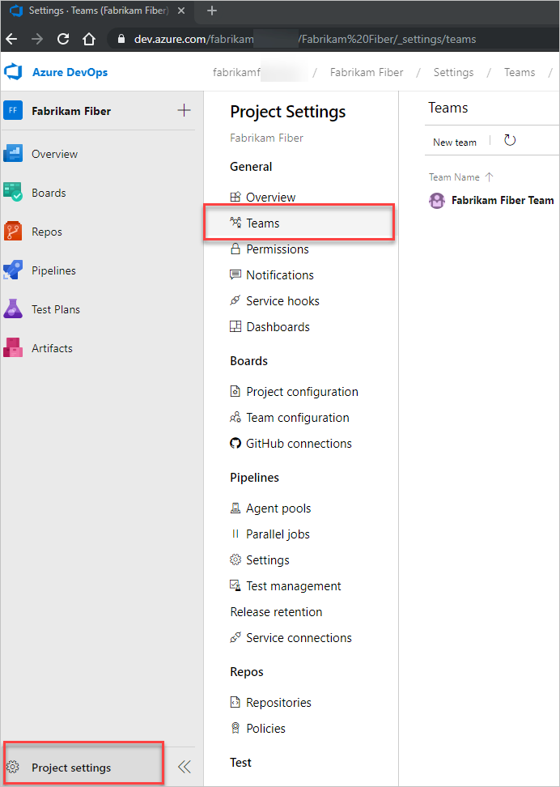
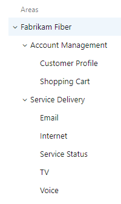
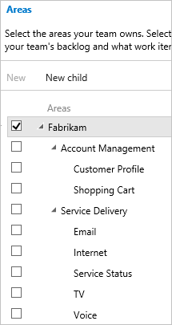
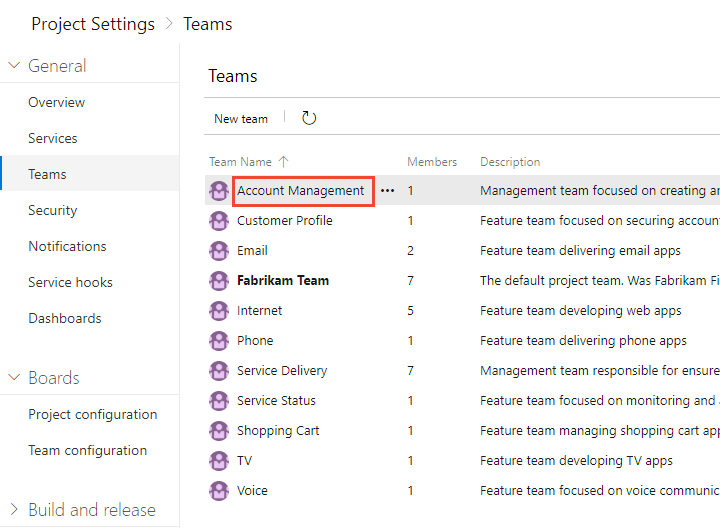
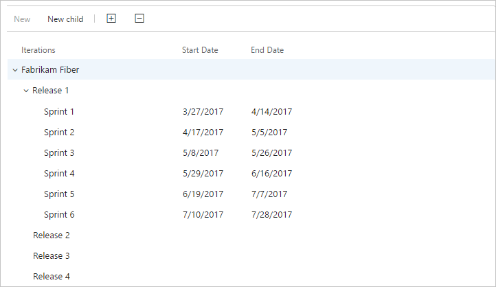

# Configure a hierarchy of teams

[!INCLUDE [temp](../includes/version-vsts-tfs-all-versions.md)]

In [Portfolio management](portfolio-management.md) we showed how management teams and feature teams can use their backlogs to focus on the work that's most important to them. In this article, we show how to configure teams that best supports the different backlog views of management and feature teams. 

Specifically, we'll show you how to configure a team structure like the one shown in the image below.

 

In this article you'll learn how to:  

::: moniker range=">= tfs-2017" 
>[!div class="checklist"]    
> * Set up a hierarchical set of teams and backlogs
> * Define a single sprint cadence for all teams 
> * Review which area paths are assigned to teams  
::: moniker-end 

::: moniker range=">= tfs-2013 <= tfs-2015" 
>[!div class="checklist"]    
> * Set up a hierarchical set of teams and backlogs
> * Define a single sprint cadence for all teams 
> * Review which area paths are assigned to teams  
::: moniker-end 

## Prerequisites 

- If you don't have a project yet, [create one](../../organizations/projects/create-project.md).  
- If you're not a project administrator, [get added as one](../../organizations/security/set-project-collection-level-permissions.md). Only members of the Project Administrators group or those who have been [granted explicit permissions to edit project information](../../organizations/security/set-project-collection-level-permissions.md) can add teams and configure the project.   

## Add teams 

The first step is to add a team for each feature team and management area. You can also rename teams that you've already added. When you finish, you'll have a set of teams similar to the ones shown.  

> [!div class="mx-imgBorder"]  
> 

::: moniker range=">= azure-devops-2019"

1. From the web portal, choose **Project settings** and open **Teams**. 

  

2. Choose **New team**. Give the team a name, and optionally a description. 

    > [!div class="mx-imgBorder"]
    > 

    Repeat this step for all feature and management teams you want to create. 

::: moniker-end

::: moniker range=">= tfs-2017 <= tfs-2018"

<a id="add-team-team-services" /> 

1. From the web portal, choose the  gear settings icon to open the **Project settings** page for the project.  

     

1. Choose **New team**. Give the team a name, and make sure to select **Create an area path with the name of the team**. If you do not select this option, you will have to set the default area path for the team once you create it. You can choose an existing area path or create a new one at that time. Team tools aren't available until the team's default area path is set. 

    

    Repeat this step for all feature and management teams you want to create. 

::: moniker-end  

::: moniker range="<= tfs-2015"
<a id="add-team-tfs-2015" />

1. From the web portal, choose the  gear settings icon to open **Project Settings.**  

    

2. Create a new team. Give the team a name, and make sure to select **Create an area path with the name of the team**. 

    If you do not select this option, you will have to set the default area path for the team once you create it. You can choose an existing area path or create a new one at that time. Team tools aren't available until the team's default area path is set. 

    

    Repeat this step for all feature and management teams you want to create.  

::: moniker-end   

## Move area paths into a hierarchical structure

In this next step, you want to move the areas paths associated with feature teams from a flat structure to a hierarchical structure. 

::: moniker range=">= tfs-2017"

| Flat area structure | Hierarchical area structure |
|---------------------|-----------------------------|
| |  |

::: moniker-end  

::: moniker range=">= tfs-2013  <= tfs-2015"

| Flat area structure | Hierarchical area structure |
|---------------------|-----------------------------|
||  |

::: moniker-end  

You do this by opening each area path associated with a feature team and changing its location to be under the management area path. 

::: moniker range=">= azure-devops-2019"

1. Choose (1) **Project Settings**, expand **Work** if needed, and choose (2) **Project configuration** and then (3) **Areas**.   

    > [!div class="mx-imgBorder"]  
    >    

1. Next, choose the  actions icon for one of the area paths associated with a feature team and select **Edit**. Then change the **Location** to move it under it's corresponding management team area path.  

    For example, here we move the Customer Profile to under Account Management.

    > [!div class="mx-imgBorder"]
    > 

    Repeat this step for all feature team area paths. 

::: moniker-end

::: moniker range=">= tfs-2017 <= tfs-2018"

1. From the web portal for the project, choose the  gear icon.   

    > [!div class="mx-imgBorder"]  
    > 

    If you're currently working from a team context, then hover over the  and choose **Project settings**.  

    > [!div class="mx-imgBorder"] 
    > 

1. Choose **Work**.  

2. Next, choose the  actions icon for one of the area paths associated with a feature team and select **Edit**. Then change the **Location** to move it under it's corresponding management team area path.  

    For example, here we move the Customer Profile to under Account Management.

    > [!div class="mx-imgBorder"]
    > 

    Repeat this step for all feature team area paths. 

::: moniker-end   

::: moniker range="<= tfs-2015"  

1. From the web portal, choose the  gear icon to open project administration pages. Then choose **Areas**. 

    

1. Next, choose the  context icon for one of the area paths associated with a feature team and select **Edit**. Then change the Location to move it under it's corresponding management team area path.  

    For example, here we move the Customer Profile to under Account Management.

      

    Repeat this step for all feature team area paths. 

::: moniker-end

## Include sub-area paths for management teams

By including sub-area paths for the management teams, you automatically include the backlog items of their feature teams onto the management team's backlog. The default setting for all teams is to exclude sub-area paths. 

::: moniker range=">= azure-devops-2019"
You define both areas and iterations from **Project Settings>Boards>Team configuration**. You can quickly navigate to it from **Teams**. 

1. From **Project Settings**, choose **Teams**, and then choose the team whose settings you want to modify. 

   Here we open the Account Management team. 

   > [!div class="mx-imgBorder"]  
   >    

1. Choose **Iterations and areas** and then **Areas**. 

    > [!div class="mx-imgBorder"]  
    >    

    If you need to switch the team context, use the team selector within the breadcrumbs.

2. Choose **Select area(s)**, and select the area path for **Account Management** and check the **Include sub areas** checkbox. 

    > [!div class="mx-imgBorder"]  
    >    

    Verify that only this area path is selected for the team and is the default area path. Remove any other area paths that may have been previously selected.  

    > [!div class="mx-imgBorder"]  
    >    

    Repeat this step for all your management areas. Also, if you want to enable rollup across all feature teams and management areas to the top level area, repeat this step for the default team. In our example, that corresponds to Fabrikam Fiber.   

::: moniker-end

::: moniker range=">= tfs-2017 <= tfs-2018"   

1. You open team settings from the top navigation bar. Select the team you want and then choose the  gear icon. To learn more about switching your team focus, see [Switch project, repository, team](../../project/navigation/go-to-project-repo.md#switch-team-context)

   > [!div class="mx-imgBorder"]  
   >  

1. Choose **Work**, and then **Areas**. 

2. Choose **Select area(s)**, and select the area path for **Account Management** and check the **Include sub areas** checkbox. 

    > [!div class="mx-imgBorder"]  
    >    

    Verify that only this area path is selected for the team and is the default area path. Remove any other area paths that may have been previously selected.  

    > [!div class="mx-imgBorder"]  
    >    

    Repeat this step for all your management areas. Also, if you want to enable rollup across all feature teams and management areas to the top level area, repeat this step for the default team. In our example, that corresponds to Fabrikam Fiber.   

::: moniker-end

::: moniker range="<= tfs-2015"  

From **Areas**, open the  context menu and select **Include sub-areas**.  

Here we choose to include sub-area paths for the Account Management area.  

 

Repeat this step for all your management areas. Also, if you want to enable rollup across all feature teams and management areas to the top level area, repeat this step for the default team. In our example, that corresponds to Fabrikam.   

::: moniker-end

## Define a single sprint cadence for all teams 

If your feature teams use Scrum or use sprints to assign their work, you'll want to set up a series of sprints that all teams can use. By default, you'll see a set of predefined sprints. Add more sprints and set their sprint dates from **Project Settings** as described in [Add iterations and set iteration dates](../../organizations/settings/set-iteration-paths-sprints.md). You can rename and edit the default sprints as needed.

> [!NOTE]
> While maintaining a single sprint cadence simplifies project administration, you can create different cadences as needed. For example, some teams may follow a monthly cadence while others follow a 3-week cadence. Simply define a node under the top project node for each cadence, and then define the sprints under those nodes. For example: 
> - Fabrikam Fiber/CY2019
> - Fabrikam Fiber/3Week Sprints
> 
> Here we define the start and end dates of the first 6 sprints corresponding to a 3-week cadence. 

::: moniker range=">= tfs-2017"  
> [!div class="mx-imgBorder"]  
>    
::: moniker-end

::: moniker range="<= tfs-2015"  

::: moniker-end

## Configure additional team settings 

For all teams to be well defined, you'll want to add team administrator(s) and have them verify or configure additional team settings. These include: 

- [Add team members](../../organizations/settings/add-teams.md#add-team-members)
- [Define iteration paths (aka sprints) and configure team iterations](../../organizations/settings/set-iteration-paths-sprints.md)
- [Select backlog levels](../../organizations/settings/select-backlog-navigation-levels.md) 
- [Show bugs on backlogs and boards](../../organizations/settings/show-bugs-on-backlog.md) 
- [Configure Kanban boards](../../organizations/settings/manage-teams.md#configure-kanban-boards)  

For additional details, see [Manage and configure team tools](../../organizations/settings/manage-teams.md) 

## Review area paths assigned to teams 

::: moniker range=">= azure-devops-2019"  

From **Project Settings>Project configuration>Areas**, you can review which **Area Paths** have been assigned to which teams. To modify the assignments, choose the team and change the team's area path assignments. 

> [!div class="mx-imgBorder"]  
>    
::: moniker-end

::: moniker range=">= tfs-2017 <= tfs-2018"  
From **Project Settings>Work>Areas**, you can review which **Area Paths** have been assigned to which teams. To modify the assignments, choose the team and change the team's area path assignments. 

> [!div class="mx-imgBorder"]  
>    
::: moniker-end

::: moniker range="<= tfs-2015" 
This feature isn't supported for TFS 2015 and earlier versions.
::: moniker-end 

## Related articles

With the hierarchical set of teams in place, you're well positioned to start planning and using the Agile tools available. To take the next steps in planning your portfolio of projects, see these articles: 

- [Create your backlog](../backlogs/create-your-backlog.md)  
- [Kanban quickstart](../boards/kanban-quickstart.md)
- [Organize your backlog](../backlogs/organize-backlog.md)
- [Work with multi-team ownership of backlog items](../backlogs/backlogs-overview.md#multi-team)
- [Limitations of multi-team Kanban board views](../boards/kanban-overview.md#limits-multi-team)