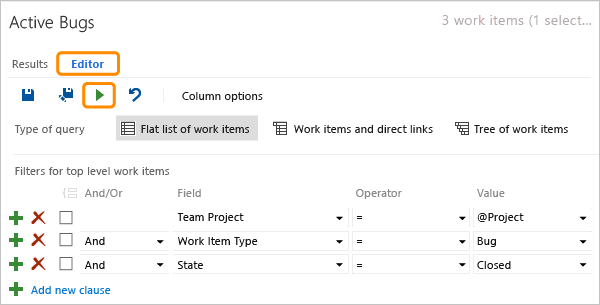

# Ad hoc vs managed work item queries

[!INCLUDE [temp](../includes/version-vsts-tfs-all-versions.md)]

You have two ways to perform work item searches: semantic or ad hoc searches and managed queries. 

::: moniker range=">= azure-devops-2019"  

You perform semantic or ad hoc searches using the work item search box (shown below)   

Choose any **Boards** page, enter a keyword or phrase in the search box, and press *Enter* or choose the  start search icon.  

> [!div class="mx-imgBorder"]
>     

You add and run managed queries using the built-in query-editor available from the **Boards>Queries** page.

> [!div class="mx-imgBorder"]
>   

::: moniker-end   

::: moniker range="<= tfs-2018"  

You perform semantic or ad hoc searches using the work item search box (shown below). 

In the search box, check that the text says _Search work items_. If it doesn't, use the selector to select it. Enter a keyword or phrase in the search box, and press *Enter* or choose the  start search icon. 

You add and run managed queries using the built-in query-editor available from the **Work>Queries** page.

::: moniker-end  

::: moniker range="azure-devops"  
> [!div class="mx-imgBorder"]
>   

::: moniker-end

::: moniker range=">= tfs-2015 <= tfs-2018"  

   

::: moniker-end  

::: moniker range="tfs-2013"  

  

::: moniker-end

For details about semantic or ad hoc searches, see [Perform a semantic or ad hoc work item search](search-box-queries.md). For details about managed queries, see [Create managed queries with the query editor](using-queries.md). 

### Use semantic or ad hoc searches to perform the following tasks:  
- Find a specific work item using its ID or a keyword 
- Find one or more work items across all projects in a fast, flexible manner
- Perform full text search across all work item fields
- Review work items assigned to a specific team member
- Search against specific work item fields to quickly narrow down a list of work items
- Determine what key words will support a managed search

### Use managed queries to perform the following tasks: |

- Review or triage a group of work items
- Perform bulk updates on several work items such as change Assign To, Iteration Path, or more
- Review parent-child or dependent links among work items
- Create a status or trend chart from a flat list query
- Create a list of work items that you'll export to [Excel](../backlogs/office/bulk-add-modify-work-items-excel.md) or [Project](../backlogs/office/create-your-backlog-tasks-using-project.md) 

> [!NOTE]    
> With semantic search, you search against a more fully indexed set of fields. With ad hoc search, the number of fields that are indexed are limited. 

## Related articles  
- [Use the query editor to create managed queries](using-queries.md)
- [Perform a semantic or ad hoc work item search](search-box-queries.md) - [Perform work item search](../../project/search/work-item-search.md) 
- [Create managed queries with the query editor](using-queries.md)   
- [Query fields, operators, and macros](query-operators-variables.md)   
- [Work item field index](../work-items/guidance/work-item-field.md)    
- [Syntax for the Work Item Query Language (WIQL)](wiql-syntax.md)