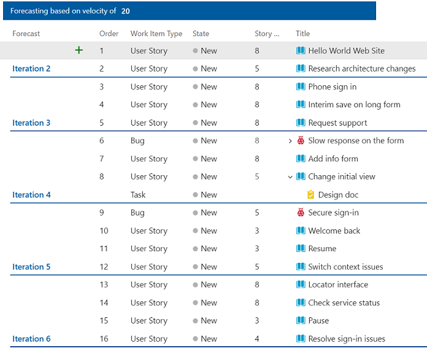
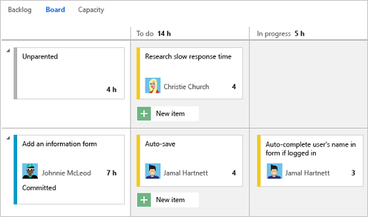

#  Sprints and Scrum key concepts

[!INCLUDE [temp](../_shared/version-vsts-tfs-all-versions.md)] 

This article provides a short dictionary of terms and available tools used in tracking work using Sprints and Scrum methods. See also: 
- [Agile glossary](../work-items/agile-glossary.md) 
- [Work item field index](../work-items/guidance/work-item-field.md)  
- [Project management and navigation glossary](../../project/navigation/glossary.md)  

[!INCLUDE [temp](../../_shared/glossary-terms/agile-tools.md)] 

[!INCLUDE [temp](../../_shared/glossary-terms/bugs.md)] 

<!---
## Burndown charts 
-->

## Capacity 
Capacity correlates to actual task time, either hours or days, that an individual or a team has to work. Azure DevOps provides a Capacity tool for each team's sprint to set capacity. Teams typically set capacity when they plan to create tasks and estimate the time it takes to complete a task. 

By setting team capacity, the team knows exactly the total number of work hours or days the team has for each sprint. With this tool, you set individual team member capacity as well as days off. Setting capacity for each team member working during a sprint causes the capacity bar for that individual to appear. Learn more: [Set sprint capacity](set-capacity.md). 

 

## Capacity bars 
With capacity bars, you can quickly see who is over, at, or under capacity. Capacity bars update with each of these activities: 
- Tasks are assigned with non-zero remaining work  
- Change in remaining work  
- Date change within the sprint cycle. Individual and team capacity always reflects their capacity from the current day till the end of the sprint.   

|Capacity colors |Capacity bars |
|----------------|--------------|
| |  | 

Learn more: [Adjust work to fit sprint capacity](adjust-work.md). 

## Daily scrum meetings
Daily Scrum meetings help teams stay focused on what they need to do to maximize their ability to meet their sprint commitments. The team's Scrum Master should enforce the structure of the meeting and ensure that it starts on time and finishes in 15 minutes or less. Learn more: [Scrum best practices, Daily scrum meeting](best-practices-scrum.md#daily-scrum-meetings).   

<a id="forecast" />
## Forecast
The forecast tool helps team plan their sprints by showing them the backlog items that can be completed in future sprints based on work item estimates and a set velocity. 
As shown here, a velocity of 20 indicates that it will take five sprints to complete the work shown.  Learn more: <a href="forecast.md" data-raw-source="[Forecast your product backlog](forecast.md)">Forecast your product backlog</a>.

> [!div class="mx-imgBorder"]  
> 

[!INCLUDE [temp](../../_shared/glossary-terms/issues.md)] 

[!INCLUDE [temp](../../_shared/glossary-terms/iterations.md)] 

[!INCLUDE [temp](../../_shared/glossary-terms/product-backlog.md)] 

[!INCLUDE [temp](../../_shared/glossary-terms/product-backlog-item.md)] 

<!---
## Product Backlog Item Effort  
## Product Burndown Chart
## Release
## Release Burndown Chart
-->

## Product owner role

The role of product owners is to act as the interface between customers and the team. A product owner can reduce the need for detailed specifications by being more responsive to the team's questions about implementation details and clearly articulating acceptance criteria within each requirement. Learn more: [Refine your backlog, Role of the product owner](../backlogs/best-practices-product-backlog.md#product-owner-role). 

## Scrum master role
Scrum Masters help build and maintain healthy teams by employing Scrum processes. They guide, coach, teach, and assist Scrum teams in the proper employment of Scrum methods. Scrum Masters also act as change agents to help teams overcome impediments and to drive the team toward significant productivity increases. Learn more: [Scrum best practices, Role of the Scrum Master](best-practices-scrum.md#scrum-master-role).   

[!INCLUDE [temp](../../_shared/glossary-terms/sprints.md)] 

[!INCLUDE [temp](../../_shared/glossary-terms/sprint-backlogs.md)]  

<a id="sbc" />
## Sprint burndown chart

The sprint burndown chart reflects the progress made by a team in completing all the work they estimated during their sprint planning meeting. Team's monitor it to mitigate risk and check for scope creep throughout their sprint cycle. The ideal trend line always indicates a smooth and steady burndown. The blue area, as shown in the following chart, represents what's actually going on. It shows the buildup of work as team members add tasks and the reduction of work as team members complete those tasks. Learn more: [Monitor sprint burndown](sprint-burndown.md). 
 

 
## Sprint goals

Sprint goals are used to focus sprint activities. The goal summarizes what the team wants to accomplish by the end of the sprint. Learn more: [Scrum best practices, Set sprint goals](best-practices-scrum.md#set-sprint-goals).  

## Sprint planning 
The Sprint planning meeting occurs at the start of a sprint and is when the product owner and team agree on a set of sprint goals and work.  Learn more: [Scrum best practices, Sprint planning meetings](best-practices-scrum.md#assign-work-sprint-meeting).  

## Sprint retrospective meetings
The Sprint review or retrospective meeting occurs at the end of a sprint and is when the team demonstrates the work that they completed during the sprint. The product owner, customers, and stakeholders accept the user stories that meet their expectations and identify any new requirements. Customers often understand their additional needs more fully after seeing the demonstrations and may identify  changes that they want to see. Learn more: [Scrum best practices, Sprint retrospective meeting](best-practices-scrum.md#sprint-retrospective-meeting).  

## Task  
A type of work item used to track estimated and remaining work. In Scrum a task is usually defined to range between four and twelve hours. Defining tasks are essential for monitoring sprint burndown, working with team capacity, and using the [Taskboard](#taskboard). Tasks are linked to their parent product backlog items or user stories. Learn more: [Add tasks to backlog items](add-tasks.md). 

<a id="taskboard" />
## Taskboard 
A taskboard provides an interactive progress board for work required to complete a team&#39;s sprint backlog. During your sprint you&#39;ll want to update the status of tasks and the remaining work for each task. Updating tasks daily or several times a week yields a smoother <a href="#sbc" data-raw-source="[sprint burndown chart](#sbc)">sprint burndown chart</a>.  Learn more: <a href="task-board.md" data-raw-source="[Taskboard](task-board.md)">Taskboard</a>.

[!INCLUDE [temp](../../_shared/glossary-terms/teams.md)] 

## Team member

A member who has been added to a project or organization who has been added to a specific team. Project members can be added to several teams. Several Agile tools, such as capacity planning, team alerts, and dashboard widgets are team-scoped. That is, they automatically reference the users that have been added as members of a team to support planning activities or sending alerts.

To add users to a team, see [Add users to a project or specific team](../../organizations/security/add-users-team-project.md).

## Technical debt 
Technical debt includes anything the team must do to deploy production quality code and keep it running in production. Examples are bugs, performance issues, operational issues, accessibility, and others. Learn more about how to minimize technical debt: [What is Agile Development?](/learn/agile/what-is-agile-development).  

## Triage meetings 
Triage meetings are used to review and prioritize the backlog and bugs assigned to a team. Additional details, such as estimates, acceptance criteria, and more may be added to the work items. Typically, a product owner runs triage meetings, and team leads, business analysts and other stakeholders who can speak about specific project risks attend them. 
Learn more: [Triage work items](../queries/triage-work-items.md).

[!INCLUDE [temp](../../_shared/glossary-terms/user-story.md)] 

## Velocity and velocity chart

Velocity provides a useful metric for gaining insight into how much work your team can complete during a sprint cycle. After your team has worked several sprints, they can use the velocity chart and [forecast](#forecast) tool to estimate work that can be accomplished in future sprints.  

Velocity is a measure of how much work a team can complete based on their sprint cadence. The built-in velocity chart measures velocity by summing the Story Points (Agile), Effort (Scrum), or Size (CMMI) defined for a sprint. 

For example, in the chart shown below the green bar indicates the total estimated effort (story points) of the user stories completed within each sprint. Blue corresponds to the estimated effort of items not yet completed. Learn more: [View and work with the built-in team velocity chart](../../report/dashboards/velocity-chart-data-store.md). 

::: moniker range=">= azure-devops-2019"  
In addition to the built-in Velocity chart, you can add a Velocity widget to your team dashboard. You can configure this widget to sum a count of work items or the sum of effort. Learn more: [Configure the Velocity widget](../../report/dashboards/team-velocity.md). 
::: moniker-end  

Each team is associated with one and only one velocity chart. Velocity will vary depending on team capacity, sprint over sprint. However, over time, the velocity should indicate a reliable average that can be used to forecast the full backlog. By minimizing the variability of backlog item size&mdash;effort or story points&mdash;you gain more reliable velocity metrics. Learn more: [Add tasks to backlog items](add-tasks.md).

## Related articles 

- [Refine your backlog](../backlogs/best-practices-product-backlog.md)
- [Scrum best practices](best-practices-scrum.md). 
- [About Sprints and Scrum](scrum-overview.md)  
- [What is Scrum?](/azure/devops/learn/agile/what-is-scrum)

