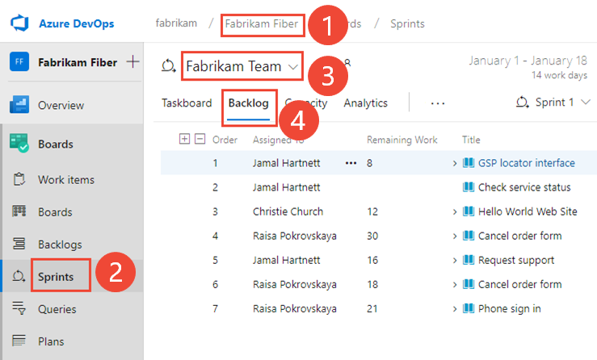
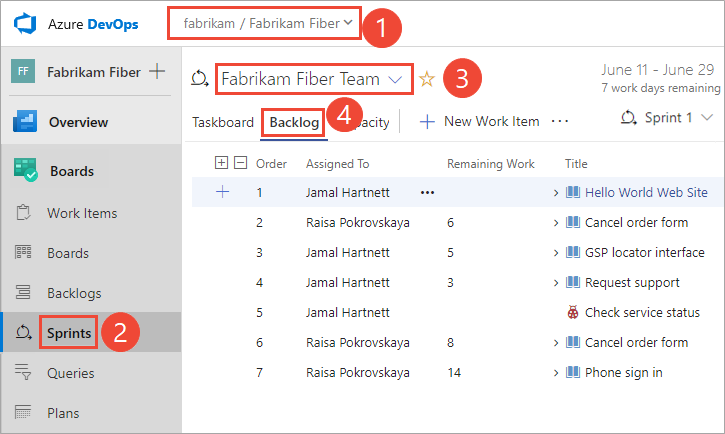
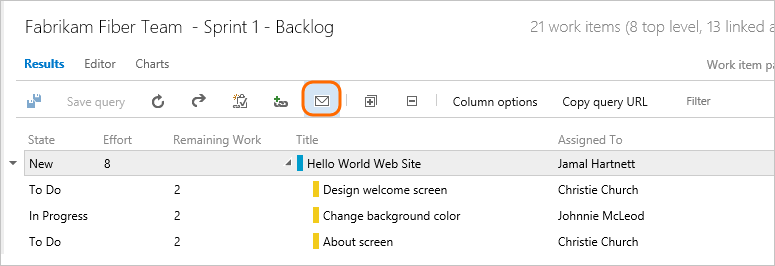

# 5. Share your sprint plan

[!INCLUDE [temp](../includes/version-vsts-tfs-all-versions.md)] 
 

Once you've completed your sprint plan, you can easily share it with other members of your team or organization.  This article shows you how to: 

> [!div class="checklist"]   
> * Create a query from your sprint plan    
> * Email your sprint plan   

Any stakeholder on your team (someone with permissions to connect to your project) can view your sprint plan. Simply send them the URL of your sprint backlog page. But also, you can share it with them through email or print a version. 

## Open a Sprint backlog for a team 

::: moniker range="azure-devops"

1. From your web browser, open your product backlog. (1) Check that you have selected the right project, (2) choose **Boards>Sprints**, (3) select the correct team from the team selector menu, and lastly (4), choose **Backlog**. 

    > [!div class="mx-imgBorder"]  
    > 

   To choose another team, open the selector and select a different team or choose the  **Browse all sprints** option. Or, you can enter a keyword in the search box to filter the list of team backlogs for the project.

   > [!div class="mx-imgBorder"]  
   >   

2. To choose a different sprint than the one shown, open the sprint selector and choose the sprint you want. 

	> [!div class="mx-imgBorder"]  
	> 

	The system lists only those sprints that have been selected for the current team focus. If you don't see the sprints you want listed, then choose **New Sprint** from the menu, and then choose **Select existing iteration**. For details, see [Define iteration paths (aka sprints)](../../organizations/settings/set-iteration-paths-sprints.md). 

::: moniker-end

::: moniker range="azure-devops-2019"

1. From your web browser, open your product backlog. (1) Check that you have selected the right project, (2) choose **Boards>Sprints**, (3) select the correct team from the team selector menu, and lastly (4), choose **Backlog**. 

1. 

   To choose another team, open the selector and select a different team or choose the  **Browse all sprints** option. Or, you can enter a keyword in the search box to filter the list of team backlogs for the project.

   > [!div class="mx-imgBorder"]  
   >   

2. To choose a different sprint than the one shown, open the sprint selector and choose the sprint you want. 

	> [!div class="mx-imgBorder"]  
	> 

	The system lists only those sprints that have been selected for the current team focus. If you don't see the sprints you want listed, then choose **New Sprint** from the menu, and then choose **Select existing iteration**. For details, see [Define iteration paths (aka sprints)](../../organizations/settings/set-iteration-paths-sprints.md). 

::: moniker-end

::: moniker range=">= tfs-2013 <= tfs-2018"

1. From your web browser, open your team's product backlog. (1) Select the team from the project/team selector, choose (2) **Work**, (3) **Backlogs**, and then (4) the product backlog, which is **Backlog items** (for Scrum), **Stories** (for Agile), or **Requirements** (for CMMI). 

	> [!div class="mx-imgBorder"]
	>  

	To choose another team, open the project/team selector and select a different team or choose the **Browse** option. 

	> [!div class="mx-imgBorder"]  
	>  

	The set of sprints selected for your team appears in the left pane. If you don't see any sprints listed, you can add sprints or select existing sprints for your team's use. To learn how, see [Define sprints](define-sprints.md). 

1. Choose the sprint you want to plan. 

	> [!div class="mx-imgBorder"]  
	> 

	The system lists only those sprints that have been selected for the current team focus. If you don't see the sprints you want listed, then see [Define iteration paths (aka sprints)](../../organizations/settings/set-iteration-paths-sprints.md). 

::: moniker-end

## Create query of your sprint plan 

::: moniker range=">= azure-devops-2019"

1. (Optional) To choose which columns should display and in what order, choose the  actions icon and select **Column options**. To learn more, see [Change column options](../backlogs/set-column-options.md). 

	> [!div class="mx-imgBorder"]  
	>  

1. To email your sprint plan, create and save the query for the sprint backlog. 

	> [!div class="mx-imgBorder"]  
	>  

2. Then, open the query and choose the email icon. 

   > [!div class="mx-imgBorder"]  
   >  

3. In the form that appears, enter the name(s) of valid users (ones who have access to the project). 

   > [!IMPORTANT]     
   > You can only send the email to individual address for a project member that is recognized by the system. Adding a team group or security group to the to line isn't supported. If you add an email account that the system doesn't recognize, you receive a message that one or more recipients of your email don't have permissions to read the mailed work items.  

::: moniker-end

::: moniker range="<= tfs-2018"

1. (Optional) To choose which columns should display and in what order, choose **Column options**. To learn more, see [Change column options](../backlogs/set-column-options.md). 

1. To email the sprint plan, create and save the query for the sprint backlog. 

	

2. Then, open the query and choose the email icon. 

    

3. In the form that appears, enter the name(s) of valid users (ones who have access to the project). 

   > [!IMPORTANT]     
   > You can only send the email to individual address for a project member that is recognized by the system. Adding a team group or security group to the to line isn't supported. If you add an email account that the system doesn't recognize, you receive a message that one or more recipients of your email don't have permissions to read the mailed work items.  

::: moniker-end

Or, you can select all the items in the list, choose **Copy as HTML**, and paste the formatted list into an email form or Word document. See [Copy a list of work items](../backlogs/copy-list.md?toc=/azure/devops/boards/sprints/toc.json&bc=/azure/devops/boards/sprints/breadcrumb/toc.json). 

## Try this next
> [!div class="nextstepaction"]
> [6. Update the taskboard](task-board.md) 

## Related articles

- [Email or print work items](../work-items/email-work-items.md)  
- [Share information in work items and social tools](../queries/share-plans.md)  

