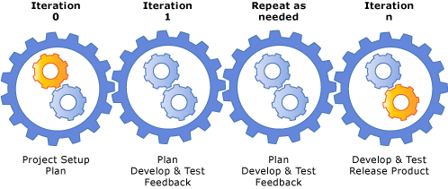
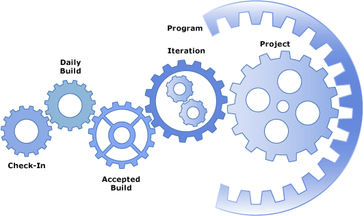

# Project management (CMMI)  

[!INCLUDE [temp](../../../includes/version-vsts-tfs-all-versions.md)]

You can use the Project Management section of the MSF for CMMI process improvement guidance to better understand how to manage, plan, and coordinate the development and maintenance of software products. For more information about CMMI, see [Background to CMMI](guidance-background-to-cmmi.md).  
  
 The Project Management grouping of process areas in the CMMI includes Project Planning, Project Monitoring and Control, Supplier Agreement Management, Integrated Project Management, Risk Management, and Quantitative Project Management. All but Quantitative Project Management are part of model levels 2 or 3. Quantitative Project Management is a model level 4 activity that reflects how high-maturity organizations use quantitative, statistically defensive, objective data to make management decisions and to steer projects to a successful and predictable outcome.  
  
 The project management activities represent economic costs on value-added engineering activities. These activities are necessary and important to manage risk, coordinate successful engineering efforts, and set customer expectations appropriately. However, you should minimize the effort that is expended on these activities. "Little and often" is a good mantra. Smaller batches reduce complexity and coordination costs. When you define and tailor your process definition, you should keep in mind that your project management activities should be as minimal as possible while satisfying the risk profile of your project.  
  
## Iterative development  
 Team Foundation together with the MSF for CMMI process template supports iterative work. Iterative development manages risk by delivering demonstrable and tested software at set intervals throughout the project.  
  
   
  
 The project schedule is organized into a series of iterations that are typically four to six weeks long. Each iteration ends with a demonstration of usable, tested software. To schedule sprints, see [Schedule sprints](../../../sprints/define-sprints.md).  
  
- The *project plan* states what feature requirements will be developed in each iteration. The project plan is developed in Iteration 0 and reviewed at the start of each iteration. To create and view the project plan, see [Create backlog](../../../backlogs/create-your-backlog.md).  
  
- Each *iteration plan* states what tasks will be performed during that iteration. Most tasks are development and test work that is needed to fulfill the feature requirements that are scheduled for that iteration. The iteration plan can be viewed through the [sprint backlog page](../../../sprints/assign-work-sprint.md).  
  
  Iterative work does not automatically manage risks. To minimize risk, you must arrange the project plan in increments. Early iterations should provide an "end-to-end thin slice," that is, a minimal version of the most important behaviors of the product. Later iterations add more functionality.  
  
  By contrast, it would be much less useful to schedule all of the sales part of a shopping Web site for the first third of the project, all of the warehouse system in the second third, and all of the payments system in the last third. This schedule would risk producing an attractive and feature-rich sales Web site that has no means for the business to take money from its customers. It is iterative without being incremental.  
  
  Incremental development has the following benefits:  
  
- Meets the true requirements. Stakeholders have the opportunity to try out the product, which always results in improvements to their stated requirements.  
  
- Tunes the architecture. Allows the development team to discover and address any difficulties that occur with their platform or potential improvements to their design.  
  
- Ensures results. Stakeholders know that, even if project resources are cut part-way through, the expenditure to date has not been not wasted. The same is true if the development estimates prove to have been optimistic and you must drop the less important features.  
  
  For more information about how to express the requirements in an appropriate form for incremental development, see [Develop requirements](guidance-develop-requirements.md).  
  
## Larger and smaller cycles  
 The project and the iteration are not the only cyclic aspects of software development. For example, in an iteration, team members start and complete tasks and check in code. The build system builds the product on a continuous or nightly basis. The team holds a brief daily review of progress on the iteration tasks.  
  
   
  
### Large projects  
 A project in which a team works through a series of iterations may be part of a larger project or program. A large project has several teams that work in parallel. Each team typically has four to 16 people.  
  
 Open a separate version control branch for each team. Each team should integrate with the main branch at the end of each iteration. For more information, see [Use branches](../../../../repos/tfvc/use-branches-isolate-risk-team-foundation-version-control.md).  
  
 Reserve the main branch for integration and tests. The build machine should perform a complete set of tests after an integration.  
  
 Assign an area to each team so that its work items can be easily separated from the others. For more information, see [Customize area and iteration paths](../../../../organizations/settings/set-area-paths.md).  
  
 The teams can share a series of integrations, but this is not always necessary. If the teams do not synchronize integrations, each team must have its own prefix for its iteration names.  
  

   

## Related articles
- **The Project Cycle/[Project activities](guidance-project-activities.md):** Start the project, gather requirements, create a project plan, divide it into iterations, and deliver releases. Manage risks, and manage changes to the plan.    
- **The Iteration Cycle/[Iteration activities](guidance-iteration-activities.md):** Review and update requirements, plan the tasks to implement requirements, and manage issues as they occur.  
- [CMMI process](../cmmi-process.md)   