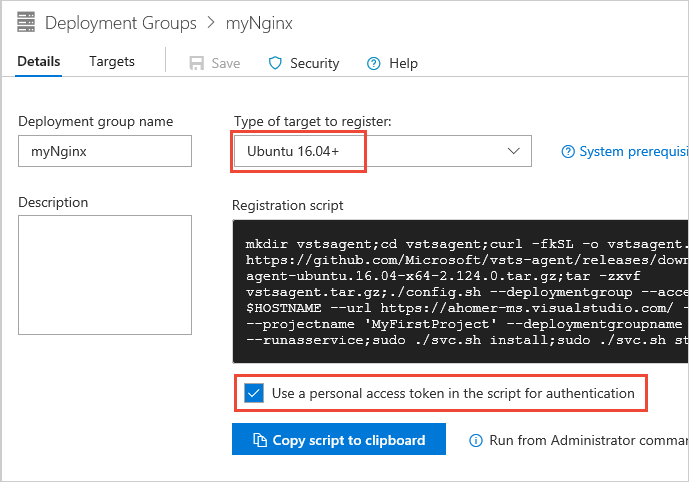

## Create a deployment group

Deployment groups in VSTS make it easier to organize the servers you want to use to host your app.
A deployment group is a collection of machines with a VSTS agent on each of them.
Each machine interacts with VSTS to coordinate deployment of your app.

1. Open a SSH session to your Linux VM. You can do this using the Cloud Shell button on the menu
   in the upper-right of the [Azure portal](https://portal.azure.com/).

   

1. Initiate the session by typing the following command, substituting the IP address of your VM:   

   `ssh <publicIpAddress>`

   For more information, see [SSH into your VM](https://docs.microsoft.com/en-us/azure/virtual-machines/linux/quick-create-cli#ssh-into-your-vm).

1. Run the following command:

   `sudo apt-get install -y libunwind8 libcurl3`

   The libraries this command installs are pre-requisites for installing the build and release agent
   onto a Ubuntu 16.04 VM. Pre-requisites for other versions of Linux can be found [here](../../actions/agents/v2-linux.md).

1. Open the VSTS web portal `https://{your-account}.visualstudio.com`, navigate to the **Build &amp; Release** hub,
   and choose **Deployment groups**.

1. Choose **Add Deployment group** (or **New** if you have existing deployment groups).

1. Enter a name for the group such as **myNginx** and choose **Create**.

1. In the **Register machine** section, make sure that **Ubuntu 16.04+** is selected and that
   **Use a personal access token in the script for authentication** is also checked.
   Choose **Copy script to clipboard**.

   

   The script you've copied to your clipboard will download and configure an agent on the
   VM so that it can receive new web deployment packages and apply them to web server.

1. Back in the SSH session to your VM, paste and run the script.

1. When you're prompted to configure tags for the agent, press _Enter_ (you don't need any tags).

1. Wait for the script to finish and display the message *Started VSTS Agent*. Type "q" to exit the file editor and return to the shell prompt.

1. Back in VSTS or TFS, on the **Deployment groups** page of the **Build &amp; Release** hub in VSTS, open the **myNginx** deployment group.
   On the **Targets** tab, verify that your VM is listed.

   
