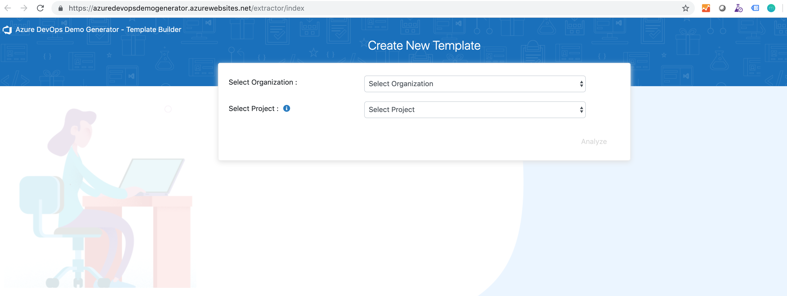
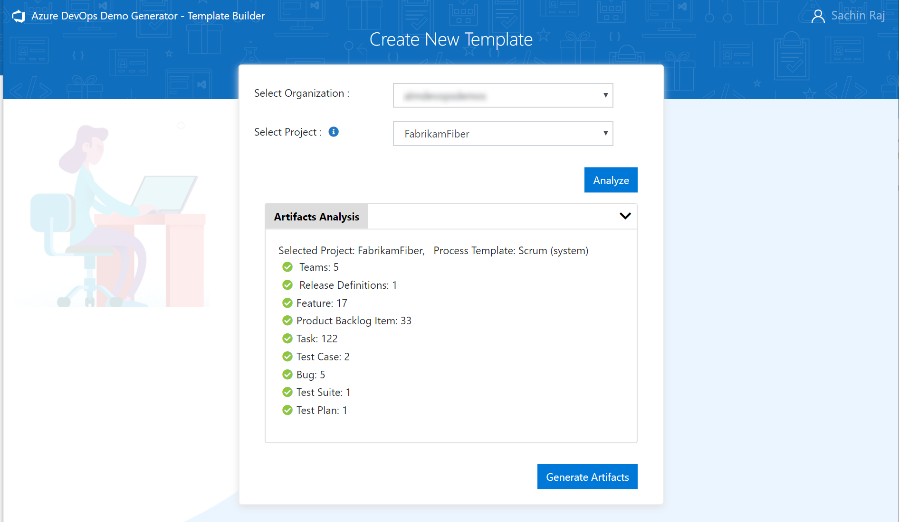
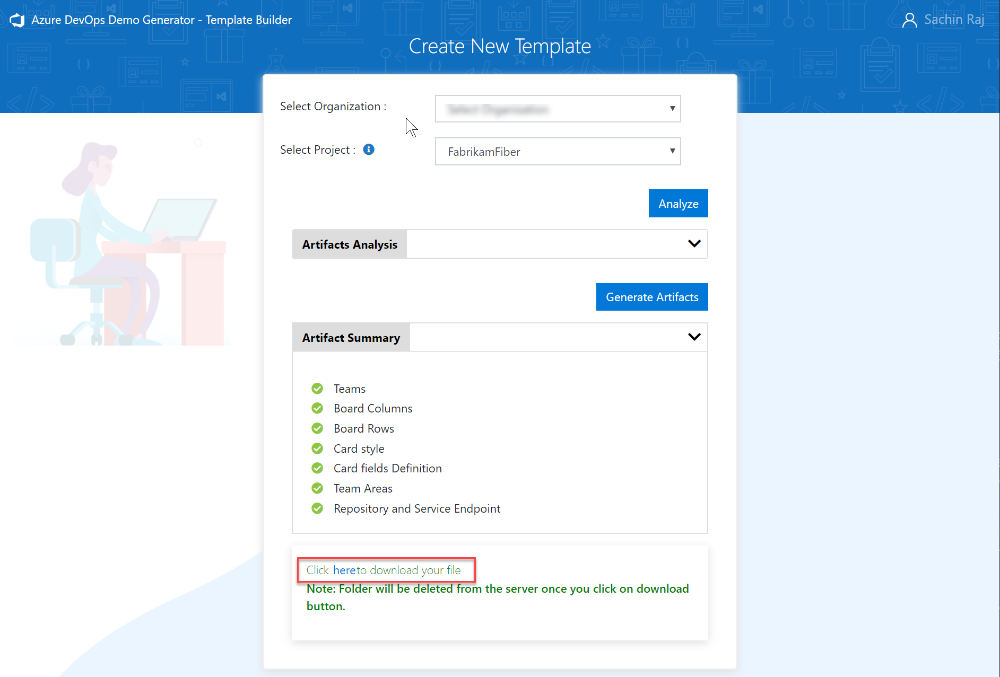

# Building your own template

Azure DevOps Generator provides a number of templates, out of the box, that supports a wide variety of scenarios, from different project types to different programming languages, deployment platforms, etc., In addition to this, the generator also allows users to make their own templates. Users can convert their existing projects into templates and then provision new projects using that template. The ability to have custom templates can be useful in many scenarios, such as building custom training materials, provision only certain artifacts, etc., 

This document walks you through the steps on how you can use the extractor.

## Before you start

Setup an Azure DevOps project and make sure it is ready to be extracted. The extractor will capture the contents of the project and save them as JSON files which will be archived into a zip file.

## Building a new custom template

1. Access the generator with the query parameter **"enableextractor=true"** added to the URL: [https://azuredevopsdemogenerator.azurewebsites.net/?enableextractor=true](https://azuredevopsdemogenerator.azurewebsites.net/?enableextractor=true)

    

1. After you sign in, on the main page, you will see a new link labeled **"Build your template"**

    

1. Selecting that will open the **extractor** main page in a new tab. 

    

1. Select the organization and then the project that you want to turn into a template.

1. Click **Analyze**. This will validate if the project is one of the supported types (only Agile, Scrum and Basic process based projects are supported for the time being) and that all of the contents can be read. At the end of the analysis, you will see the artifacts and count of items for you to confirm if the extractor has read all items correctly.

    

1. If it is correct and you wish to proceed, select the **Generate Artifacts** button. This will again read all the items from the project but this time, the contents will be saved as JSON data. After all the items have been extracted, the folder will be archived into a zip file.

1. Select the link to download the zip file. Note that the zip file is not stored on the server side - so, make sure you download the file.  It will not be available after you close the page. 

    

**Note:** The Extractor supports only limited artifacts and work item types and so it should not be considered as a migration tool for moving projects from one server to another. For what's supported and what's not supported, see the limitations section

## Provisioning your project from your custom template

1. Return back to the generator page or re-open it again if you have already closed it. You should use the **enableextractor=true** query parameter in the URL.

1. Select **Choose Template** 

1. You will see a new tab labeled **Private**. Select the tab.

    

1. Under the private tab, you have the option to import template from your local drive, GitHub or any https URL. 
    
    

    

    > If the URL needs authentication, please provide **Access Token** or **Username & Password**
    
    
1. Clicking **Submit** will validate your template and credentials.

1. If the validation is effective, it will accept your template. In the **Selected Template** field, your template name will be presented.

   Now you are ready to create project using your own template

-------------

Previous: [Using the Generator](use-demo-generator-v2.md) 

