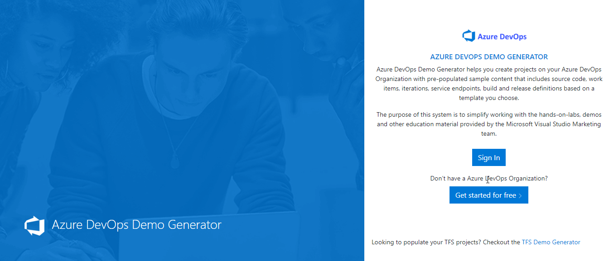
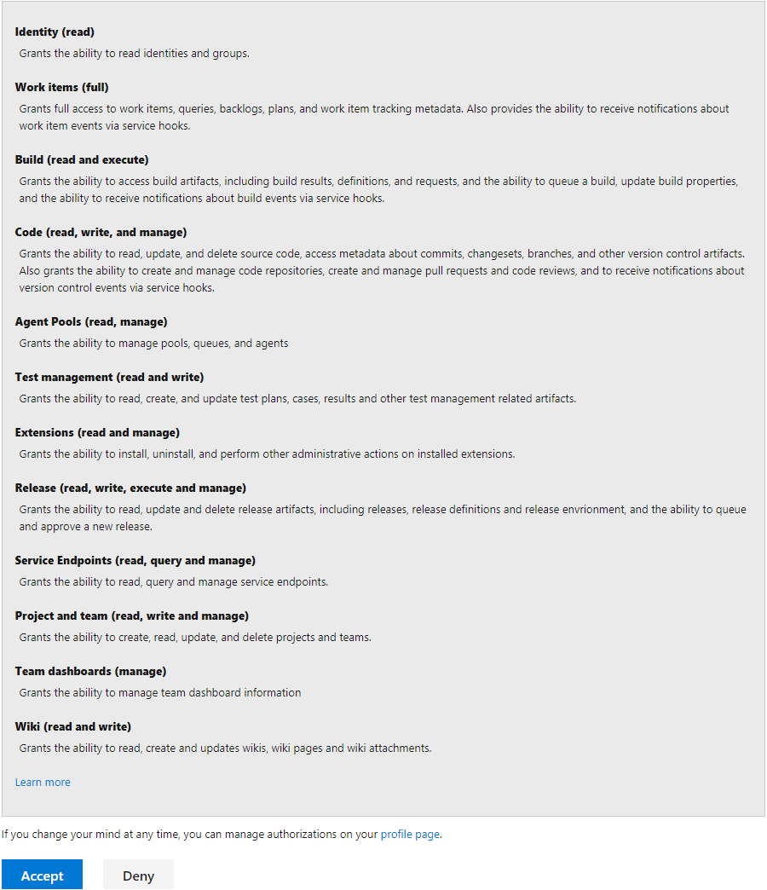
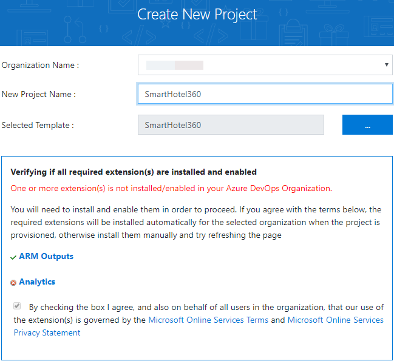
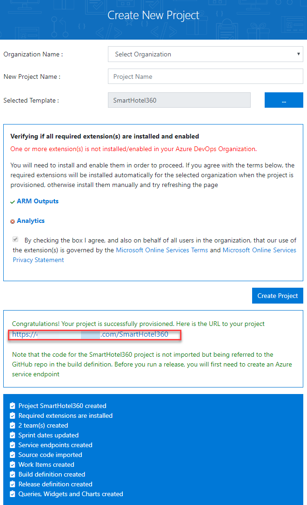

# Get started creating and populating demo Azure DevOps Services projects with the Azure DevOps Demo Generator

1. Browse to the [Azure DevOps Demo Generator site](https://azuredevopsdemogenerator.azurewebsites.net/) by click the link, or copy `https://azuredevopsdemogenerator.azurewebsites.net/` into your browser's URL field.

1. Click **Sign In** and provide the Microsoft or Azure AD account credentials associated with an Azure DevOps Services organization. If you don't have an Azure DevOps Services organization, Click on **Get Started for Free** to create one and then log in with your credentials.

    > [!div class="mx-imgBorder"]

1. After you sign in, select **Accept** to grant the Demo Generator permissions to access your VSTS account.

    > [!div class="mx-imgBorder"]

1. Select the Azure DevOps organization you will use to host the Azure DevOps Services project created by the Azure DevOps Demo Generator. (You may have multiple accounts of which you are a member, and which are associated with your login, so choose carefully.) Provide a name for your project (such as "MyProjectDemo" ) that you and other contributors can use to identify it as a demo project. Lastly, select the demo project template you want to provision by clicking **...** (Browse) button.

    > [!div class="mxImage"]

    > [!NOTE] 
    > The default template is **SmartHotel360**, which contains complete ASP.NET 2 web mobile and desktop business apps for a hotel, and can be deployed using Docker containers. Other templates include **MyHealthClinic**, which defines a team project for an ASP.NET Core app that deploys to Azure App Service; **PartsUnlimited**, which defines an ASP.NET app with customized CI/CD pipelines; and **MyShuttle**, which defines a Java app and Azure App service deployment.
    >
    > All four templates provide fictional Azure DevOps users and pre-populated Agile planning and tracking work items and data, along with source code in an Azure Repos Git repo, as well as access to Azure Pipelines.

1. Some templates may require additional extensions to be installed to your Azure DevOps organization. The demo generation process checks to see if these extensions are already installed. If the extension is already installed, a green check will be displayed in front of the extension name. If the extension is **not** installed, select the empty check boxes to install the extension(s) to your account. When ready, click on **Create Project** button.

    > If you want to manually install the extensions,  click on the provided link for a specific extension, which takes you to the extension's page on Azure DevOps Marketplace. From there, you can install the extension.

1. Your project may take a couple of minutes for the Demo Generator to provision. When it completes, you will be provided with a link to the demo project.

    > [!div class="mxImage"]

1. Select the link to go to the new demo Azure DevOps Services project and confirm it was successfully provisioned.

    > [!div class="mxImage"]

> [!NOTE]
> You must provide your own information such as URLs, logins, password, and others for the configuration of demo endpoints that use Azure resources. 
