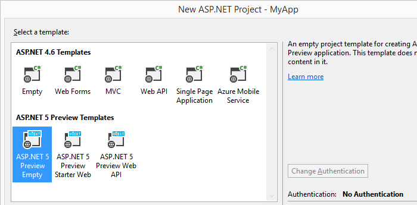
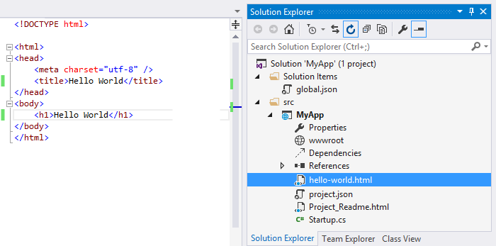
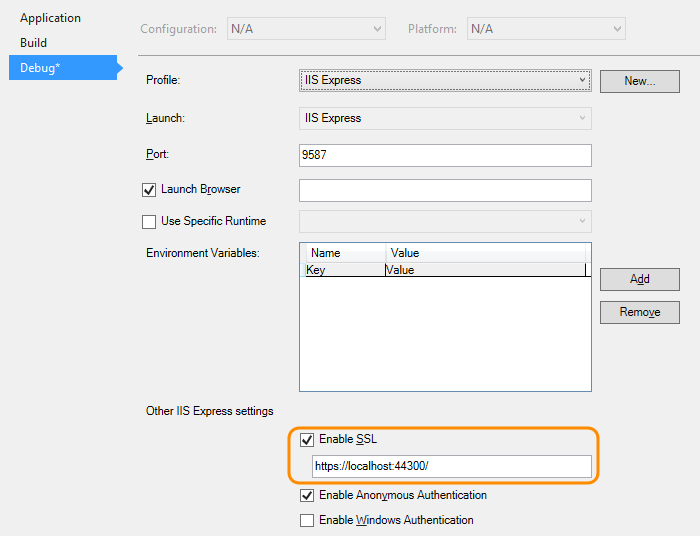

1. Create an ASP.NET application.

	

2. Use the empty template.

	

3. Add the web page that you want to display as a hub. We're doing a simple Hello World page here.

	

4. Add a 58x58 pixel image to your web app that identifies your extension.

	

	If you have the image published on another site, you don't need to add it to your extension. You'll be able to reference it from that site.

5. Add three more pages - one the describes your extension, one that provides support infomormation, and one that describes your terms of service.

	```
	info.html
	support.html
	terms-of-service.html
	```

	Like the image, if you have any of these pages on another site, you can use them instead of adding them to your extension.

6. Enable https for your web app.

	

