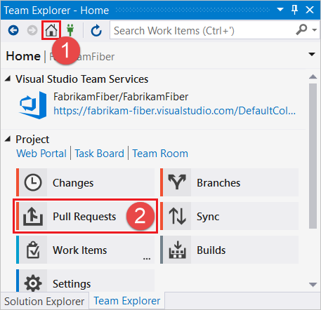
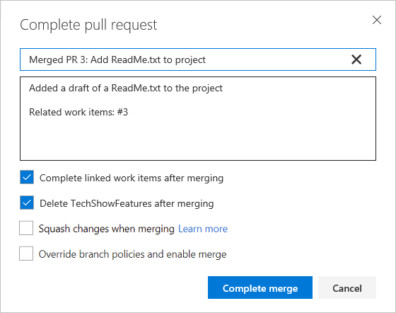

#  Create a pull request

#### VSTS | TFS 2018 | TFS 2017 | TFS 2015 | VS 2017 | VS 2015

[Git's workflow](gitworkflow.md) uses [branches](branches.md) to isolate work until you're ready to merge the changes into your default branch, such as `master`. 
The pull request is the collaborative process that lets the rest of the team discuss changes in a branch and agree to merge them once everyone approves.
Use pull requests to get early feedback from others on work in progress, even if you're not ready to merge the changes into another branch.

In this image, the purple branch is merged into the blue branch through a pull request. The changes are discussed by reviewers in the pull request before the code is merged.
When you complete the pull request, there is a merge commit (seen here as the filled blue commit) where the changes in the purple branch are now [merged](merging.md) in the blue branch. 

In this tutorial you learn how to:

> [!div class="checklist"]
> * Create a pull request
> * Complete a pull request

## Create a pull request

To create a pull request in VSTS:

0. [Push](pushing.md) your local branch.
0. Create a pull request for the branch in VSTS. You can do this in the **Code** view on the web from either the **Pull Requests** tab or the **Files** tab.

  

  
 
  You can also initiate a pull request from Visual Studio. Select the **Pull Requests** view when [connected to your Team Project](../../user-guide/connect-team-projects.md).

  

  From the **Pull Requests** view you can view pull requests opened by you, assigned to you, and you can create new pull requests. Select **New Pull Request** to open up a web browser where you can create the new pull request in the VSTS web portal for your current branch.   

  

0. Create the pull request. You should give a clear title for the pull request that describes the changes in the branch. In the description field give a clear explanation of how the changes are implemented along with any resources that might help reviewers understand the changes. You can include VSTS work items and hyperlinks to allow others to have as much context as possible when reviewing your changes. Add any team member who you would like to review the changes. 

  

### Who reviews the pull request?

When you create the pull request, you can add others who need to review your changes. You can add users and groups to the pull request after it is created if the scope of the
review needs to expand. You can also associate the pull request with a task in VSTS to let others working with the task know changes are ready for review.

### How does the code review work?

Pull request reviewers will see the proposed updates to the branch in the form of file differences between the two branches. Reviewers can add comments on any of the changes and 
include notifications for other team members to answer a question or give other feedback. You can make changes and push commits to resolve issues brought up in the feedback and these 
changes are immediately reflected in the pull request.

If the changes need much more development to complete, you can abandon the pull request. You can later open up a new pull request to
revisit the changes and link to the conversations that took place in the abandoned pull request. 

You can also open up a pull request on a very early version of your code to ask for feedback from others, even if the code isn't ready to merge yet. 
Once you get the team's feedback, you can keep the pull request open to continue the conversation or abandon the pull request until your code is ready to be shared again. 

## Complete a pull request

Complete your pull request after the reviewers approve of the changes by selecting **Complete** in the upper right of the pull request view.

- **Complete**: Complete the pull request now and merge the changes to the target branch.
- **Set auto-complete**: If you have branch policies, you can choose **Set auto-complete** to configure the pull request to close once all branch policies are met. Fore more information on auto-complete (and reasons why you might not see this option), see [Complete automatically](../pull-requests.md#complete-automatically).
- **Abandon**: Choose **Abandon** to close the pull request without merging the changes. 

Enter the message used for the [merge commit](merging.md) and update the pull request description as needed in the dialog that follows. 

- Check **Complete linked work items after merging** to complete any linked work items.
- Check **Delete `<branch name>` after merging** to delete the source branch from the pull request. Git retains the commit history in the `master` branch after the pull request is complete, 
so unless you plan on doing more work in the branch, it is safe to remove.
- Check **Squash changes when merging** to [squash merge](../merging-with-squash.md) your pull request.
- Check **Override branch policies and enable merge** to force merge even if all branch policies haven't been satisfied. This option is only available if you have [Exempt from policy enforcement](../branch-policies.md#bypass-branch-policies) permissions.

### What happens when a pull request is merged?
You must resolve any [merge conflicts](merging.md) between the pull request branch and the target branch. Git adds
a new commit (the *merge commit*) to the end of the master branch. This merge commit links the earlier history of both the master branch and the commits for the branch
that was merged as part of the pull request.

## Next steps

> [!div class="nextstepaction"]
> [Resolve merge conflicts](merging.md)
