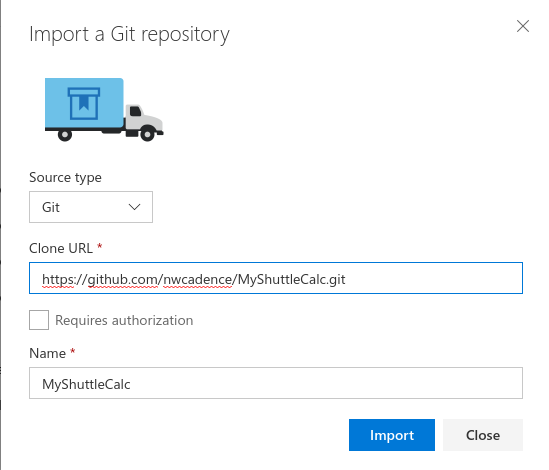

# Set up Azure DevOps Services for a Java project

This exercise will walk you through the steps to creating your Azure DevOps account and create a new project. 

## Prerequisites

> [!NOTE]
> These Hands-On Labs use a virtual machine with a Java environment configured by our partner, [Northwest Cadence](https://www.nwcadence.com/).
>
> **[Learn how to connect to the Java VM environment here](https://github.com/nwcadence/java-dev-vsts)**.

1. Sign in to your organization - `https://{your account name}.visualstudio.com`. If you do not have an organization, [sign up for a free one](https://visualstudio.microsoft.com/team-services/).

   > [!div class="mx-imgBorder"]
   > 

## (Optional) Generate an Azure DevOps Services Personal Access Token (PAT)

In this task you will generate a personal access token for yourself. PATs essentially are alternate passwords. You need them to integrate Azure DevOps Services with non-Microsoft tools such as Git, XCode, etc. You will need PAT to provision your project using the demo generator or to connect a self-hosted agent to your organization.

> [!TIP]
> If you already have a PAT, you can skip this step and use your existing PAT (assuming it has the correct scopes).

1. On your Azure DevOps Services page, in the upper right, click on your profile image and click **Security**.

   > [!div class="mx-imgBorder"]
   > 

2. On the Personal access tokens page, click **Add**. Enter "java" (or whatever you want) for the Description. Scroll to the bottom of the page and click **Create token**.

3. When the token is created, make a note of it as it cannot be viewed again. Copy it from the browser into the clipboard.

4. Click on the Visual Studio Code icon in the toolbar to open Visual Studio Code.

   > [!div class="mx-imgBorder"]
   > 

5. Press Ctrl-N (or use File -> New File) to create a new file. Paste in your PAT. Save this file (**File->Save** or Ctrl+S) to `/home/vmadmin/pat.txt`.

## Create a new project with Azure DevOps Services Demo Generator...

Next, you need to create a team project. You can create the team project manually or by using [Azure DevOps Services Demo Generator](https://Azure DevOps Servicesdemogenerator.azurewebsites.net/), a tool that helps you create team projects on your organization with sample content that include source code, work items, iterations, service connections, build and release pipelines based on the template you choose during the configuration.

The steps below use Azure DevOps Services Demo Generator to provision a demo Java project for you.

1. Open [Azure DevOps Services Demo Generator](https://Azure DevOps Servicesdemogenerator.azurewebsites.net/).

2. Enter your account name and the PAT you saved earlier. Click **Verify and Continue**.

   > [!div class="mx-imgBorder"]
   > 

3. Use **MyShuttle2** for the template. Use **jdev-labs** for the Project Name. Select **Create Project**.

   > [!div class="mx-imgBorder"]
   > 

4. After the project is provisioned, click the URL to navigate to the project.

## ...or import a Github Repo into Azure DevOps Services

If you have not provisioned the team project using the Azure DevOps Services demo generator in the previous exercise, you can follow the steps in this exercise to manually create a team project and import code from a GitHub repository.

1. From your Azure DevOps organization home page, select **New Project**.

1. Use `jdev-labs` for the new **Project Name**. Select **Scrum** as the **Work item process**. Click **Create**.

   > [!div class="mx-imgBorder"]
   > 

1. Click on the repo drop-down in the upper-left (in the grey toolbar) and select "Import repository".

   > [!div class="mx-imgBorder"]
   > 

1. Enter the following url: `https://github.com/nwcadence/MyShuttle2.git` and click Import.

   > [!div class="mx-imgBorder"]
   > 

1. After a few moments, the code will be imported.

## Import the MyShuttleCalc code from Github into Azure DevOps Services

In this task you will import the MyShuttleCalc code from GitHub into Azure DevOps Services. If you have already done so, skip this step.

1. Click on the `jdev-labs` team project to navigate to it. Click on Code in the blue toolbar at the top to open the Code Hub.

1. Click on the repo drop-down in the upper left (in the grey toolbar) and select "Import repository". (This will be the second time you import a repo if you create the project manually.)

   > [!div class="mx-imgBorder"]
   > 

1. Enter the following url: `https://github.com/nwcadence/MyShuttleCalc.git` and click **Import**.

   > [!div class="mx-imgBorder"]
   > 
    
1. After a few moments, the code will be imported.

   > [!NOTE]
   > It is not necessary to clone GitHub repos into Azure DevOps Services. Azure DevOps Services will work just fine with GitHub (or other hosted Git) repos. However, some links from source code to other aspects of the DevOps pipeline (such as work items, builds, or releases) work best if the code is in Azure DevOps Services.

