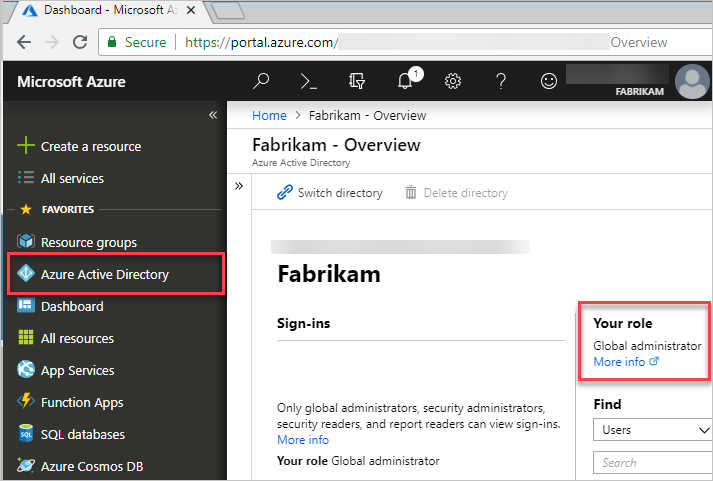

# Access your organization with Azure Active Directory

[!INCLUDE [version-vsts-only](../../_shared/version-vsts-only.md)]

Learn how to authenticate users and control access to
your organization the same way that you
can with Microsoft services like Office 365 and Azure.
If your organization was created with a Microsoft account,
you can connect your organization to your
[Azure Active Directory (Azure AD)](/azure/active-directory/fundamentals/active-directory-whatis).
You can then sign in to Azure DevOps with the same username
and password that you use with these Microsoft services.
You can also enforce policies for accessing
your team's critical resources and key assets.

> To use existing on-premises identities with Azure DevOps,
> you can integrate directories with Azure AD by using
> [Azure AD Connect](https://azure.microsoft.com/documentation/articles/active-directory-aadconnect/).
> To switch your organization to another directory,
> learn [how to change your directory in Azure AD](change-organization-location.md).

## How does Azure Active Directory control access to Azure DevOps?

Your organization authenticates users
through your organization's directory so that
only users who are members or guests in that directory can
get access to your organization.
When users are disabled or removed from your directory, they can no longer access your organization by any mechanism including via PATs, SSH, or any other alternate credentials.
Only specific [Azure AD administrators](https://azure.microsoft.com/documentation/articles/active-directory-assign-admin-roles/)
can manage users in your directory,
so they control who can get access to your organization.

Without Azure AD, you're solely responsible for
controlling organization access.
And all users must sign in with Microsoft accounts.

## What do I need to set up an existing Azure DevOps instance with Azure AD?

You need the following:

* [Ownership of the organization](faq-add-delete-users.md#find-owner) that you want to connect to Azure AD.

* A ["full" Azure subscription](https://azure.microsoft.com/pricing/purchase-options/),such as a [Pay-As-You-Go subscription](https://azure.microsoft.com/offers/ms-azr-0003p/),associated with Azure Active Directory and at least co-administrator permissions for your subscription.

  You need both to make your directory appear in the Azure portal, so that you can link your subscription and connect Azure AD to your organization. Learn about
[Azure subscription co-administrator permissions](../billing/add-backup-billing-managers.md).

  [Want to use Office 365 Azure AD with Azure DevOps?](faq-azure-access.md#o365aad)

* Global administrator permissions for your directory so you can add current Azure DevOps users to that directory.

  Otherwise, work with your directory's global administrator to add users.
Learn more about [Azure AD administrators](/azure/active-directory/users-groups-roles/directory-assign-admin-roles).

  To check your permissions, [sign in to the Azure portal](https://ms.portal.azure.com) with your
  work or school account. Go to your directory.

  > [!div class="mx-imgBorder"]  
  >

You must add your Microsoft account to Azure AD.

Although directory membership isn't required to
connect your organization to Azure AD, it makes sure that you can sign in and
access your organization after you connect to Azure AD. Otherwise, your Microsoft account does not have access to
your organization.

## What happens to current users?

Your work in Azure DevOps is associated with your sign-in address.
After your organization is connected to your directory,
users continue working seamlessly if their
sign-in addresses appear in the connected directory.
If their sign-in addresses don't appear, you must [add those users to your directory](add-users-to-azure-ad.md#SetUpCurrentUsers).
Your organization might have policies about adding users to the directory, so find out more first.

### What if we can't use the same sign-in addresses?

You have to add these users to the directory with new work or school accounts.
If they have existing work or school accounts, they can use those instead. Their work won't be lost and stays with their current sign-in addresses. You must add them as new
users, reassign access levels, and readd them to any projects. Users can migrate work that they want to keep,
except for their work history. Learn [how to manage organization users](add-organization-users.md).

### What happens to tools that use my credentials, like alternate credentials?

Alternate credentials won't work anymore for
tools that run outside a web browser, like the Git command-line tool.  You have to [set up your credentials](http://support.microsoft.com/kb/2991274/) again for the organization that you connected.

## What if I accidentally delete a user in Azure AD?

You should [restore the user](/azure/active-directory/active-directory-users-restore), rather than create a new one. If you create a new user, even with the same email address, this user is not associated with the previous identity.

## Manage organization access with Azure AD

* [Add Azure DevOps users to Azure AD](add-users-to-azure-ad.md)
* [Connect your organization to Azure AD](connect-organization-to-aad.md)
* [Disconnect your organization from Azure AD](disconnect-organization-from-aad.md)
* [Delete users from Azure DevOps connected to Azure AD](delete-users-from-services-aad.md)
