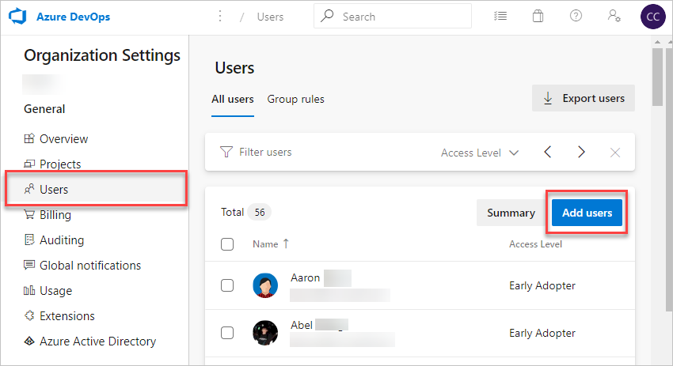
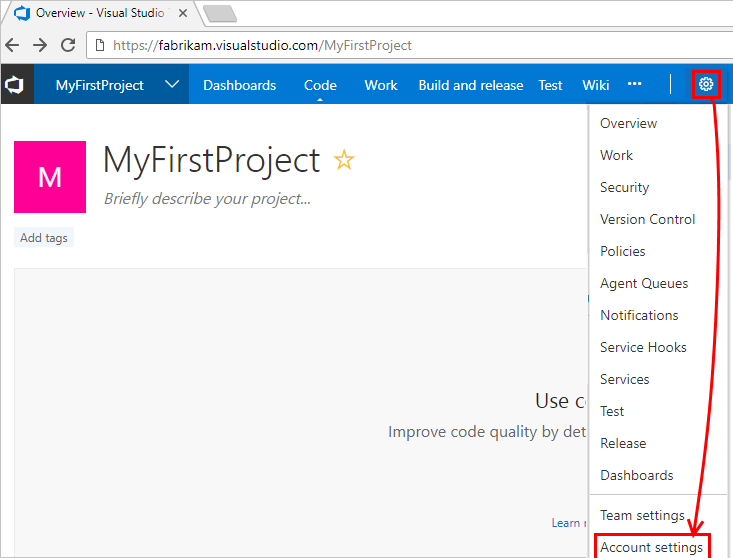
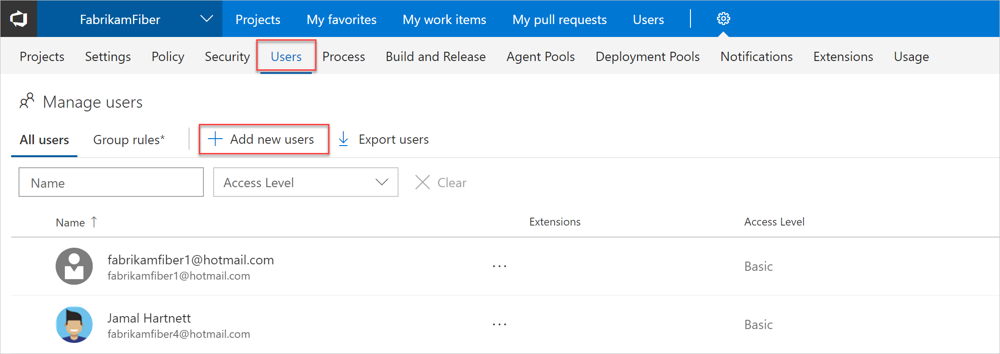
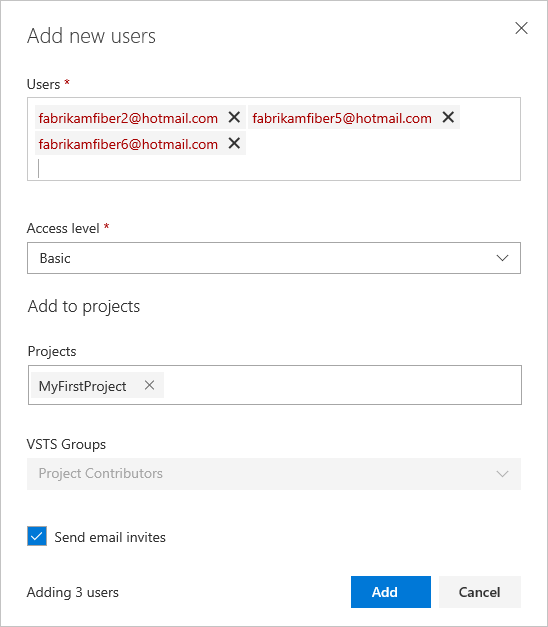

# Add users to your VSTS organization or team project

**VSTS**

Add users to your Visual Studio Team Services (VSTS) organization and specify the level of features they can use, such as Basic or Stakeholder.
These kinds of users can join your VSTS organization for free:

* 5 users who get [Basic features](https://visualstudio.microsoft.com/team-services/compare-features/),
such as version control, tools for Agile, Java, build, release management, and more
* Unlimited users who get [Stakeholder features](https://visualstudio.microsoft.com/team-services/compare-features/),
such as working with your backlog, work items, and queries
* Unlimited [Visual Studio subscribers](https://visualstudio.microsoft.com/team-services/compare-features/)
who also get Basic features, and in some cases, additional features with specific extensions, such as
[Test Manager](https://marketplace.visualstudio.com/items?itemName=ms.vss-testmanager-web)

[Need more users with Basic features or Visual Studio subscriptions?](add-basic-or-vs-subscription-users.md)

> [!NOTE]
> You can add people to team projects,
> rather than to your organization. VSTS automatically assigns them
> [Basic features](https://visualstudio.microsoft.com/team-services/compare-features/),
> if your organization has seats available,
> or [Stakeholder features](https://visualstudio.microsoft.com/team-services/compare-features/),
> if not. Learn [how to add members to team projects](add-team-members-vs.md).
>
> When people don't need access to your VSTS organization anymore, [delete them](delete-organization-users.md) from your organization.

## How *access* differs from *permissions*

Access levels control which features are available to users, i.e. the full set of organization resources that a user is entitled to access. Permissions then control which of these organization resources the user can act on. To learn more, see [Default permissions and access for VSTS and TFS](../../security/permissions-access.md)

## Prerequisites

You'll need [VSTS project collection administrator or organization owner permissions[Quickstart: Add administrators, set permissions at the project-level or project collection-level](../security/set-project-collection-level-permissions.md?toc=/vsts/organizations/accounts/toc.json&bc=/vsts/organizations/accounts/breadcrumb/toc.json).

## Add users to your VSTS organization

Administrators can now add users to an organization, grant access to appropriate tooling extensions and service access level,
and add users to groups all in one view. You can add up to 50 users at once.  You can add more than 50 users by repeatedly
using this Users view.  When you add users, each receives a notification email with a
link to the organization page.

 > [!NOTE]
 > If have an Azure Active Directory (Azure AD) backed VSTS organization, and you need to add users who are external to your Azure AD, first [add external users](https://docs.microsoft.com/en-us/vsts/organizations/accounts/add-external-user?view=vsts) to
 > your Azure AD.  Be sure on the **Tell us about this user page**, under **Type of user**, to choose **User with an
 > existing Microsoft account**.  After completing those steps, follow the steps below to add the external Azure AD
 > user to VSTS.

Provide others access to your organization by adding their email address.

[!INCLUDE [temp](../../work/_shared/new-agile-hubs-feature.md)]

# [New navigation](#tab/new-nav)

1. Sign in to your VSTS organization (```https://{yourorganization}.visualstudio.com```).

2. Choose  **Admin settings**.

    
 
3. Choose **Users** and then choose **Add new users** to open the form.

   

4. Fill out the form.

   

   * **Users**: Enter the Microsoft account (MSA) email address for the user organization. You can add several email addresses by separating them with a semicolon (;). Note that in MSAs, the email addresses display in red.
   * **Access level**: Leave the Access level at **Basic** for those users who will contribute to the code base. To learn more, see [About access levels](../../organizations/security/access-levels.md).
   * **Add to projects**: Select the project that you named in the previous procedure.
   * **VSTS Groups**: Leave this entry at Project Contributors, the default security group for people who will contribute to your project. To learn more, see [Default permissions and access assignments](../../organizations/security/permissions-access.md).

5. Choose **Add** to complete your invitation.


# [Previous navigation](#tab/previous-nav)

1. From your web browser, choose , the gear Settings icon, and choose the **Organization Settings**

   

2. Choose **Users** and then choose **Add new users** to open the form.

   

3. Fill out the form.

   

   * **Users**: Enter the Microsoft account (MSA) email address for the user. You can add several email addresses by separating them with a semicolon (;). Note that in MSAs, the email addresses display in red.
   * **Access level**: Leave the Access level at **Basic** for those users who will contribute to the code base. To learn more, see [About access levels](../../organizations/security/access-levels.md).
   * **Add to projects**: Select the project that you named in the previous procedure.
   * **VSTS Groups**: Leave this entry at Project Contributors, the default security group for people who will contribute to your project. To learn more, see [Default permissions and access assignments](../../organizations/security/permissions-access.md).

4. Choose **Add** to complete your invitation.

<!---
Go to the User Hub:


Choose **Add new users** below "Manage users".


Then fill in the "Add new users" dialog:


Next steps: [Manage users in table view](manage-users-table-view.md)
-->

## Related articles

* [Connect to a team project](../../organizations/projects/connect-to-projects.md)
* [Change individual permissions, grant select access to specific functions](../../organizations/security/change-individual-permissions.md)
* [Grant or restrict access to select features and functions](../../organizations/security/restrict-access.md)
* [Delete users from Visual Studio Team Services (VSTS)](delete-organization-users.md)
* [Troubleshoot adding and deleting organization users in the VSTS user hub](faq-add-delete-users.md)
* [Troubleshoot adding members to team projects in Visual Studio Team Services (VSTS)](faq-add-team-members.md)
