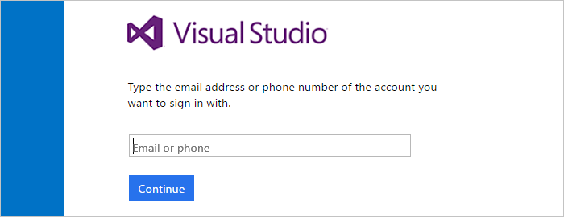
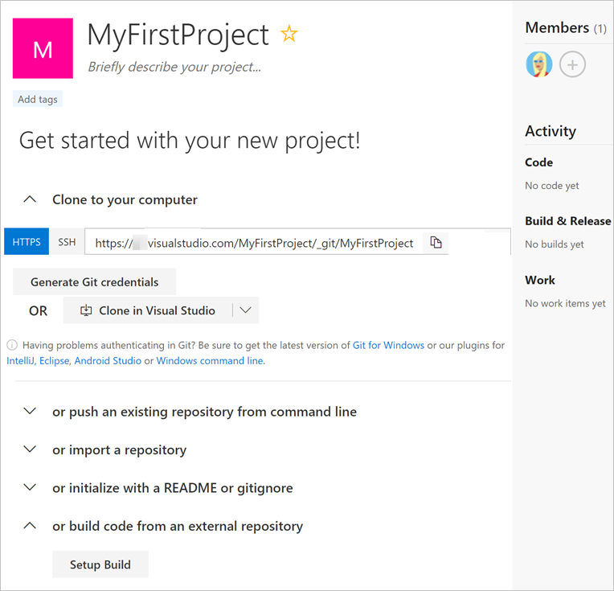

# Quickstart: Create your organization

[!INCLUDE [version-vsts-only](../../_shared/version-vsts-only.md)]

To create an Azure DevOps organization with a personal Microsoft account or a work or school account, go to the [Azure DevOps Services](https://visualstudio.microsoft.com/products/visual-studio-team-services-vs) site.

In this quickstart, you learn how to upload and share code in free, unlimited private Git repositories or Team Foundation Version Control. To work on apps anytime, anywhere, you can connect your favorite development tools, such as Eclipse, Xcode, Visual Studio, IntelliJ, or Android Studio. Azure DevOps Services offers integrated, enterprise agile tools for DevOps, so your team can build often, test early, and ship faster.

> Want to set up an on-premises server? [Get Team Foundation Server](https://visualstudio.microsoft.com/products/tfs-overview-vs), or learn [how to install and set up Team Foundation Server](/tfs/server/install/get-started). 

> [Who can join for free?  What do users get in Azure DevOps Services?](faq-create-organization.md#free-users)

## Prerequisites

* Read [Defining your Azure DevOps organizations and projects](../../user-guide/define-organizations-and-projects.md).
* Before you begin, do either of the following:

   * Complete the following steps to use only Microsoft accounts with your organization. Ignore the Azure Active Directory (Azure AD) callouts.

      1. If you don't have a Microsoft account, create one when you sign up for Azure DevOps.

      2. Use your Microsoft account if you don't need to authenticate users for an organization with [Azure AD](https://azure.microsoft.com/documentation/articles/active-directory-whatis/). All users must sign in to your organization with a Microsoft account.

   * Complete the following steps to authenticate users and control organization access through your Azure AD. Pay attention to the Azure AD callouts.

	  1. Use your work or school account to *automatically connect* your organization to your Azure AD. All users must be members in that directory to access your organization. To add users from other organizations, use [Azure AD B2B collaboration capabilities](/azure/active-directory/active-directory-b2b-what-is-azure-ad-b2b).

	  2. You need a work or school account that's managed by your Azure AD. If you use Azure or Office 365, you might have one already. If you don't, learn how to [sign up for Azure as an organization](https://azure.microsoft.com/documentation/articles/sign-up-organization/).

	  3. To use existing on-premises identities with Azure DevOps Services, see [use Azure AD Connect for integrating on-premises directories with Azure AD](https://azure.microsoft.com/documentation/articles/active-directory-aadconnect/).

## How does Azure AD control access to Azure DevOps Services?

Azure DevOps Services authenticates users through your Azure AD, so that only users who are members in that directory can access your organization. When you remove users from that directory, they can no longer access your organization. Only specific [Azure AD administrators](https://azure.microsoft.com/documentation/articles/active-directory-assign-admin-roles/) can manage users in your directory, so administrators control who can access your organization.

Without Azure AD, you're solely responsible for controlling Azure DevOps organization access. And all users must sign in with their Microsoft account. 
[What are other differences?](faq-create-organization.md#SignInOrganizationDifferences)

## Create your organization and sign up for Azure DevOps Services

1. Go to [Azure DevOps Services](https://go.microsoft.com/fwlink/?LinkId=307137), and use either of the following:

	* **Microsoft account**: If you're a Visual Studio subscriber and get Azure DevOps Services as a benefit, use the Microsoft account email address that's associated with your subscription. 

	* **Azure AD**: Use your work or school account email address. Depending on the account you use, your sign-in page might vary from the page shown as follows:

	  

	  [Got browser problems?](faq-create-organization.md#browser-problems)

2. Do the following:

    a. **Microsoft account**: Enter the email address for your Microsoft account, select **Next**, and then enter your password to finish signing in.  
    If you are not using **Azure AD**, and you don't have a Microsoft account, you can create a Microsoft account at this time.

	  
	
	b. **Azure AD**: On the Visual Studio sign-in page, enter your password for your work or school account, and then select **Sign in**.
	
	  

	  [Why am I asked to choose between my work or school account and my personal account?](faq-create-organization.md#ChooseOrgAcctMSAcct)

3. Under **Host my projects at**, enter the name of your organization and then, under **Manage code using**, select **Git** or **Team Foundation Version Control**.

	

	Learn which version control works bests for you: [Git](../../repos/git/overview.md) or [Team Foundation Version Control](../../repos/tfvc/overview.md).

4. Confirm your organization's location and, if you're using **Azure AD**, confirm the directory that you're connecting to your organization. 

	
	
	**Azure AD**:
	
	

    **Microsoft account and Azure AD**: 
    
    Your first project is created in Azure DevOps Services as *MyFirstProject* and uses Agile as your default work item process to organize your work.
	
    Select **Change details** to [rename your project, change the organization location, or select another process, such as Scrum](faq-create-organization.md#organization-location).
	
	**Azure AD**: 

    After you create your account, only members of the directory shown here can access your organization, or you must use [Azure AD business-to-business (B2B) collaboration capabilities](/azure/active-directory/active-directory-b2b-what-is-azure-ad-b2b) to add users from other organizations. 

    If you belong to multiple directories, ensure that you want to connect this directory to your organization. Changing the directory now is easier than [changing the directory later](faq-create-organization.md#ChangeDirectory).

5. After your organization and project are created, add code, work items, or more users.

    
	Congratulations, you're now an organization owner! 

	To sign in to your organization at any time, go to `https://<yourorganization>.visualstudio.com`.

	> [!NOTE]
	> If you activated your Visual Studio subscription with a Microsoft account, and your subscription includes Azure DevOps Services as a benefit, learn [how to add your work or school account](../../billing/link-msdn-subscription-to-organizational-account-vs.md) to your subscription so that you can use your subscriber benefits in Azure DevOps Services.

## Next steps

> [!div class="nextstepaction"]
> [Manage users and access](add-organization-users-from-user-hub.md)
> or
> [!div class="nextstepaction"]
> [Create project](../projects/create-project.md)

   or

Add code to Git or Team Foundation Version Control:

* **Git**: Use [Eclipse](../../java/download-eclipse-plug-in.md), [Xcode](../../repos/git/share-your-code-in-git-xcode.md), [Android Studio](/../../java/download-android-studio-plug-in), [IntelliJ](/../../java/download-intellij-plug-in), [Visual Studio](../../repos/git/share-your-code-in-git-vs-2017.md), or [Visual Studio Code](https://code.visualstudio.com/docs/editor/versioncontrol).

* **Team Foundation Version Control**: Use [Eclipse](/../../java/download-eclipse-plug-in), [Xcode](../../repos/tfvc/share-your-code-in-tfvc-xcode.md), [Visual Studio](../../repos/tfvc/use-visual-studio-git.md), or [Visual Studio Code](https://code.visualstudio.com/docs/editor/versioncontrol).

## Related articles

* [Create your backlog](../../boards/backlogs/create-your-backlog.md)
* [Manage your process](../../organizations/settings/work/manage-process.md)
* [Customize your process](../../organizations/settings/work/customize-process.md)