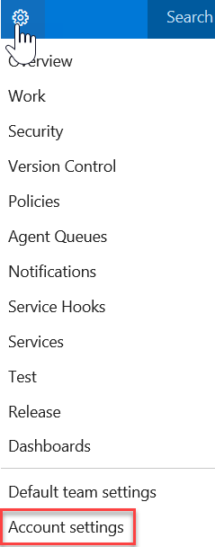
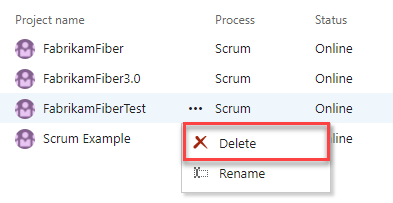
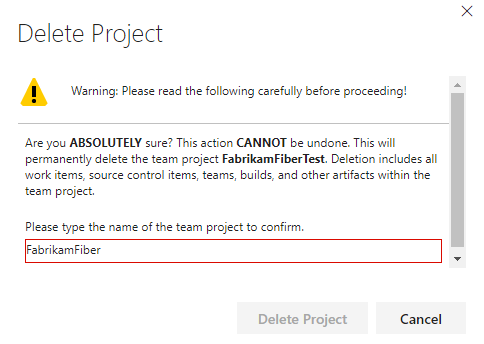

# Delete a team project

**VSTS** | **[Previous Versions](https://msdn.microsoft.com//library/ff357756%28v=vs.110%29.aspx)**

If you find that you have a team project you no longer use, you can delete it. Deleting a team project helps simplify the navigation to team projects that are in use.

>**Caution:**  Deleting a team project permanently removes data associated with that project from the database. You cannot recover it later. Therefore, you should [save team project data](save-team-project-data.md) that you might want to access later.

Delete a team project from VSTS or from an on-premises deployment of Team Foundation Server (TFS).

## Delete a team project from VSTS

1. Open the administration console for the team project collection by choosing the  gear icon and then choosing **Account settings**.

   >[!div class="mx-imgBorder"]
   

2. Open the  menu for the team project that you want to delete.

   >[!div class="mx-imgBorder"]
   

    If you don't see the actions icon , either you're not accessing VSTS or you're not a member of the Project Collection Administrators group.  Learn about [joining the Project Collection Administrators group](../../organizations/security/set-project-collection-level-permissions.md).

3. You must type the name of the team project in order to initiate the delete operation. 

   >[!div class="mx-imgBorder"]
   

## Delete a team project from Team Foundation Server (on-premises)

Using the administration console, you can delete a team project from a team project collection. Afterwards, you'll need to manually delete any associated reports and SharePoint project portal. Or, you can use the [TFSDeleteProject command line tool](/tfs/server/ref/command-line/tfsdeleteproject-cmd) to delete all artifacts.

1.  If you're not a member of one or more of the following administrator groups, [get those permissions now](/tfs/server/admin/add-administrator-tfs):

    -   Team Foundation Administrators group (required).

    -   SQL Server System Administrators group (required).

    -   Farm Administrators group for SharePoint Products (required when your deployment uses SharePoint Products).

2.  Open the administration console for TFS and delete the team project from its team project collection.

    

3.  Choose whether to delete external data associated with the team project and then initiate the delete action.

    

4.  (Optional) To review the status of the delete action, open the **Status** tab.

    To review the details of the delete action, you can open the log file from either the **Status** tab or **Logs** tab.

### Delete reports that remain after deleting a project

If your on-premises team project used reporting, and you didn't choose to delete external artifacts, you can delete the reports using SQL Server Report Manager. From the team project collection page, delete the folder that corresponds to the deleted team project.

### Remove the team project portal

If your on-premises team project had a team project portal, all links to that portal will be removed from TWA and Team Explorer, but the SharePoint site or website that acted as the portal will not be deleted. If you want to delete the portal, you must do so manually after the project has been deleted. See [How to: Create, Edit, and Delete Windows SharePoint Services Sites](http://go.microsoft.com/fwlink/?LinkId=131660).

### What to do if the delete action doesn't finish

For on-premises deployments, review the status and log files for the delete action. Open the **Status** tab and for **Deleted**, review the additional information in parentheses, and take the indicated action.

-   (**Processing**) means that the process has started and is in progress.

-   (**Pending**) means that the deletion process has started from a client application. The deletion might be in progress or might have failed. Because the process was started from a client application, the server cannot accurately report the status of the deletion.

    If a project deletion remains pending for a long time, try to delete the project again from the administration console.

-   (**Failed**) means that the deletion process started but did not successfully finish. The log file will contain specific information about the failure.

    Review the information about the failure, and then try to delete the project again.

    If partial data remains, you can also use the [TFSDeleteProject](/tfs/server/command-line/tfsdeleteproject-cmd) command line tool.
