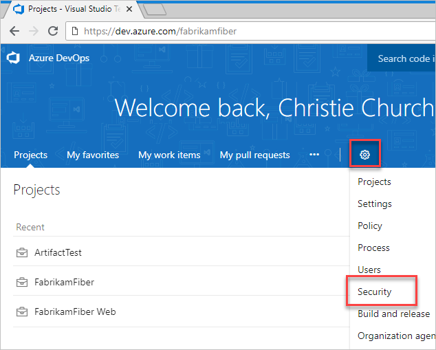

# Azure DevOps Services access with Azure Active Directory groups

[!INCLUDE [version-vsts-only](../../_shared/version-vsts-only.md)]

Do you want an easier way to control who can access your team's 
critical resources and key business assets in Azure DevOps Services? 
If you already use Microsoft services like Office 365 or 
[Azure Active Directory (Azure AD)](https://www.microsoft.com/server-cloud/products/azure-active-directory/), 
you can use the same identities with your organization.
[Azure AD works with your organization](access-with-azure-ad.md) 
to control access and authenticate users. 

When you organize directory members with 
[Azure AD groups](https://azure.microsoft.com/documentation/articles/active-directory-manage-groups), 
you can reuse those groups to manage permissions 
in bulk for your Aorganization. 
Just add those groups to the group that you want. 
For example, add them to built-in groups like 
Project Collection Administrators or Contributors, 
or manually created groups like your project management team. 
Azure AD group members will inherit permissions from the Azure DevOps Services group,
so you don't have to manage group members one at a time.

Not familiar with Azure AD, 
but want to check it out? Learn more about 
[Azure AD benefits](https://azure.microsoft.com/documentation/articles/active-directory-whatis/)
and differences in how you 
[control organization access with Microsoft accounts or with Azure AD](access-with-azure-ad.md).


## Prerequisites

* Your organization must be connected to Azure Active Directory. [My organization uses Microsoft accounts only. Can I switch to Azure AD?](faq-azure-access.md#ChangeMSA)
* You must be an Azure DevOps Services project administrator, project collection administrator, or organization owner. You must also have at least Basic access, not Stakeholder.
* To create and manage Azure AD groups, you must have Azure AD administrator permissions or have the directory administrator delegate those permissions to you in the [Azure portal](https://portal.azure.com).
* Be aware that Azure AD changes might take up to 24 hours to be visible in Azure DevOps Services.

##	Add an Azure AD group to an Azure DevOps Services group

[!INCLUDE [temp](../../_shared/new-navigation.md)]

# [New navigation](#tab/new-nav)

1. Sign in to your Azure DevOps organization (```https://dev.azure.com/{yourorganization}```).

	[Why am I asked to choose between my work or school account and my personal account?](faq-create-organization.md#ChooseOrgAcctMSAcct)

2.  Go to **Organization settings**.

    

3. Choose **Security**, select the Azure DevOps Services group you want to add a member to, select **Members**, and then select **Add**.

   
4. Add groups and then save your changes.

    
 
    You [invite guests into Azure AD](https://blogs.msdn.microsoft.com/visualstudioalm/2017/05/11/inviting-directory-guests-to-aad-backed-vsts-accounts) 
    and into your Azure AD-backed Azure DevOps Services organizations, without waiting for them 
    to accept. This invitation allows you 
    to add those guests to your organization, grant access to projects, assign extensions, and more.

5.	Add more users or groups, or save your changes if you're done.

# [Previous navigation](#tab/prev-nav)

1.	Sign in to your Azure DevOps organization (```https://dev.azure.com/{yourorganization}```).

	[Why am I asked to choose between my work or school account and my personal account?](faq-azure-access.md#ChooseOrgAcctMSAcct)

2.	Go to your project collection or project, depending on the Azure DevOps Services group that you want to work on.

3.  Go to the control panel by selecting the gear icon on the top navigation bar and **Security** on the menu.

    

4.	Select the Azure DevOps Services group where you want to add your Azure AD group.

    

5.	Find the Azure AD user or group that you want to add. Just start typing the name, alias, 
or display name. Then select it. You can get more details about a group and its members by choosing the contact card icon to the right of the name.

    
    
    You [invite guests into Azure AD](https://blogs.msdn.microsoft.com/visualstudioalm/2017/05/11/inviting-directory-guests-to-aad-backed-vsts-accounts) 
    and into your Azure AD-backed Azure DevOps Services organizations, without waiting for them 
    to accept. This invitation allows you 
    to add those guests to your organization, grant access to projects, assign extensions, and more.

6.	Add more users or groups, or save your changes if you're done.

---