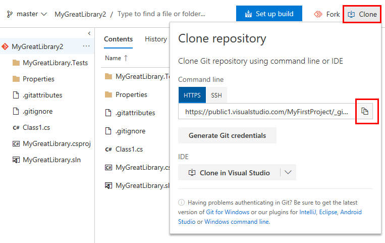
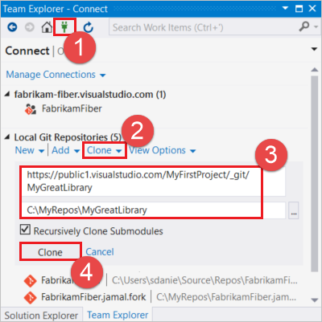

# Clone a Git repository in a public project

[!INCLUDE [temp](includes/version-public-projects.md)]

You can create a complete local copy of a Git repository from a public project by cloning it. 
Cloning a repo downloads all commits and branches in the repo and sets up a named relationship with the existing repo you cloned. If you are signed in as a member of the project, you can use this relationship to interact with the existing repo, pushing and pulling changes to share code with the public project team.

> [!NOTE]
> By default you have read-only access to the code in the repository. To perform operations such as forking, creating branches, and making pull requests, you must be [invited to contribute](invite-users-public.md). If you just want a copy of the code to review, instead of cloning you can [download the code](browse-code-public.md#download-code).

<a name="clone_url"></a>

## Get the clone URL of the Git repo

Before you can clone the repo from a public project, you'll need the clone URL.

1. To open a repository, choose **Repos>Files**.

	> [!div class="mx-imgBorder"]
	>  

2. Choose the repository you want to clone from the repository selector. 

	> [!div class="mx-imgBorder"]
	>  

3.  Choose **Clone**. In the Clone repository dialog, choose the  copy-clone icon to have the URL copied to your clipboard. Store it in a place where you can find it easily.

	> [!div class="mx-imgBorder"]
	> 

## Clone the repo to your local computer

> [!NOTE]
> The steps in this section show how to clone a public project Git repo in Visual Studio when you are not a member of the project. For instructions for cloning a public project Git repository when you are signed in to Visual Studio as a member of the public project, see [Clone a Git repo](../../repos/git/clone.md).

### Clone using Visual Studio and Team Explorer

1. In Team Explorer, (1) open up the **Connect** page by selecting the **Connect** icon. (2) Choose **Clone** under **Local Git Repositories**, (3) enter the clone URL, verify your local folder in which to clone, and (4) select the **Clone** button.

   

2. After cloning, you have a local Git repository containing the code of the repository you cloned. You can view and make local changes, but in order to push changes and make pull requests to the remote repository, you must be [invited to contribute](invite-users-public.md). 

### Clone using the command line

### Prerequisites

* Ensure you have installed the [Git command line package](https://git-scm.com/download) for your platform as well as the 
right [Git Credential Manager](../../repos/git/set-up-credential-managers.md) before continuing.

You'll need a clone URL to tell Git what repository you want to clone to your computer. Use the URL you copied earlier during the [previous step](#clone_url) in this article.

Pass this clone URL to `git clone` to make a local copy of the repo:

```
git clone https://dev.azure.com/public1/MyFirstProject/_git/MyGreatLibrary
```

`git clone` clones the repository from the URL in a folder under the current one. You can pass in a folder name after the URL to create the repo in a specific location, for example:

```
git clone https://dev.azure.com/public1/MyFirstProject/_git/MyGreatLibrary C:\Repos\MyGreatLibrary
```

## Related articles

* [Browse code, download code](browse-code-public.md)