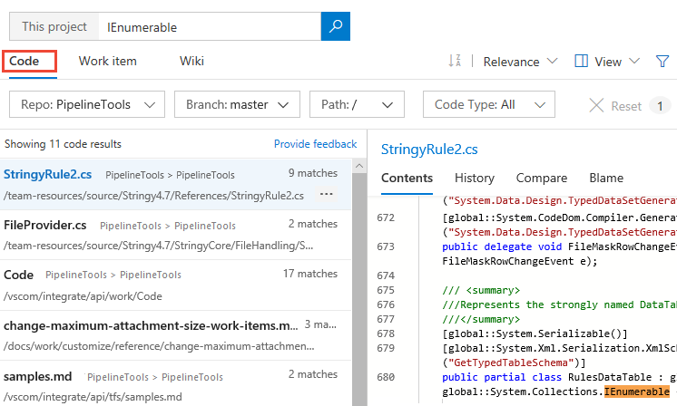
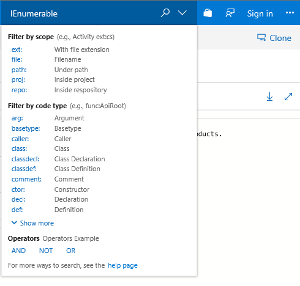
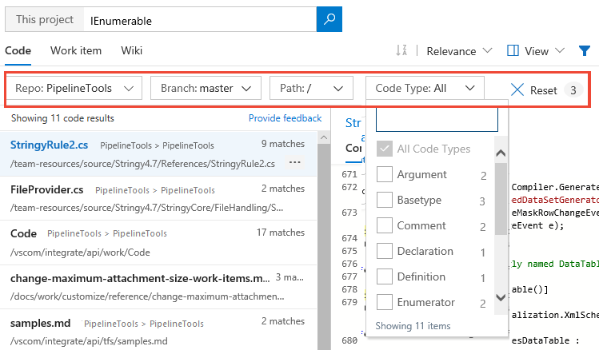
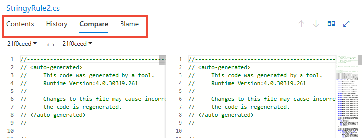

# Quickstart: Search the code base of a public project

[!INCLUDE [temp](includes/version-public-projects.md)]  

In this quickstart, you learn how to search the code base of a public projects. With code search, you can locate specific types of code and easily narrow or widen your search.

## Start a search

To start your search, choose **Repos > Files** or other page under **Repos**, enter a keyword or phrase in the search box, and press *Enter* or choose the  start search icon.

> [!div class="mx-imgBorder"]
> 

## View and work with search results  

1. The search page shows a list of the matching code files. The selected file has all
   instances of the search string highlighted. If you see a list of work items, ensure that **Code** is selected in the top left.

	> [!div class="mx-imgBorder"]  
	> 

2. Assemble more complex search strings using the operators and functions listed in the drop-down list. Select the filter function or code type you want to include in your search string, and then enter the criteria value.

	> [!div class="mx-imgBorder"]  
	> 

   * You can find all instances of "ToDo" comments in your code simply by selecting `comment:` and typing `todo`.

   * You can search in specific locations, such as within a particular path, by using a search string such as `Driver path:MyShuttle/Server`.

   * You can search for files by name, such as `Driver file:GreenCabs.cs`, or just by file extension. For example, the search string
    `error ext:resx` could be useful when you want to review all error strings in your code.
    But even if your plain text search string, without specific file type functions, matches part of a filename, the file appears in the list of found files.

   * You can combine two or more words by using Boolean operators; for example, `validate OR release`.

   * You can find an exact match to a set of words by enclosing your search terms in double-quotes. For example, `"Client not found"`.

   * You can use the code type search functions with files written in C#, C, C++, Java, and Visual Basic.NET.

## Fine-tune your search

1. Narrow your search to a specific repo, branch, file path, or code type by selecting from the drop-down lists at the top of the page.

	> [!div class="mx-imgBorder"]  
	> 

2. Use the tabs in the results page to view the **History** of the file or to **Compare** versions of the file. Choose **Blame** to view the last commit, person, and date to modify the file.

   > [!div class="mx-imgBorder"]  
   > 
   > 
   > Open the search results in a new browser tab from either search box by
   > pressing _Ctrl_ + _Enter_ or by holding _Ctrl_ and clicking  the
   >  icon.
   > In Google Chrome, press _Ctrl_ + _Shift_ + _Enter_ to switch the focus
   > to the new browser tab.

3. Choose the filename link at the top of this column to open the file in a new Code Explorer window.

	> [!div class="mx-imgBorder"]  
	> 

## Next steps

> [!div class="nextstepaction"]
> [Search work items](work-item-search-public.md)

