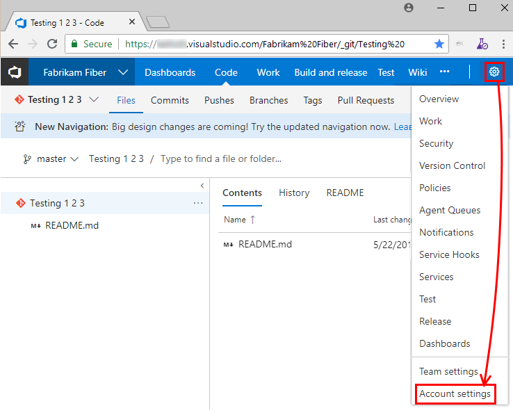
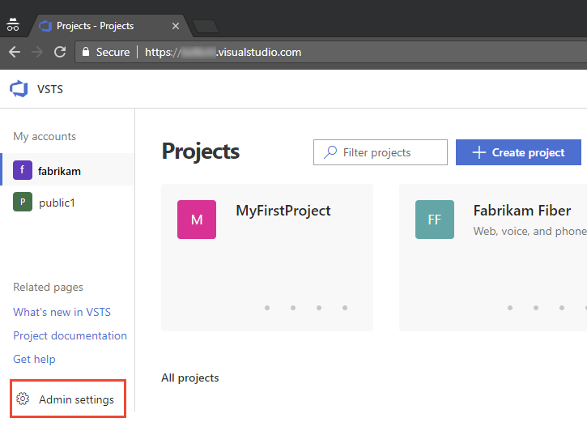

<a id="invite-others" />

# Invite users to contribute to your public project

To enable users to contribute to your project, you must add them as a member. Before you do so, review the notes provided in [Private-to-public migration checklist](migration-checklist.md).

## Open Settings>Users hub

[!INCLUDE [temp](_shared/navigation.md)] 

# [Horizontal navigation](#tab/horizontal)

0. From your web browser, sign-in to VSTS. You must be signed in to create a public project. You also must be the owner, belong to the Project Collection Administrators security group, or have been granted the necessary permissions to manage users.  

0. Choose the  gear icon to open **Account Settings**.

	> [!div class="mx-imgBorder"]  
	>  

0. Then, choose **Users** to open **Manage users**. Choose **Add new users** to open the dialog.

	> [!div class="mx-imgBorder"]  
	> 

# [Vertical navigation](#tab/vertical)

0. From your web browser, sign-in to VSTS. You must be signed in to create a public project. 

0. Choose the  VSTS icon to open **Projects**. Then choose **Admin settings**. 

	> [!div class="mx-imgBorder"]  
	>   

0. Then, choose **Users** to open **Manage users**. Choose **Add new users** to open the dialog.

	> [!div class="mx-imgBorder"]  
	> 

---

## Add user accounts to a project

0. Fill out the form based on the guidance provided.

	> [!div class="mx-imgBorder"]  
	> 

	> [!NOTE]
 	> You must add email addresses for
 	> ["personal" Microsoft accounts](https://www.microsoft.com/account). If your users don't have Microsoft accounts,
	> have them [sign up](https://signup.live.com/).
 	> Alternatively, you can use [Azure Active Directory (Azure AD)](../../accounts/connect-account-to-aad.md) 
	> to authenticate users and control account access.

	- **Users**: Enter the email address (Microsoft account address) for the user account. You can add several email addresses by separating them with a semicolon (;). Note that the email addresses display in red when they are accepted.
	- **Access level**: Leave the Access level at **Basic** for those users who will contribute to the code base. You can add up to 5 users (total including your user account) with *Basic* access. Otherwise, you can add an unlimited number of users with *Stakeholder* access. To learn more, see [About access levels](../security/access-levels.md).
	- **Add to projects**: Select the public project that you created, or select **Add All** to add the user to all projects defined for the organization.  
	- **VSTS Groups**: Leave this entry at Project Contributors, the default security group for people who will contribute to your project. To learn more, see [Default permissions and access assignments](../security/permissions-access.md).

5. When done, choose **Add** to complete your invitation.

<!---
## Add members to your public project from your project page 

 Are admins able to add new users from this page, or only users who have been previously added to the organization?  

0. Add members from your project page.   
	> [!div class="mx-imgBorder"]  
	> 

0. Fill out the form. 
	> [!div class="mx-imgBorder"]  
	> 
-->

## Try this next
> [!div class="nextstepaction"]
> [Clone an existing Git repo](clone-git-repo-public.md)