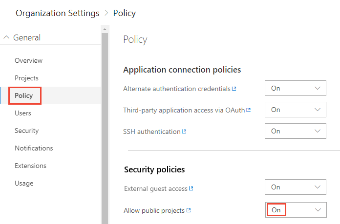
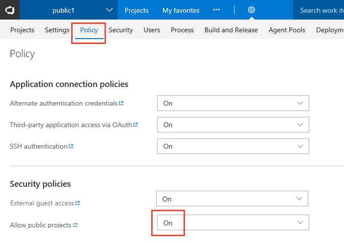
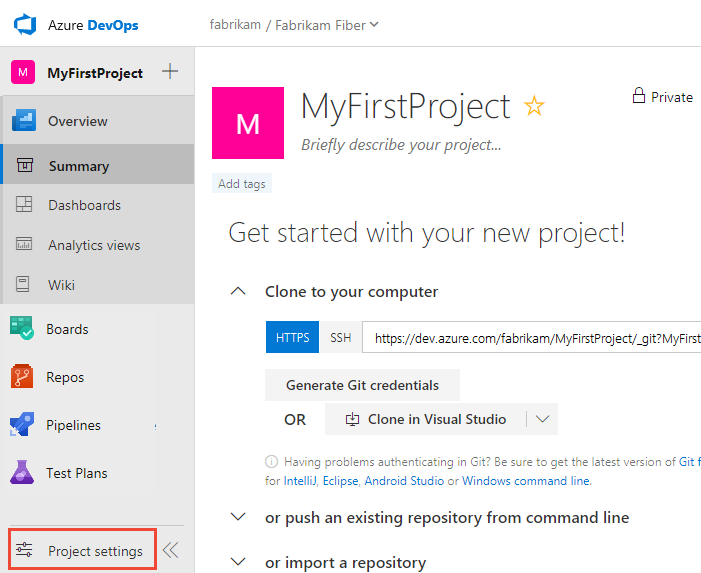
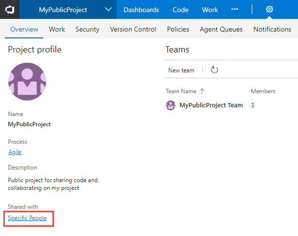
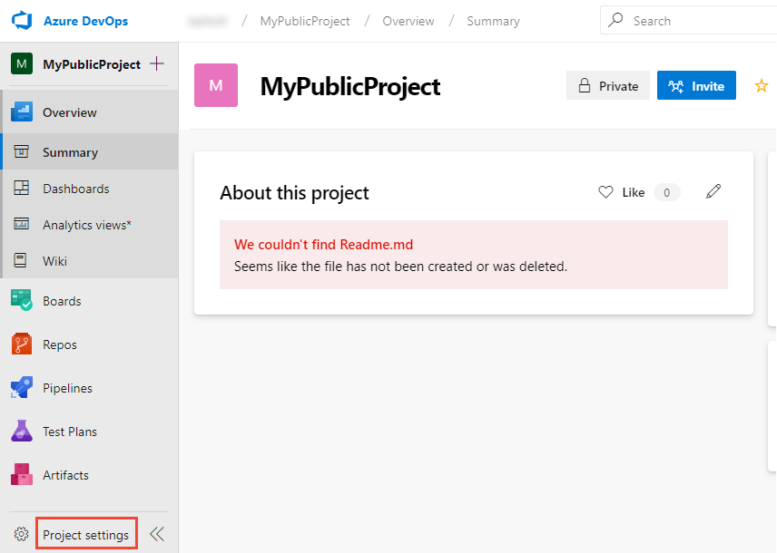

# Change the project visibility, public or private

[!INCLUDE [temp](_shared/version-public-projects.md)]  

You can easily switch a private project to a public project, and vice-versa.  Before you do so, review the notes provided in [Private-to-public migration checklist](migration-checklist.md).

> [!TIP]  
> Look through our [migration checklist](migration-checklist.md) before you make an existing project public.
> It has tips and ideas for exposing a limited set of data, in case you don't want your entire history available.

## Prerequisites

- You must have an Azure DevOps organization created. If you don't have one, [do that now](../../user-guide/sign-up-invite-teammates.md).   
- As an Azure DevOps organization owner, you can change policies and change project information. If you're not the owner, then you must be [a member of the Project Collection Administrators Group](../security/set-project-collection-level-permissions.md#collection-level).

## Enable anonymous access to projects for your organization

Before you can change a private project, to a public project, you must enable anonymous access for your organization. 

[!INCLUDE [temp](../../_shared/new-navigation.md)] 

# [New navigation](#tab/new-nav)

0. From your web browser, sign-in to Azure DevOps. You must be signed in to create a public project. 

0. Choose the  Azure DevOps logo to open **Projects**. Then choose **Admin settings**. 

	> [!div class="mx-imgBorder"]  
	>   

0. Choose the **Policy** page, and select **On** for **Allow public projects**.     

	> [!div class="mx-imgBorder"]  
	>  

# [Previous navigation](#tab/previous-nav)

0. From your web browser, sign-in to Azure DevOps. You must be signed in to create a public project. 

0. Choose the  gear icon to open **Account Settings**.

	> [!div class="mx-imgBorder"]  
	>  

0. Choose the **Policy** page, and select **On** for **Allow public projects**.     

	> [!div class="mx-imgBorder"]  
	>   

---

## Make a private project public 

# [New navigation](#tab/new-nav)

0. Choose **Project Settings** in the sidebar.

	> [!div class="mx-imgBorder"]  
	>   

0. Choose **Overview**, and then **Edit** for **Privacy**.     

	> [!div class="mx-imgBorder"]  
	>  

0. To switch from private to public, choose the **Public** icon.   

	> [!div class="mx-imgBorder"]  
	>   

0. Review the information provided, and choose **Change** to confirm your action.    

	> [!div class="mx-imgBorder"]  
	>   

# [Previous navigation](#tab/previous-nav)

0. To open the project admin context, choose the  gear icon. 

0. Choose the **Specific People** link. 

	> [!div class="mx-imgBorder"]  
	>  

0. To switch from private to public, choose the **Public** icon.   

	> [!div class="mx-imgBorder"]  
	>   

0. Review the information provided, and choose **Change** to confirm your action.    

	> [!div class="mx-imgBorder"]  
	>   

---

## Make a public project private 

# [New navigation](#tab/new-nav)

0. Choose **Project Settings**.

	> [!div class="mx-imgBorder"]  
	>   

0. Choose **Overview** page, and then **Edit** for **Privacy**.     

	> [!div class="mx-imgBorder"]  
	>  

0. To switch from public to private, choose the **Private** icon.   

	> [!div class="mx-imgBorder"]  
	>   

0. Choose **Change** to confirm your action.    

	> [!div class="mx-imgBorder"]  
	>   

# [Previous navigation](#tab/previous-nav)

0. Choose the  gear icon to open the project admin context. 

0. Choose the **Public** link. 

	> [!div class="mx-imgBorder"]  
	>  

0. To switch from public to private, choose the **Private** icon.   

	> [!div class="mx-imgBorder"]  
	>   

0. Choose **Change** to confirm your action.    

	> [!div class="mx-imgBorder"]  
	>   

---

## Try this next

> [!div class="nextstepaction"]
> [Download code](browse-code-public.md) 

## Related articles 

- [Private-to-public migration checklist](migration-checklist.md)
- [Feature differences for non-members](feature-differences.md)
- [Default roles and permissions](default-roles-access-public.md) 