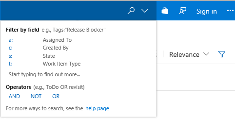

# Search for work items defined in a public project

[!INCLUDE [temp](_shared/version-public-projects.md)]  

With work item search, you can quickly find work items defined within a public project. 

## Initiate a search 

[!INCLUDE [temp](../../_shared/new-navigation.md)] 

# [New navigation](#tab/new-nav)

0. Choose **Work>Work Items**, enter a keyword or phrase in the search box, and press *Enter* or choose the  start search icon. 

	> [!div class="mx-imgBorder"]
	>     

0. Search results are displayed in a snippet view where the matches found are shown in bold.

   

   This is a full text search that uses simple search strings for words or phrases.
   Work item search matches derived forms of your search terms; for example, a search for
   "updating" will also find instances of the word "updated" and "update". Note that searches are _not_ case-sensitive.

0. Select a snippet of a work item to display it in the right window. 
  
   >Open the search results in a new browser tab from a search box by
   pressing _Ctrl_ + _Enter_ or by holding _Ctrl_ and clicking  the
    icon.
   In Google Chrome, press _Ctrl_ + _Shift_ + _Enter_ to switch the focus
   to the new browser tab. 

# [Previous navigation](#tab/previous-nav)  

1. In the search box, check that the text says _Search work items_. If it doesn't, use the selector to select it.

       

1. Enter a search string in the text box, and press _Enter_ (or choose the 
    icon) to start your search. 

1. Search results are displayed in a snippet view where the matches found are shown in bold.

   

   This is a full text search that uses simple search strings for words or phrases.
   Work item search matches derived forms of your search terms; for example, a search for
   "updating" will also find instances of the word "updated" and "update". Note that searches are _not_ case-sensitive.

1. Select a snippet of a work item to display it in the right window. 
  
   >Open the search results in a new browser tab from a search box by
   pressing _Ctrl_ + _Enter_ or by holding _Ctrl_ and clicking  the
    icon.
   In Google Chrome, press _Ctrl_ + _Shift_ + _Enter_ to switch the focus
   to the new browser tab. 

--- 

## Fine tune your search

# [New navigation](#tab/new-nav)

1. Fine tune your search by specifying the fields to search. Enter `a:` and a user name
   to search for all items assigned to that user.

	> [!div class="mx-imgBorder"]  
	>     

   The quick filters you can use are:

   * `a:` for **Assigned to:** 
   * `c:` for **Created by:** 
   * `s:` for **State** 
   * `t:` for **Work item type**

 
1. Start typing the name of a field in your work items; for example, type `ta`.

       

   The dropdown list shows work item field name suggestions 
   that match user input thereby helping the user to complete the search faster. For example, a search such as 
   **tags:Critical** finds all work items tagged 'Critical'. 

1. Add more filters to further narrow your search, and use Boolean operators
   to combine terms if required. For example, 
   **a: Chris t: Bug s: Active** finds all active bugs assigned
   to a user named Chris.

1. Narrow your search to specific types
   and states, by using the drop-down selector lists at the top of the results page.

# [Previous navigation](#tab/previous-nav)  

1. Fine tune your search by specifying the fields to search. Enter `a:` and a user name
   to search for all items assigned to that user.

	> [!div class="mx-imgBorder"]  
	>     

   The quick filters you can use are:

   * `a:` for **Assigned to:** 
   * `c:` for **Created by:** 
   * `s:` for **State** 
   * `t:` for **Work item type**

 
1. Start typing the name of a field in your work items; for example, type `ta`.

       

   The dropdown list shows work item field name suggestions 
   that match user input thereby helping the user to complete the search faster. For example, a search such as 
   **tags:Critical** finds all work items tagged 'Critical'. 

1. Add more filters to further narrow your search, and use Boolean operators
   to combine terms if required. For example, 
   **a: Chris t: Bug s: Active** finds all active bugs assigned
   to a user named Chris.

1. Narrow your search to specific types
   and states, by using the drop-down selector lists at the top of the results page.

---

## Related articles

- [Search the code base](code-search-public.md) 

