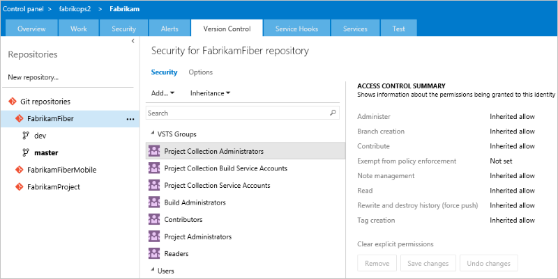

# Git permissions prior to TFS 2017 Update 1

[!INCLUDE [version-tfs-2013-2017](../../includes/version-tfs-2013-2017.md)]

In TFS 2017 Update 1 (and Azure DevOps), Git repository permissions have changed.
For those customers using previous versions of TFS, here are the old permissions.
Those using TFS 2017 Update 1 or Azure DevOps should see the [latest list of permissions](permissions.md#git-repository).

These permissions appear only for a project including a Git repository.

> [!div class="mx-imgBorder"]  
>   

Set permissions across all Git repositories by making changes to the top-level **Git repositories** entry.  

Individual repositories inherit permissions from the top-level **Git Repositories** entry.     

Branches inherit permissions from assignments made at the repository level.   

By default, the project level Readers groups have only Read permissions.

<table valign="top" width="100%">
<tbody valign="top">
	<tr>
		<th width="30%">Permission</th>
		<th width="70%">Description</th>
	</tr>
	<tr>
		<td id="git-administer-permission">Administer</td>
		<td>
            Can rename and delete the repository. If assigned to the top-level <strong>Git repositories</strong> entry, can add additional repositories.
			  
			At the branch level, users can set permissions for the branch and unlock the branch.
			<blockquote>
				<b>TFS 2013, TFS 2015</b>: The Administer permission set on a individual Git repository does not grant the ability to rename or delete the repository. These tasks require
                Administer permissions at the top-level <strong>Git repositories</strong> entry. 
			</blockquote>
		</td>
	</tr>
	<tr>
		<td id="git-branch-creation-permission">Branch Creation</td>
		<td>
			Can create and publish branches in the repository. 
			Lack of this permission does not limit users from creating branches in their local repository;
			it merely prevents them from publishing local branches to the server. 
			When a user creates a new branch on the server,
			they have Administer, Contribute, and Force permissions for that branch by default.
		</td>
	</tr>
	<tr>
		<td id="git-contribute-permission">Contribute</td>
		<td>
            At the repository level, can push their changes to branches in the repository. Does not override restrictions in place from <a href="../../repos/git/branch-policies.md" data-raw-source="[branch policies](../../repos/git/branch-policies.md)">branch policies</a>. 
			At the branch level, can push their changes to the branch and lock the branch.
		</td>
	</tr>
	<tr>
		<td id="git-note-management-permission">Note Management</td>
		<td>
			Can push and edit Git notes to the repository.
			They can also remove notes from items if they have the Force permission.
		</td>
	</tr>
	<tr>
		<td id="git-read-permission">Read</td>
		<td>
			Can clone, fetch, pull, and explore the contents of the repository.
		</td>
	</tr>
	<tr>
		<td id="git-rewrite-and-destroy-history-permission">Rewrite and destroy history (force push)</td>
		<td>
			Can force an update to a branch and delete a branch. A force update can overwrite commits added from any user.  
			Users with this permission can modify the commit history of a branch.
		</td>
	</tr>
	<tr>
		<td id="git-tag-creation-permission">Tag Creation</td>
		<td>
			Can push tags to the repository,
			and can also edit or remove tags if they have the Force permission.
		</td>
	</tr>
</tbody>
</table>
