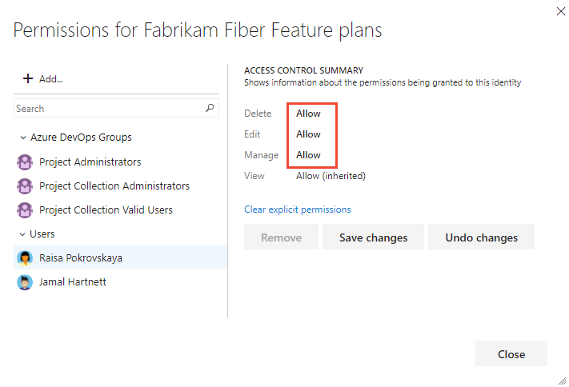
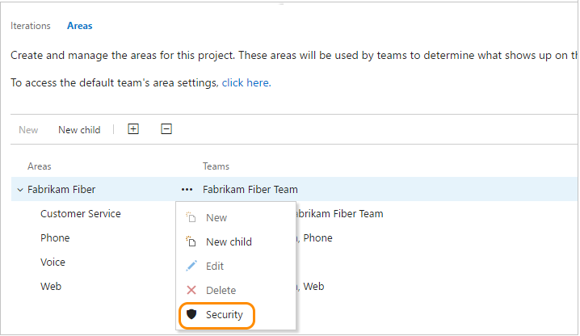
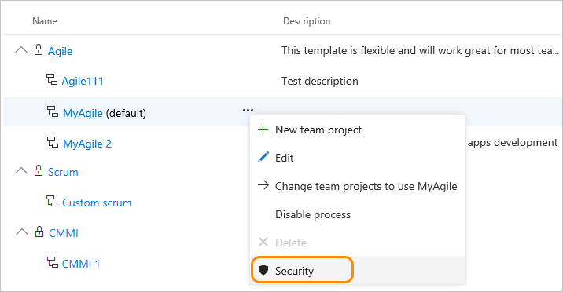
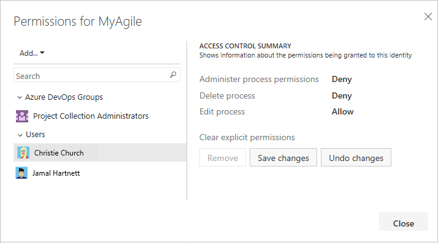

# Set permissions and access for work tracking

[!INCLUDE [temp](../../_shared/version-vsts-tfs-all-versions.md)]

You grant or restrict access to various work tracking features by granting users or groups specific permissions for an object, project, or collection. Or, when you assign a user as a team administrator, they have permissions to manage all assets for the specific team. Add users to the Contributors group to provide access to most features as listed in [Permissions and access for work tracking](permissions-access-work-tracking.md). 

> [!NOTE]   
> For public projects, Stakeholder access gives users greater access to work tracking features and full access to Azure Pipelines. To learn more, see [About access levels, Stakeholder access](access-levels.md#stakeholder-access).

> [!div class="mx-tdBreakAll"]
> | Role or permission level | Functional areas set  |
> |-----------------------|-----------------------------------|
> |**Team administrator role** | - [Manage teams and configure team tools](../settings/manage-teams.md) - [Define and edit team dashboards](../../report/dashboards/dashboards.md) - [Add and manage team-level work item templates](../../boards/backlogs/work-item-template.md) - [Add team administrators](../settings/add-team-administrator.md)|
> |**Object-level permissions** |- [Modify work items under an area path](#set-permissions-area-path) - [Create and edit nodes under an area path or iteration path](#set-permissions-area-path) - [Define and edit queries or query folders](#work-item-queries) - [Define and edit Delivery Plans](#plan-permissions) | 
> |**Project-level permissions** |- [Create work item tags](../../boards/queries/add-tags-to-work-items.md) - [Delete and restore work items](../../boards/backlogs/remove-delete-work-items.md) - [Move work items out of a project](#move-delete-permissions) - [Permanently delete work items](#move-delete-permissions) - [Delete test artifacts](#delete-test-permissions) - Edit shared work item queries - Add teams and team administrators - Create and manage area and iteration paths - Edit project-level permissions - Customize a project (On-premises XML  or Hosted process models) | 
> |**Project collection-level permissions** | - Create, delete, or edit a process (Inheritance process model, Azure DevOps only) - Delete field from account(Inheritance process model, Azure DevOps only) - Manage process permissions (Inheritance process model, Azure DevOps only) - Edit collection level permissions | 

Project collection-level permissions include all permissions you can set at the project-level.

To add a user to the team administrator role, see [Add a team administrator](../../organizations/settings/add-team-administrator.md). 

## Edit project-level or collection-level/instance-level information

The **Edit project-level information** and **Edit instance-level information** (also referred to as Edit collection-level information) provide permissions to several work tracking features as summarized below. To add users or set permissions at these levels, see [Add administrators, set permissions at the project-level or project collection-level](set-project-collection-level-permissions.md).

> [!div class="mx-tdBreakAll"]
> | Edit project-level information | Edit instance-level information  |
> |-----------------------|-----------------------------------|
> - Add and administer teams and all team-related features - Create and modify areas and iterations - Edit shared work item queries - Edit project level permission ACLs - Manage process templates - Customize a project  - Create and modify global lists - Edit event subscriptions (email or SOAP) on project level events.|- Add and administer teams and all team-related features - Create and modify areas and iterations - Edit check-in policies - Edit shared work item queries - Edit project level and collection level permission ACLs - Manage process templates - Customize a project or process - Create and modify global lists - Edit event subscriptions (email or SOAP) on project or collection level events. |

<a name="set-permissions-area-path" /> 

## Create child nodes, modify work items under an area path   

Area path permissions let you grant or restrict access to edit or modify work items, test cases, or test plans assigned to those areas. You can restrict access to users or groups. You can also set permissions for who can add or modify areas or iterations for the project.  

[!INCLUDE [temp](../../_shared/new-navigation.md)]  

# [New navigation](#tab/new-nav)

::: moniker range="vsts"  
You define both areas and iterations for a project from the **Project Settings>Work>Project configuration**. 

0. Choose (1) **Project Settings**, expand **Work** if needed, and choose (2) **Project configuration** and then (3) **Areas**.   

	> [!div class="mx-imgBorder"]  
	>    

0. Choose the ... context menu for the node you want to manage and select **Security**.  
	
	

0. Select the group or team member, and then change the permission settings. If you don't see the group you want, try adding it first. 

	For example, here we've added the Disallow Access Group, and disallowed members of this group the ability to view, modify, or edit work items in the Customer Service area path.

	  
	
	You can specify two explicit authorization states for permissions: **Deny** and **Allow**. In addition, permissions can exist in one of three additional states.  To learn more, see [About permissions and groups](about-permissions.md). 

::: moniker-end

::: moniker range=">= tfs-2013 <= tfs-2018"  
[!INCLUDE [temp](../../_shared/new-navigation-not-supported.md)]   
::: moniker-end

# [Previous navigation](#tab/previous-nav) 

::: moniker range=">= tfs-2017"  

1. From the web portal for the project, choose the  gear icon.   
	::: moniker range=">= tfs-2017"
	> [!div class="mx-imgBorder"]  
	> 

	If you're currently working from a team context, then hover over the  and choose **Project settings**.  

	> [!div class="mx-imgBorder"]
	> 
	::: moniker-end  

2. Choose **Work** and then **Areas**.  

0. Choose the ... context menu for the node you want to manage and select **Security**.  
	
	

::: moniker-end   

::: moniker range=">= tfs-2013 <= tfs-2015"  

0. From the web portal, choose the  gear icon to open project administration pages. Then choose **Areas**. 

	

0. Choose the context menu for the node you want to manage.  
	
	  

::: moniker-end

0. Select the group or team member, and then change the permission settings. If you don't see the group you want, try adding it first. 

	For example, here we've added the Disallow Access Group, and disallowed members of this group the ability to view, modify, or edit work items in the Customer Service area path.

	  
	
	You can specify two explicit authorization states for permissions: **Deny** and **Allow**. In addition, permissions can exist in one of three additional states.  To learn more, see [About permissions and groups](about-permissions.md). 

<!--- --> 

---

## Define and edit queries or query folders

You can specify who can add or edit query folders or queries at the object-level. See [Set permissions on a shared query or query folder](../../organizations/security/set-permissions-access-work-tracking.md) to restrict who can modify the query or queries within a folder.

To learn more about queries, see [Create managed queries to list, update, or chart work items](../../boards/queries/example-queries.md).

::: moniker range=">= tfs-2017"

## Manage or edit Delivery Plans 

Plans are an object within a project. You manage plan permissions for each plan similar to the way you [manage permissions for shared queries or query folders](../../boards/queries/set-query-permissions.md). The creator of a Delivery Plan as well as all members of the Project Collection Administrators and Project Administrators groups have permissions to edit, manage, and delete plans. 

To learn more about Delivery Plans, see [Review team delivery plans](../../boards/plans/review-team-plans.md).
::: moniker-end
::: moniker range="tfs-2017"
> [!NOTE]  
> **Feature availability**: Delivery plans are available for TFS 2017.2 and later versions, you can access plans by installing the [Delivery Plans Marketplace extension](https://marketplace.visualstudio.com/items?itemName=ms.vss-plans).
::: moniker-end

::: moniker range=">= tfs-2017"  
0. Open **Work>Plans**. For details, see [Review team delivery plans](../../boards/plans/review-team-plans.md).  

0. To grant permissions to a group or user to manage or edit a specific plan, choose the  actions icon to open the **Security** dialog for the plan.  

	> [!div class="mx-imgBorder"]  
	>      

0. Add a user or group who you want to grant permissions to or restrict access. By default, non-administrators can't delete or edit a plan that you create. 

0. With the user or group selected, set the permission you want them to have to **Allow**. 

	For example, here we grant permission to Raisa to edit the plan.

	> [!div class="mx-imgBorder"]  
	> 

::: moniker-end  

::: moniker range="vsts"  
## Move or permanently delete work items 

By default, Project Administrators and Contributors can change the work item type and delete work items by moving them to the Recycle bin. Only Project Administrators can permanently delete work items and test artifacts. Project admins can grant permissions to other team members as needed. 

For example, as a project admin you can grant a user, team group, or other group you've created to have these permissions. Open the Security page for the project and choose the user or group you want to grant permissions. (To learn how to access project-level **Security**, see [Set permissions at the project-level or project collection-level](set-project-collection-level-permissions.md).)

In this example, we grant members assigned to the team administrator role, who belong to the Team Admin groups, permissions to move work items to another project and to permanently delete work items.   

> [!div class="mx-imgBorder"]  
>   

::: moniker-end  

## Delete test artifacts
  
In addition to the project-level permissions set in the previous section, team members need permissions to manage test artifacts which are set for an area path. 

[Open the **Security** page for area paths](#set-permissions-area-path) and choose the user or group you want to grant permissions. 

  

Set the permissions for **Manage test plans** and **Manage test suites** to **Allow**.  

  

To have full access to the Test feature set, your [access level must be set to Advanced](change-access-levels.md). Users with Basic access and with permissions to permanently delete work items and manage test artifacts can only delete orphaned test cases. 
 
::: moniker range="vsts"

## Customize an inherited process 

By default, only Project Collection Administrators can create and edit processes. However, these admins can grant permissions to other team members by explicitly setting the **Create process**, **Delete process**, or **Edit process** permissions at the collection level for a specific user. 

To customize a process, you need to grant **Edit process**  permissions to a user account for the specific process. 

1. Open the &hellip; context menu for the inherited process and choose **Security**.  To open this page, see [Customize a project using an inherited process](../settings/work/customize-process.md).   

	  

2. Add the account name of the person you want to grant permissions to, set the permissions to **Allow** that you want them to have, and then choose **Save changes**. 

	Here we add Christie Church and allow her to edit the process.  
 
	    

>[!NOTE]  	  
> Each process is a securable unit and has individual access control lists (ACLs) that govern creating, editing, and deleting inherited processes.  At the collection level, project collection administrators can choose which processes can be inherited from and by whom. When you create a new inherited process, the process creator as well as project collection administrators have full control of the process and can also set individual ACLs for other users and groups to edit and delete the process.

::: moniker-end

## Additional options for restricting access to work items   

> [!NOTE]   
> You can use one or more of the following options with the Hosted XML or On-premises XML process models. To learn more about process models, see [Customize work tracking experience](../../reference/customize-work.md).  

You can restrict access to work tracking objects in one of two ways:

-   By [adding WITs to the Hidden Categories group](../../reference/xml/use-categories-to-group-work-item-types.md), you can prevent the majority of project contributors from creating them. You [can create a hyperlink to a template](../../boards/backlogs/work-item-template.md) that opens the work item form and share that link with those team members who you do want to create them. 
-   [Set a condition field rule](../../reference/xml/apply-rule-work-item-field.md), [a condition-based field rule](../../reference/xml/assign-conditional-based-values-and-rules.md) or a combination of the two that applies to a group. You can restrict changes from being made to a field by specifying a qualifying rule and making it apply for a specific group. Conditional rules can include **CANNOTLOSEVALUE**, **EMPTY**, **FROZEN**, **NOTSAMEAS**, **READONLY**, and **REQUIRED** elements. 

For more information about how to customize WITs, 
see [Modify or add a custom work item type (WIT)](../../reference/add-modify-wit.md).

## Related articles 

*	[Set permissions on queries and query folders](../../boards/queries/set-query-permissions.md)  
*	[Permissions and access for work tracking](permissions-access-work-tracking.md) 
*	[Permissions and groups reference](permissions.md) 
