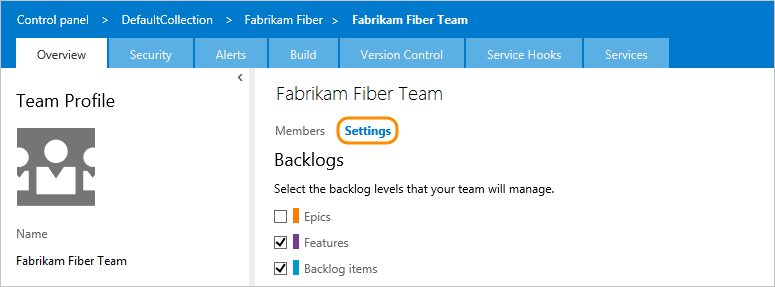

# Select backlog navigation levels for your team

[!INCLUDE [temp](../../boards/includes/version-vsts-tfs-2015-on.md)]  

Each team can determine the backlog levels that they use. For example, feature teams may want to only focus on their product backlog, while a management team may choose to only show feature and epics (the two default portfolio backlogs). You configure which backlog levels appear from your team settings dialog. 

::: moniker range="azure-devops" 
If you want additional portfolio backlogs, see the following topics based on the process model you use: 
- **Inheritance**: [Customize your backlogs or boards for a process](work/customize-process-backlogs-boards.md)  
- **Hosted XML**: [Add portfolio backlogs](../../reference/add-portfolio-backlogs.md).  

For an overview of process models, see [Customize your work tracking experience](../../reference/customize-work.md).

::: moniker-end

::: moniker range="tfs-2015 <= tfs-2018" 
If you want additional portfolio backlogs, see [Add portfolio backlogs](../../reference/add-portfolio-backlogs.md).  
::: moniker-end

::: moniker range="tfs-2015" 
> [!NOTE]    
> **Feature availability**: The team setting for choosing which backlog levels is available for TFS 2015 and later versions. For TFS 2013, the Feature portfolio backlog level is enabled for all teams.  
::: moniker-end

[!INCLUDE [temp](includes/prerequisites-team-settings.md)]

## Set your team's preferences for backlog levels

Because this setting affects all team members' view of the team backlogs and boards, you must be a team administrator to change the setting. Changing the setting is disabled if you're not a team administrator. Go [here to get added as a team administrator](add-team-administrator.md).

You can change the setting from a backlog or board view. Here we show how to change it from the board view.

::: moniker range=">= azure-devops-2019" 

1.  [Open your Kanban board](../../boards/boards/kanban-quickstart.md). If you're not a team admin, [get added as one](add-team-administrator.md). Only team and project admins can customize the Kanban board.

2. Choose the  gear icon to configure the board and set general team settings.  

	> [!div class="mx-imgBorder"]
	>   

4. Choose **Backlogs** and check the boxes of those backlog levels you want your team to manage. 

	  

5. When done with your changes, choose **Save and close**.  

6. To see the changes, open or refresh your team's [backlog](../../boards/backlogs/create-your-backlog.md). 

::: moniker-end  

::: moniker range=">= tfs-2017 <= tfs-2018" 

1. [Open your Kanban board](../../boards/boards/kanban-quickstart.md). If you're not a team admin, [get added as one](add-team-administrator.md). Only team and project admins can customize the Kanban board.

1. Choose the  gear icon to open the  settings dialog.  

	> [!div class="mx-imgBorder"]
	>   

2. Choose **Backlogs** and check the boxes of those backlog levels you want your team to manage. 

	  

3. When done with your changes, choose **Save**.  

4. To see the changes, open or refresh your team's [backlog](../../boards/backlogs/create-your-backlog.md). 

::: moniker-end

::: moniker range="tfs-2015" 

Requires TFS 2015.1 or later version. 

1. From your web portal, choose the  gear icon to open the administration page. 

	  

1. From **Overview**, choose the team whose settings you want to configure, and then choose **Settings**. 

2. Check the boxes of those backlog levels you want your team to manage. 

	  

3. To see the changes, open or refresh your team's [backlog](../../boards/backlogs/create-your-backlog.md). 

::: moniker-end

## Related articles

- [Get started with Agile tools to plan and track work](../../boards/get-started/what-is-azure-boards.md)
- [Backlogs, boards, and plans](../../boards/backlogs/backlogs-boards-plans.md)
- [Create your backlog](../../boards/backlogs/create-your-backlog.md)  
- [Define features and epics](../../boards/backlogs/define-features-epics.md)
- [Organize your backlog](../../boards/backlogs/organize-backlog.md)   

