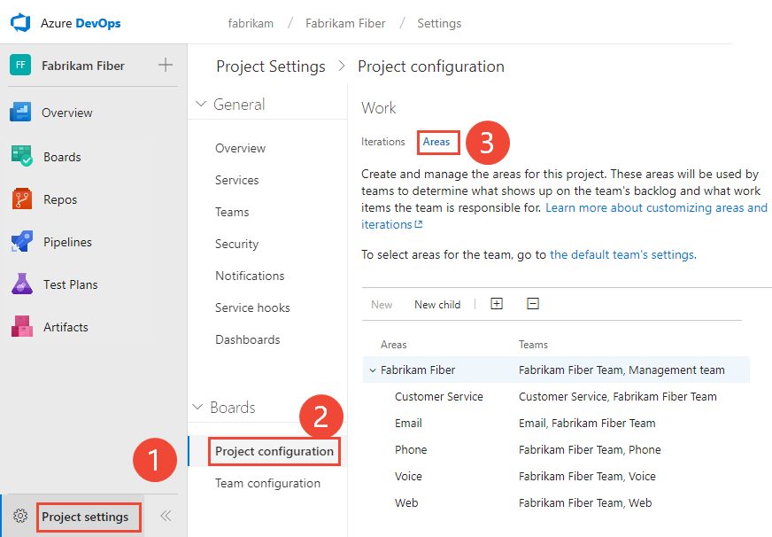
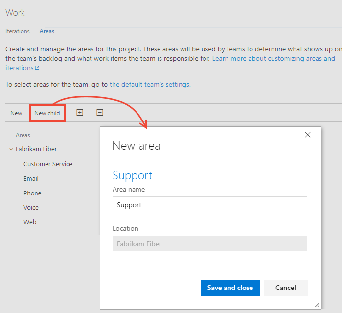
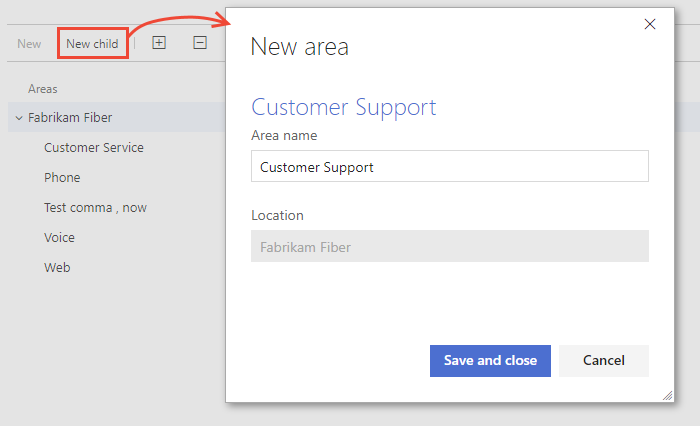
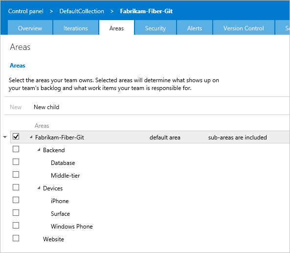
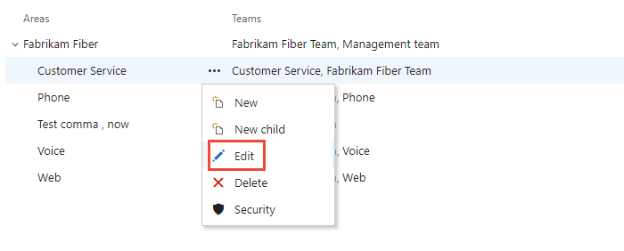

# Define area paths  

[!INCLUDE [temp](../../_shared/version-vsts-tfs-all-versions.md)]

Newly created projects contain a single, root area that corresponds to the project name. You add area paths under this root. You add area paths to support teams and queries based on work items that belong to different areas of the product. To understand how the system uses area paths, see [About area and iteration paths](about-areas-iterations.md). 

## Prerequisites

::: moniker range="vsts"
* You must be a member of a project. If you don't have a project yet, [create one](../projects/create-project.md). If you haven't been added as a team member, [get added now](../../accounts/add-account-users-assign-access-levels.md). 
::: moniker-end
::: moniker range=">= tfs-2013 <= tfs-2018"
* You must be a member of a project. If you don't have a project yet,[create one](../projects/create-project.md). If you haven't been added as a team member, [get added now](../security/add-users-team-project.md). 
::: moniker-end
* To create or modify areas or iterations, you must either be a member of the **Project Administrators** group, or your **Create and order child nodes**, **Delete this node**, and **Edit this node** permissions must be set to **Allow** for the area or iteration node that you want to modify.

	If you aren't a project administrator, [get added as one](../security/set-project-collection-level-permissions.md) or have someone provide you with explicit permissions to **Edit project-level information**.   

For naming restrictions on area and iteration paths, see [About areas and iterations, Naming restrictions](about-areas-iterations.md#name-restrictions).

<a id="admin-intro-team-services" /> 

## Open Project Settings, Project configuration    

From the web portal, open **Project Settings**.

[!INCLUDE [temp](../../_shared/new-navigation.md)]  

# [New navigation](#tab/new-nav)

::: moniker range="vsts"  
You define both areas and iterations for a project from the **Project Settings>Work>Project configuration**. 

0. Choose (1) **Project Settings**, expand **Work** if needed, and choose (2) **Project configuration** and then (3) **Areas**.   

	> [!div class="mx-imgBorder"]  
	>    

::: moniker-end

::: moniker range=">= tfs-2013 <= tfs-2018"  
[!INCLUDE [temp](../../_shared/new-navigation-not-supported.md)]   
::: moniker-end

# [Previous navigation](#tab/previous-nav) 

You define both areas and iterations from the **Work** pages of the project admin context. From the user context, you open the admin context by choosing the  gear icon. 

<a id="admin-intro-team-services" /> 
::: moniker range=">= tfs-2017"  

1. From the web portal for the project, choose the  gear icon.   
	::: moniker range=">= tfs-2017"
	> [!div class="mx-imgBorder"]  
	> 

	If you're currently working from a team context, then hover over the  and choose **Project settings**.  

	> [!div class="mx-imgBorder"]
	> 
	::: moniker-end  

2. Choose **Work**.  

::: moniker-end   
<a id="admin-intro-tfs-2015" />
::: moniker range=">= tfs-2013 <= tfs-2015"  

1. From the web portal, choose the  gear icon to open project administration pages. Then choose **Areas**. 

	

::: moniker-end

---

<a id="tfs-15-area-paths" />
## Add an area path 

If you haven't added any areas or teams, you'll see that only one area is defined. You add area paths under the root area path for the project, or as a child to another area path.  
::: moniker range=">= tfs-2018"  
> [!div class="mx-imgBorder"]  
> 

* To add a child node, highlight the area path and then choose **New child**. Optionally, you can open the  context menu for the area path and choose **New child**.   

	Enter a name (255 characters or less) for the node. For additional name restrictions, see [About areas and iterations, Naming restrictions](about-areas-iterations.md#naming-restrictions). 

	> [!div class="mx-imgBorder"]  
	>  

::: moniker-end

::: moniker range="tfs-2017"  
> [!div class="mx-imgBorder"]  
> 

* To add a child node, highlight the area path and then choose **New child**. Optionally, you can open the  context menu for the area path and choose **New child**.   

	Enter a name (255 characters or less) for the node. For additional name restrictions, see [About areas and iterations, Naming restrictions](about-areas-iterations.md#naming-restrictions). 

	> [!div class="mx-imgBorder"]  
	>  

::: moniker-end

::: moniker range=">= tfs-2013 <= tfs-2015"  

1. Open **Areas**.  

	

	From the areas page, you can set the default area path used to filter the backlog. The default area path is also used when new work items a user creates new work items. 

2. Add a new child node to the area you have selected.

	
 
::: moniker-end
 

## Rename, move, or delete an area path

When you rename an area or an iteration, or move the node within the tree hierarchy, the system will automatically update the work items and queries that reference the existing path or paths.  

0. To rename an area or iteration path, choose the  actions icon for the node, and select **Edit**.  

	> [!div class="mx-imgBorder"]  
	>   

0. In the dialog that opens, enter the new name. 

	> [!div class="mx-imgBorder"]  
	> 

0.  To move the node within the hierarchy, change the Location field. 

0. To delete a node, choose the **Delete** option from the actions menu. 

	> [!NOTE]   
	> When you delete an area node or change the Location field, the system automatically updates the existing work items with the node that you enter at the deletion prompt. 

## Chart progress by area 

You can quickly generate [queries](../../boards/queries/using-queries.md) to view the progress based on an area path. As an example, you can [visualize progress of work items assigned to each team's area path](../../report/dashboards/charts.md) as shown in the following stacked bar chart.  

## Try this next
> [!div class="nextstepaction"]
> [Set iteration paths or sprints](set-iteration-paths-sprints.md) or [Set team defaults](set-team-defaults.md)  

## Related articles 
As you can see, areas play a major role in supporting Agile tools and managing work items. You can learn more about working with these fields from these topics: 

*	[About areas and iterations](about-areas-iterations.md)  
*	[Add another team](../../organizations/settings/add-teams.md)  
*	[Configure team settings and add team administrators](manage-teams.md)   
*	[Agile tools that rely on areas or iterations](about-teams-and-settings.md)
*	[Query by area or iteration path](../../boards/queries/query-by-area-iteration-path.md)  
*	 [Set permissions and access for work tracking](../security/set-permissions-access-work-tracking.md)

