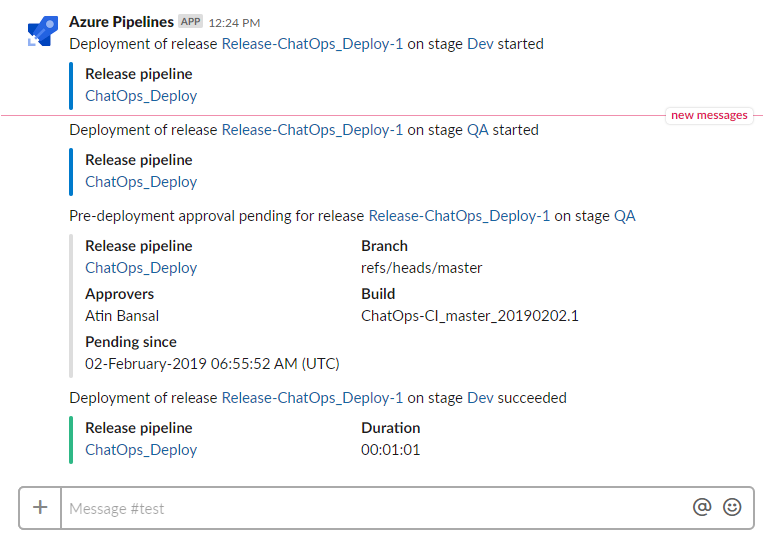
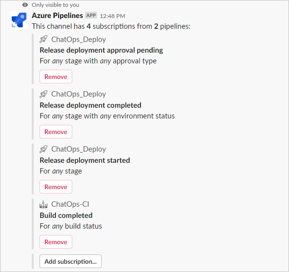
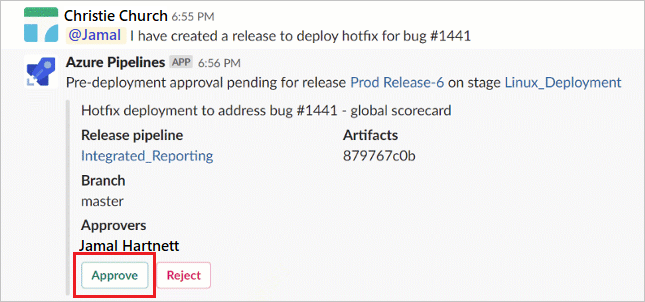
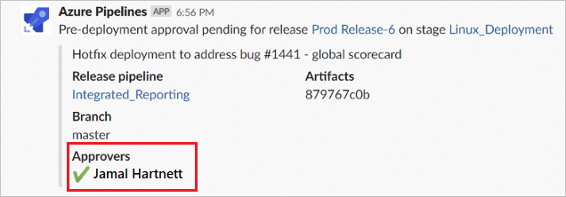

 
# Azure Pipelines with Slack

[!INCLUDE [version-team-services](../includes/version-team-services.md)]

If you use [Slack](https://slack.com), you can use the [Azure Pipelines app for Slack](https://slack.com/apps/AFH4Y66N9-azure-pipelines) to easily monitor the events for your pipelines. Set up and manage subscriptions for builds, releases, YAML pipelines, 
pending approvals and more from the app and get notifications for these events in your Slack channels.

> [!div class="mx-imgBorder"]
> 


[!INCLUDE [temp](../../includes/feature-support-cloud-only.md)] 

## Add the Azure Pipelines app to your Slack workspace

Navigate to [Azure Pipelines Slack app](https://azchatopprodcus1.azchatops.visualstudio.com/_slack/installslackapp) to install the Azure Pipelines app to your Slack workspace. Once added, 
you will see a welcome message from the app as below. Use the `/azpipelines` handle to start interacting with the app.

> [!div class="mx-imgBorder"]
> 

## Connect the Azure Pipelines app to your pipelines

Once the app has been installed in your Slack workspace, you can connect the app to the pipelines you want to monitor. The app will ask you to authenticate to Azure Pipelines before running any commands. 

> [!div class="mx-imgBorder"]
> 

To start monitoring all pipelines in a project, use the following slash command inside a channel:

```
/azpipelines subscribe [project url]
```

The project URL can be to any page within your project (except URLs to pipelines).

For example:

```
/azpipelines subscribe https://dev.azure.com/myorg/myproject/
```

You can also monitor a specific pipeline using the following command:

```
/azpipelines subscribe [pipeline url]
```

The pipeline URL can be to any page within your pipeline that has `definitionId` or `buildId/releaseId` in the URL.  

For example:

```
/azpipelines subscribe https://dev.azure.com/myorg/myproject/_build?definitionId=123
```

or:

```
/azpipelines subscribe https://dev.azure.com/myorg/myproject/_release?definitionId=123&view=mine&_a=releases
```

The subscribe command gets you started with a few subscriptions by default. For Build pipelines, the channel is subscribed to *Build completed* notification. For Release pipelines, 
the channel will start receiving *Release deployment started*, *Release deployment completed* and *Release deployment approval pending* notifications. For YAML pipelines, subscriptions are created for the *Run stage state changed* and *Run stage waiting for approval* notifications.

> [!div class="mx-imgBorder"]
> 

## Manage subscriptions

To manage the subscriptions for a channel, use the following command:

`/azpipelines subscriptions`

This command will list all the current subscriptions for the channel and allow you to add new subscriptions.

> [!div class="mx-imgBorder"]
> 

## Using filters effectively to customize subscriptions

When a user subscribes to any pipeline, a few subscriptions are created by default without any filters being applied. Often, users have the need to customize these subscriptions. 
For example, users may want to hear only about failed builds or get notified only when deployments are pushed to production. The Azure Pipelines app supports filters to customize what you see in your channel.

1. Run the `/azpipelines subscriptions` command
2. In the list of subscriptions, if there is a subscription that is unwanted or must be modified (Example: creating noise in the channel), select the **Remove** button 
3. Select the **Add subscription** button
4. Select the required pipeline and the desired event
5. Select the appropriate filters to customize your subscription

### Example: Get notifications only for failed builds

> [!div class="mx-imgBorder"]
> 

### Example: Get notifications only if the deployments are pushed to production environment

> [!div class="mx-imgBorder"]
> 

## Approve deployments from your channel

You can approve deployments from within your channel without navigating to the Azure Pipelines portal by subscribing to the *Release deployment approval pending* notification for classic Releases or the *Run stage waiting for approval* notification for YAML pipelines. Both of these subscriptions are created by default when you subscribe to the pipeline.



Whenever the running of a stage is pending for approval, a notification card with options to approve or reject the request is posted in the channel. Approvers can review the details of the request in the notification and take appropriate action. In the following example, the deployment was approved and the approval status is displayed on the card.



The app supports all the checks and approval scenarios present in Azure Pipelines portal, like single approver, multiple approvers (any one user, any order, in sequence) and teams as approvers. You can approve requests as an individual or on behalf of a team.

## Previews of pipeline URLs

When a user pastes a pipeline URL, a preview is shown similar to that in the following image. This helps to keep pipeline related conversations relevant and accurate.


For this feature to work, users have to be signed-in. Once they are signed in, this feature will work for all channels in a workspace.


## Remove subscriptions and pipelines from a channel

If you want to clean up your channel, use the following commands to unsubscribe from all pipelines within a project.

	```
	/azpipelines unsubscribe all [project url]
	```

	For example:

	```
	/azpipelines unsubscribe all https://dev.azure.com/myorg/myproject
	```

This command deletes all the subscriptions related to any pipeline in the project and removes the pipelines from the channel. 

> [!IMPORTANT] 
> Only project administrators can run this command.


## Commands reference

Here are all the commands supported by the Azure Pipelines app:

| Slash command        | Functionality  |
| -------------------- |----------------|
| /azpipelines subscribe [pipeline url/ project url]      | Subscribe to a pipeline or all pipelines in a project to receive notifications | 
| /azpipelines subscriptions      | Add or Remove subscriptions for this channel      | 
| /azpipelines feedback | Report a problem or suggest a feature      |
| /azpipelines help     | Get help on the slash commands |
| /azpipelines signin  | Sign in to your Azure Pipelines account |
| /azpipelines signout  | Sign out from your Azure Pipelines account |
| /azpipelines unsubscribe all [project url] | Remove all pipelines (belonging to a project) and their associated subscriptions from a channel |

### Notifications in Private channels

The Azure Pipelines app can help you monitor the pipelines activity in your private channels as well. You will need to invite the bot to your private channel by using `/invite @azpipelines`. 
Post that, you can set up and manage your notifications the same way as you would for a public channel.

>[!NOTE]
> * You can use the Azure Pipelines app for Slack only with a project hosted on Azure DevOps Services at this time.
> * The user has to be an admin of the project containing the pipeline to set up the subscriptions
> * Notifications are currently not supported inside direct messages
> * Deployment approvals which have 'Revalidate identity of approver before completing the approval' policy applied, are not supported
> * 'Third party application access via OAuth' must be enabled to receive notifications for the organization in Azure DevOps (Organization Settings -> Security -> Policies)

## Troubleshooting

If you are experiencing the following errors when using the [Azure Pipelines App for Slack](https://slack.com/apps/AFH4Y66N9-azure-pipelines), follow the procedures in this section. 

[!INCLUDE [troubleshooting](includes/troubleshoot-authentication.md)]

In the **same browser**, start a new tab, navigate to `https://slack.com`, and sign in to your work space (**use web client**). Run the `/azpipelines signout` command followed by the `/azpipelines signin` command. 

Select the `Sign in` button and you'll be redirected to a consent page like the one in the following example. Ensure that the directory shown beside the email is same as what was chosen in the previous step. Accept and complete the sign-in process.

> [!div class="mx-imgBorder"]
> 

If these steps don't resolve your authentication issue, reach out to us at [Developer Community](https://developercommunity.visualstudio.com/spaces/21/index.html).

## Related articles
- [Azure Boards with Slack](https://aka.ms/AzureBoardsSlackIntegration)
- [Azure Repos with Slack](https://aka.ms/AzureReposSlackIntegration)
- [Create a service hook for Azure DevOps with Slack](../../service-hooks/services/slack.md)
