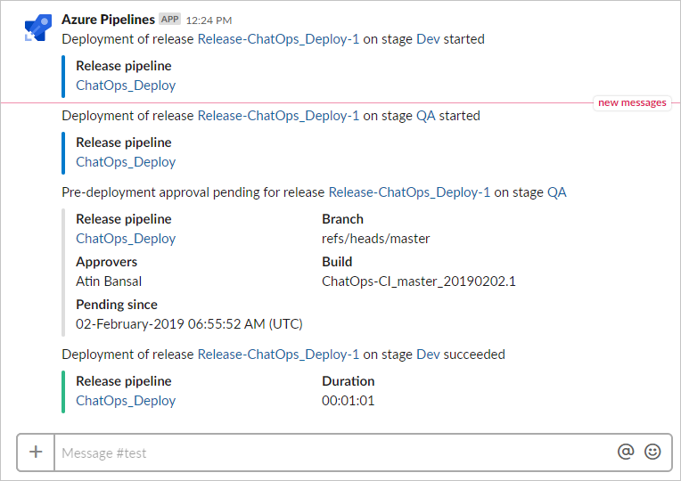

# Azure Pipelines with Slack

If you use [Slack](https://slack.com), you can use the Azure Pipelines app for Slack to easily monitor the events for your pipelines. Set up and manage subscriptions for completed builds, releases, 
pending approvals and more from the app and get notifications for these events in your Slack channels.



## Add the Azure Pipelines app to your Slack workspace

[Click here](https://azchatopprodcus1.azchatops.visualstudio.com/_slack/installslackapp) to install the Azure Pipelines app to your Slack workspace. Once added, 
you will see a welcome message from the app as below. Use the `/azpipelines` handle to start interacting with the app.


## Connect the Azure Pipelines app to your pipelines

Once the app has been installed in your Slack workspace, you can connect the app to the pipelines you want to monitor. Note that the app will ask you to authenticate to Azure Pipelines before running any commands. 


To start monitoring a pipeline, use the following slash command inside a channel:

```
/azpipelines subscribe [pipeline url]
```

The pipeline URL can be to any page within your pipeline which has the `definitionId` or `buildId/releaseId`.  

For example, for Build pipelines, use:

```
/azpipelines subscribe https://dev.azure.com/myorg/myproject/_build?definitionId=123
```

For Release pipelines, use:

```
/azpipelines subscribe https://dev.azure.com/myorg/myproject/_release?definitionId=123&view=mine&_a=releases
```

The subscribe command gets you started with a few subscriptions by default. For Build pipelines, the channel is subscribed to *Build completed* notification while for Release pipelines, 
the channel will start receiving *Release deployment started*, *Release deployment completed* and *Release deployment approval pending* notifications.


## Manage subscriptions

To manage the subscriptions for a channel, use the following command:

`/azpipelines subscribe`

This command will list all the current subscriptions for the channel and allow you to add new subscriptions.


## Commands reference

Here are all the commands supported by the Azure Pipelines app:

| Slash command        | Functionality  |
| -------------------- |----------------|
| /azpipelines subscribe [pipeline url]      | Subscribe to notifications for a pipeline you want to monitor | 
| /azpipelines subscribe      | Manage/add subscriptions for a channel      | 
| /azpipelines feedback | Report problems or suggest features for the app      |
| /azpipelines help     | Get help on the slash commands |
| /azpipelines signout  | Disconnect your Azure Pipelines account from the app |

### Notifications in Private channels

Azure Pipelines app can help you monitor the pipelines activity in your private channels as well. You will need to invite the bot to your private channel by using `/invite @azpipelines`. 
Post that, you can set up and manage your notifications the same way as you would for a public channel.

>[!NOTE]
>Notifications are currently not supported inside direct messages.