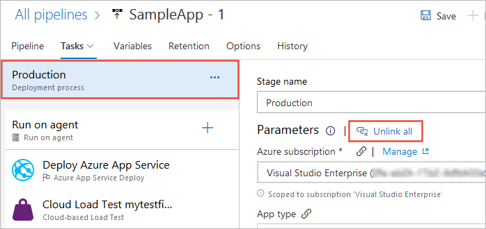
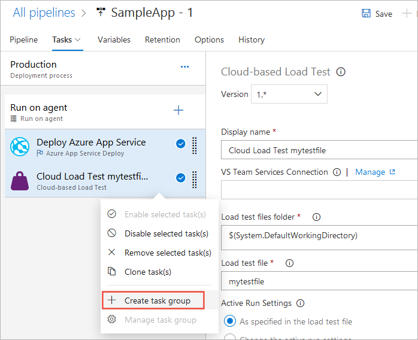
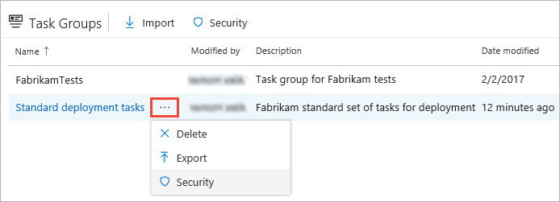
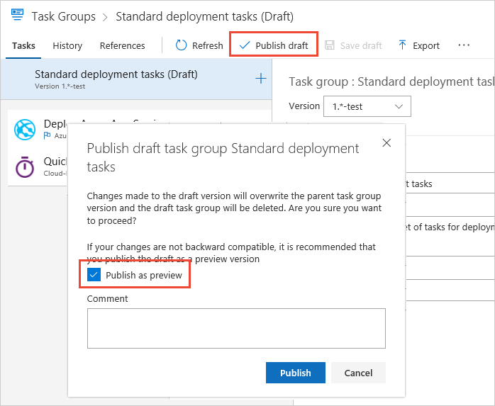
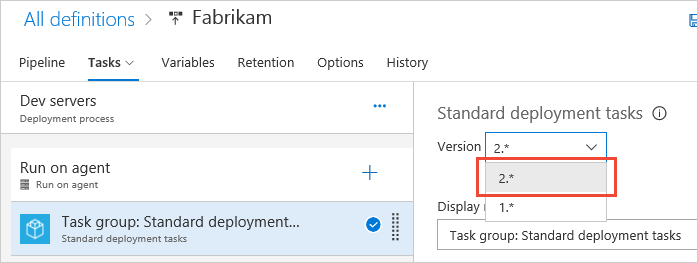

# Task groups for builds and releases

**Azure Pipelines | TFS 2018 | TFS 2017**

::: moniker range="<= tfs-2018"
[!INCLUDE [temp](../_shared/concept-rename-note.md)]
::: moniker-end

A *task group* allows you to encapsulate a sequence of tasks, already defined
in a build or a release pipeline, into a single reusable task that can be
added to a build or release pipeline, just like any other task. You can
choose to extract the parameters from the encapsulated tasks as configuration
variables, and abstract the rest of the task information.

The new task group is automatically added to the task catalogue, ready to be added
to other release and build pipelines. Task groups are stored at the project level,
and are not accessible outside the project scope.

Task groups are a way to standardize and centrally manage deployment steps for all your applications.
When you include a task group in your definitions, and then make a change centrally to the task group,
the change is automatically reflected in all the definitions that use the task group. There is no need
to change each one individually.

## Before you create a task group...

* Ensure that all of the tasks you want to include in a task group have
  their parameters defined as variables,
  such as **$(MyVariable)**, where you want to be able to configure these parameters
  when you use the task group. Variables used in the tasks are automatically extracted and converted into parameters for the task group.
  Values of these configuration variables will be converted into default values for the task group.

* If you specify a value (instead of a variable) for a parameter, that
  value becomes a fixed parameter value and cannot be exposed as a parameter to the task group.
  
* Parameters of the encapsulated tasks for which
  you specified a value (instead of a variable), or you didn't provide
  a value for, are not configurable in the task group when added to a build
  or release pipeline.

* Task conditions (such as "Run this task only when a previous task has failed" for a
  **PowerShell Script** task) can be configured in a task group and these settings are persisted with the task group.

* When you save the task group, you can provide a name and a description for the
  new task group, and select a category where you want it to appear in the
  **Task catalog** dialog. You can also change the default values for each of the parameters.

* When you queue a build or a release, the encapsulated tasks
  are extracted and the values you entered for the task group parameters are applied to the tasks.
  
* Changes you make to a task group are reflected in every instance of the task group.

## Create a task group

1. Ensure that all the tasks you intent to incude do not contain linke parameters. The easy
   way to do this is to choose **Unlink all** in the settings panel for the entire process.

   

1. Select a sequence of tasks in a build or release pipeline (when using a mouse, click on the
   checkmarks of each one). Then open the shortcut menu and choose **Create task group**.

   

2. Specify a name and description for the new task group, and the category (tab in the Add tasks panel) you want to add it to.

3. After you choose **Create**, the new task group is created and replaces the selected tasks in your pipeline.

4. Save your updated pipeline.

## Manage task groups

All the task groups you create in the current project are listed in
the **Task Groups** page of **Azure Pipelines**.

Use the **Export** shortcut command to save a copy of the task group as a JSON pipeline,
and the **Import** icon to import previously saved task group definitions. Use this feature to
transfer task groups between projects and enterprises, or replicate and save copies of your task groups.

Select a task group name to open the details page.

* In the **Tasks** page you can edit the tasks that make up the task group.
  For each encapsulated task you can change the parameter values for the
  non-variable parameters, edit the existing parameter variables,
  or convert parameter values to and from variables. When you save the changes,
  all definitions that use this task group will pick up the changes.

* In the **History** tab you can see the history of changes to the group.

* In the **References** tab you can expand lists of all the build and release pipelines,
  and other task groups, that use (reference) this task group.
  This is useful to ensure changes do not have unexpected effects on other processes.

::: moniker range="vsts"

## Create previews and updated versions of task groups

All of the built-in tasks in Azure Pipelines and TFS are [versioned](../process/tasks.md#task-versions).
This allows build and release pipelines to continue to use the existing version of a task while
new versions are developed, tested, and released. In Azure Pipelines, you can version your own custom
task groups so that they behave in the same way and provide the same advantages.  

1. After you finish editing a task group, choose **Save as draft** instead of **Save**.

   

1. The string **-test** is appended to the task group version number.
   When you are happy with the changes, choose **Publish draft**. You can choose
   whether to publish it as a preview or as a production-ready version.

   
 
1. You can now use the updated task group in your build and release processes;
   either by changing the version number of the task group in an existing pipeline
   or by adding it from the **Add tasks** panel.  

   

   > As with the built-in tasks, the default when you add a task group is the highest non-preview version.

1. After you have finished testing the updated task group, choose **Publish preview**.
   The **Preview** string is removed from the version number string. It will now appear
   in definitions as a "production-ready" version.

   

1. In a build or release pipeline that already contains this task group, you can now select the new "production-ready" version.
   When you add the task group from the **Add tasks** panel, it automatically selects the new "production-ready" version.  

   

::: moniker-end

## Related topics

* [Tasks](../process/tasks.md)
* [Task jobs](../process/phases.md)

[!INCLUDE [rm-help-support-shared](../_shared/rm-help-support-shared.md)]
