# New release progress views

**Azure Pipelines**

A new and fully redesigned user experience is available for release progress in Azure Pipelines.
To use this page, you simply need to switch it on using one of the on-screen prompts,
or from the [user profile **Previews** panel](../../project/navigation/preview-features.md#enable-features-for-your-use).

Open the new progress view using the **Release (pipeline view)** link in the toolbar.

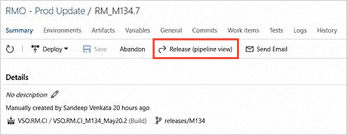

The view shows information about the release and the deployment results.
Use the links in the pipeline view to see more details.


To go back to the old view, open the drop-down list from the ellipses (**...**) icon.

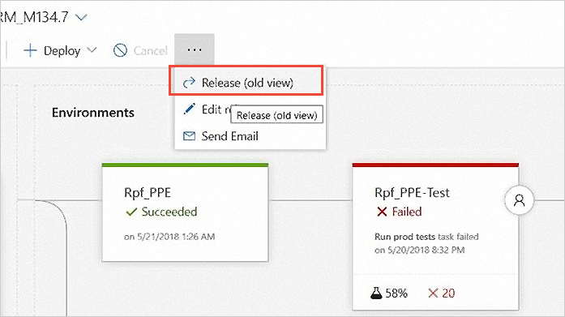

## Pipeline, artifacts, and stages

| Feature | Details |
| --- | --- | 
| 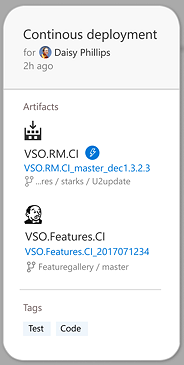 | See your triggers, artifacts, tags, and who requested the release. |
| 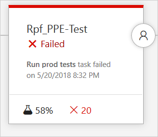 | See your stages with details of deployment progress, outcome, test status, and more. |
|  | See details of the pre- and post-deployment conditions you defined. |
| 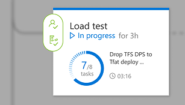 | See the status and details of the deployment to each stage. |

## Pre- and post-deployment gates and approvals

The deployment conditions links open the information panels for pre- and post-deployment conditions. See the status of approvals and gates for your stage. You can also Approve/Reject the pending approvals and Ignore a gate that the stage is waiting for.

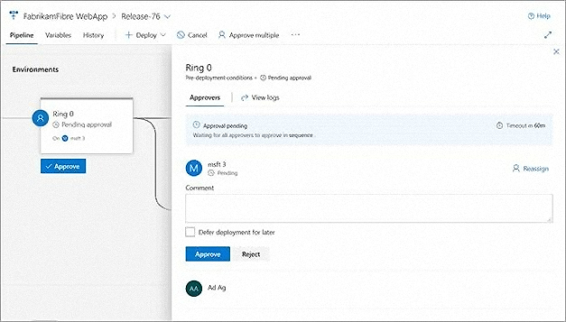


## Commits and workitems

Choose the stage in the pipeline to see a summary of commits and workitems related to this release.

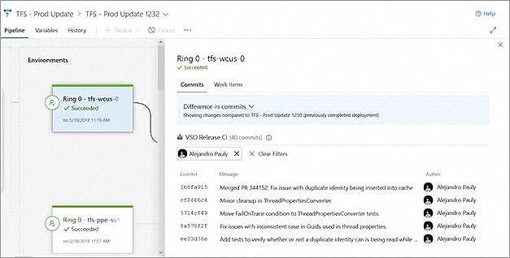

## In-progress deployments and logs

Choose the progress indicator for a stage to see the live deployment logs.

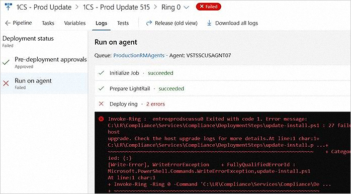

## Test results

Choose the test results indicator for a stage to see a summary of test results.

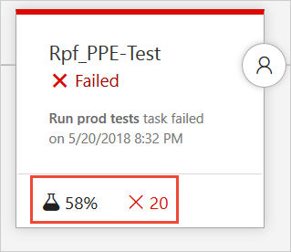

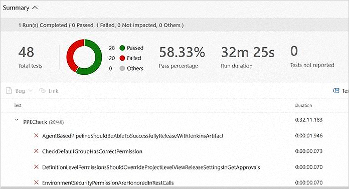

## Contribution points and extensions

The new progress view supports existing and new extensions through a set of contribution points.

Extensions that previously appeared in the **Summary** tab menu for a release:

 

... now appear in the menu bar for the new release progress view pane:

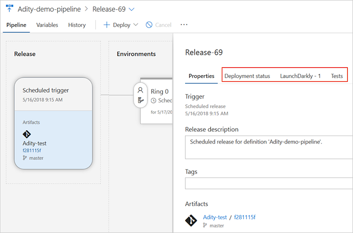 

Extensions that previously appeared in the **Summary** tab editor toolbar for a release:

 

... now appear in the drop-down list in the new release editor:

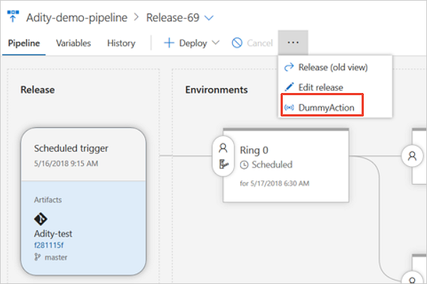 

Extensions that previously appeared in the release summary section for a release:

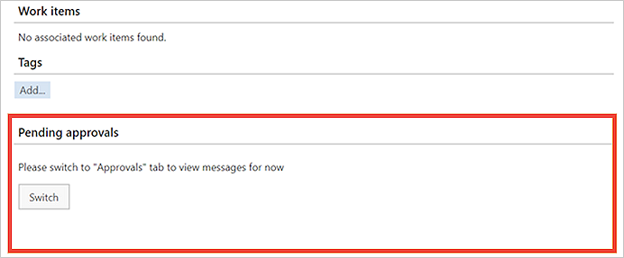 

... now appear as a section in the new release progress view pane:

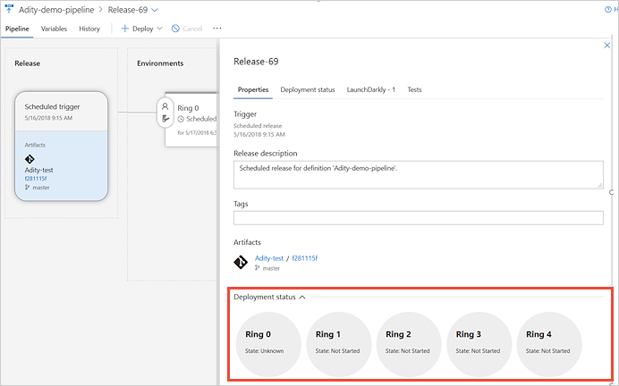 

The contribution point in the columns for stages in the **Summary** tab of a release
is no longer supported. A richer test results summary appears in the stage in pipeline
view when you choose the test results icon. For example, extensions that appeared here:

 

... will not be displayed in the new progress view pages. Please let us know by using the 
**Feedback** section of this topic if you are currently using this contribution point.

### New contribution points in the release progress view

The new release progress view clearly segregates the entire data into release views and stage views to
provide a much better reporting experience for each stage: 

* The **release-level** view contains the release level information such as the pipeline, release description, release tags, and artifact details.  

  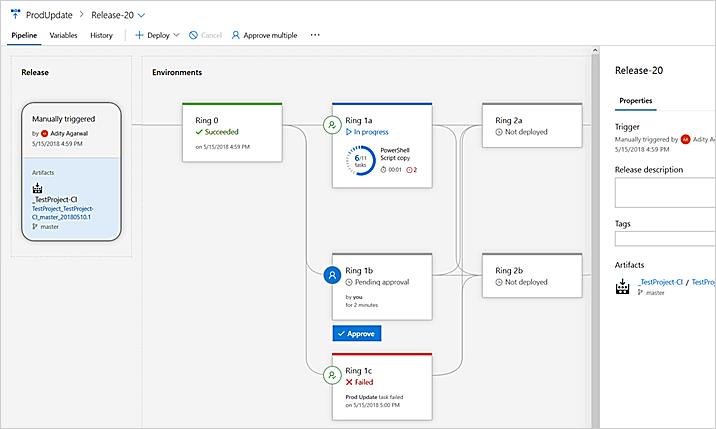 

* The **stage-level** view displays stage data such as the work items, commits, tasks, logs and tests.

  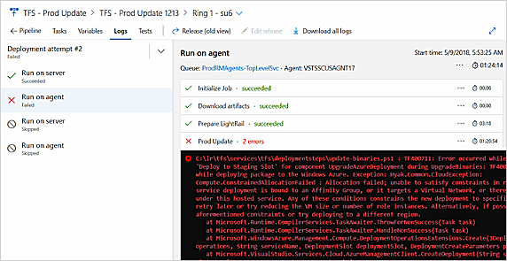 

Many extensions need to show information on a per-stage basis because the information varies for each stage.
In the old release summary, many extensions used filters to do this. However, the new views provide a much better experience.
For example, a new contribution point is available for stage-level information (in the release stage editor tab).
You can use this to expose information for each stage:   
 
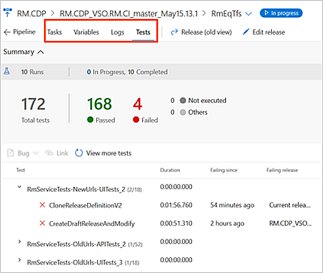 

### Migrate an extension for the new release progress view
 
To migrate your code from the release level contribution point (the release details summary tab) to the new stage-level
contribution point (the release stage editor tab): 

1. Change the target and properties of the extension code in **vss-extension.json**. For example,   
   previous code for contributing to the old contribution point could be:
 
   ```
   { 
      "id": "rm-details-view-sample", 
      "type": "ms.vss-releaseManagement-web.release-summary-section", 
      "targets": [ "ms.vss-releaseManagement-web.release-details-summary-tab" ], 
      "properties": { 
         "name": "Tab name", 
         "uri": "index.html" 
      } 
   } 
   ```

   The updated code for the new contribution point would be: 

   ```
   { 
      "id": "rm-environments-tab", 
      "type": "ms.vss-web.tab", 
      "description": "Adds a 'Hello World' tab to the release stage.", 
      "targets": [ "ms.vss-releaseManagement-web.release-environment-editor-tab" ], 
      "properties": { 
         "name": "ReleaseStage", 
         "order": "99", 
         "uri": "index.html", 
         "registeredObjectId": "registeredEnvironmentObject", 
         "dynamic": true 
      } 
   } 
   ```
 
1. Understand the functional changes to the extension model:

   * The `onReleaseChanged` function for the release progress view tab contribution supplies the release object.
     This is called to initially render the extension, or to update it when a change to the release occurs.
     This function is no longer required in the new contribution point.
 
   * For the new stage-level contribution point, the `registeredObjectId` must be passed in **vss-extension.json**.
     This identifier is used to listen for updates occurring to the stage object. Instead of just initializing the extension,
     you must also register the extension for updates by using `registeredObjectId`. You will receive the `releaseEnvironment` object
     instead of the entire release object. If any update occurs to this object, an event is raised that will be received by the
     `updateContext` function.
 
1. Make the following changes to the extension code in **main.js**:

   ```
   // This code helps in the initial load of the extension 
   VSS.ready(()=>{ 
        // Initial config from host i.e. selected release stage object.
       console.log(JSON.stringify(VSS.getConfiguration()));     
   }); 
 
   // This code is required for listening to updates on the release stage object 
   VSS.register("registeredEnvironmentObject", { 
       updateContext: function(tabContext) {  
          /* tabContext will follow the contract for the extension, this function will be called on any update in context.*/ 
           console.log(JSON.stringify(tabContext)); 
       } 
  }); 
```

[Download the sample extension code](https://github.com/ankitk94/vsts-environment-tab-extension).

[!INCLUDE [rm-help-support-shared](../_shared/rm-help-support-shared.md)]
