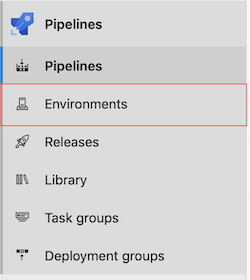
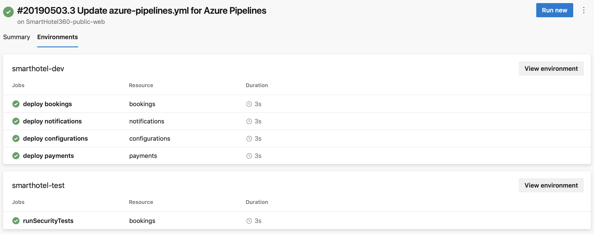
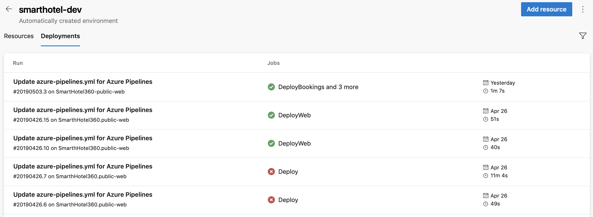

# Create and target an environment

[!INCLUDE [include](../includes/version-team-services.md)]

An environment is a collection of resources that can be targeted by deployments from a pipeline. Environments can include Kubernetes clusters, Azure web apps, virtual machines, databases. Typical examples of environment names are Dev, Test, QA, Staging, and Production.

The advantages of using environments include the following.

- **Deployment history** - Pipeline name and run details are recorded for deployments to an environment and its resources. In the context of multiple pipelines targeting the same environment or resource, [deployment history](#deployment-history) of an environment is useful to identify the source of changes.
- **Traceability of commits and work items** - View jobs within the pipeline run that target an environment. You can also view the [commits and work items](#deployment-history) that were newly deployed to the environment. Traceability also allows one to track whether a code change (commit) or feature/bug-fix (work items) reached an environment.
- **Diagnose resource health** - Validate whether the application is functioning at its desired state.
- **Permissions** - Secure environments by specifying which users and pipelines are allowed to target an environment.

## Resources

While environment at its core is a grouping of resources, the resources themselves represent actual deployment targets. The [Kubernetes resource](environments-kubernetes.md) and [virtual machine resource](environments-virtual-machines.md) types are currently supported.

<a name="creation"></a>

## Create an environment

1. Sign in to your Azure DevOps organization and navigate to your project.

2. In your project, navigate to the Pipelines page. Then choose Environments and click on **Create Environment**.

   > [!div class="mx-imgBorder"]
   > 

3. After adding the name of an environment (required) and the description (optional), you can create an environment. Resources can be added to an existing environment later as well.

> [!TIP]
> It is possible to create an empty environment and reference it from deployment jobs. This will let you record the deployment history against the environment.

> [!NOTE]
> You can use a Pipeline to create, and deploy to environments as well. To learn more, see the [how to guide](../ecosystems/kubernetes/aks-template.md)

<a name="target-from-deployment-job"></a>

## Target an environment from a deployment job

A [deployment job](deployment-jobs.md) is a collection of steps to be run sequentially. A deployment job can be used to target an entire environment (group of resources) as shown in the following YAML snippet.

```YAML
- stage: deploy
  jobs:
  - deployment: DeployWeb
    displayName: deploy Web App
    pool:
      vmImage: 'Ubuntu-latest'
    # creates an environment if it doesn't exist
    environment: 'smarthotel-dev'
    strategy:
      runOnce:
        deploy:
          steps:
          - script: echo Hello world
```

> [!NOTE]
> If the specified environment doesn't already exist, an empty environment is created using the environment name provided.

<a name="target-resource-from-deployment-job"></a>

## Target a specific resource within an environment from deployment job

You can scope the target of deployment to a particular resource within the environment. This allows you to record deployment history on a specific resource within the environment. The steps of the deployment job **automatically inherit** the service connection details from resource targeted by the deployment job. 

```YAML
environment: 'smarthotel-dev.bookings'
strategy: 
 runOnce:
   deploy:
     steps:
     - task: KubernetesManifest@0
       displayName: Deploy to Kubernetes cluster
       inputs:
         action: deploy
         namespace: $(k8sNamespace)
         manifests: $(System.ArtifactsDirectory)/manifests/*
         imagePullSecrets: $(imagePullSecret)
         containers: $(containerRegistry)/$(imageRepository):$(tag)
         # value for kubernetesServiceConnection input automatically passed down to task by environment.resource input
```

<a name="in-run-details"></a>

## Environment in run details

All  environments targeted by deployment jobs of a specific run of a pipeline can be found under the *Environments* tab of pipeline run details.

  > [!div class="mx-imgBorder"]
  > 

## Approvals

You can manually control when a stage should run using approval checks. You can use approval checks to control deployments to production environments. Checks are a mechanism available to the *resource owner* to control when a stage in a pipeline consumes resource. As the owner of a resource, such as an environment, you can [define approvals and checks](approvals.md) that must be satisfied before a stage consuming that resource starts. 

Currently, manual approval checks are supported on environments. 
For more information, see [Approvals](approvals.md).

<a name="deployment-history"></a>

## Deployment history within environments

The deployment history view within environments provides the following advantages.

1. View jobs from all pipelines that are targeting a specific environment. Consider the scenario where two microservices, each having its own pipeline, are deploying to the same environment. In that case, the deployment history listing helps identify all pipelines that are impacting this environment and also helps visualize the sequence of deployments by each pipeline.

   > [!div class="mx-imgBorder"]
   > 


2. Drill down into the job details reveals the listing of commits and work items that were newly deployed to the environment.

   > [!div class="mx-imgBorder"]
   > 

## Security

### User permissions
You can control who can create, view, use, and manage the environments with user permissions. There are four roles - Creator (scope: all environments), Reader, User, and Administrator. In the specific environment's **user permissions** panel, you can set the permissions that are inherited and you can override the roles for each environment. 

-  Navigate to the specific **Environment** that you would like to authorize. 
-  Click on overflow menu button located at the top-right part of the page next to "Add resource" and choose **Security** to view the settings.
-  In the **User permissions** blade, click on **+Add** to add a **User or group** and select a suitable **Role**. 

| Role on an environment | Purpose |
|------------------------------------|---------|
| Creator | Global role, available from environments hub security option. Members of this role can create the environment in the project. Contributors are added as members by default. Not applicable for environments auto created from YAML pipeline.|
| Reader | Members of this role can view the environment. |
| User | Members of this role can use the environment when authoring yaml pipelines. |
| Administrator | In addition to using the environment, members of this role can manage membership of all other roles for the environment. Creators are added as members by default. |

> [!NOTE]
> - If you create an environment within a YAML, contributors and project administrators will be granted **Administrator** role. This is typically used in provisioning Dev/Test environments.
> - If you create an environment through the UI, only the creator will be granted the **Administrator** role. You should use the UI to create protected environments like for a production environment.

### Pipeline permissions

Pipeline permissions can be used to authorize all or selected pipelines for deployment to the environment.

- To remove **Open access** on the environment or resource, click the **Restrict permission** in **Pipeline permissions**.
- To allow specific pipelines to deploy to an environment or a specific resource, click **+** and choose from the list of pipelines.
