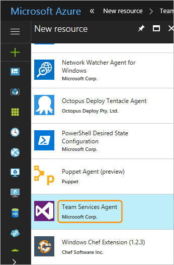
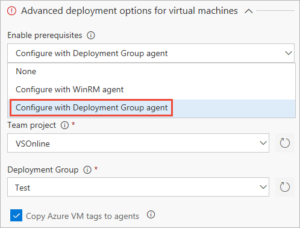

# How To: Provision agents for deployment groups

**VSTS | TFS 2018**

::: moniker range="<= tfs-2018"
[!INCLUDE [temp](../../_shared/concept-rename-note.md)]
::: moniker-end

[Deployment groups](index.md) make it easy to define logical groups of target machines for deployment,
and install the required agent on each machine. This topic explains how to create a deployment group,
and install and provision the agent on each virtual or physical machine in your deployment group.

You can install the agent in any one of these ways:

* [Run the script](#runscript) that is generated automatically when you create a deployment group.
* [Install the **VSTS Agent** Azure VM extension](#azureext) on each of the VMs.
* [Use the **Azure Resource Group Deployment** task](#deploytask) in your release pipeline.

For information about agents and pipelines, see:

* [Concurrent pipelines in Team Foundation Server](../../licensing/concurrent-pipelines-tfs.md).
* [Concurrent jobs in VSTS](../../licensing/concurrent-jobs-vsts.md).
* [Pricing for VSTS features](https://visualstudio.microsoft.com/team-services/pricing/)

<a name="runscript"></a>

## Run the installation script on the target servers

1. In the **Deployment groups** tab of the **Build &amp; Release** hub, choose **+New** to create a new group.

1. Enter a name for the group, and optionally a description, then choose **Create**.

1. In the **Register machines using command line** section of the next page, select the target machine operating system.

1. Choose **Use a personal access token in the script for authentication**. [Learn more](https://go.microsoft.com/fwlink/?linkid=844181).

1. Choose **Copy the script to clipboard**.

1. Log onto each target machine in turn using the account with the [appropriate permissions](../../agents/v2-windows.md#permissions) and:

   - Open an Administrator PowerShell command prompt, paste in the script you copied, then execute it to register the machine with this group.
 
   - If you get an error when running the script that a secure channel could not be created, execute this command at the Administrator PowerShell prompt:

     `[Net.ServicePointManager]::SecurityProtocol = [Net.SecurityProtocolType]::Tls12` 
   
   - When prompted to configure tags for the agent, press `Y` and enter any tags you will use to identify subsets of the machines in the group for partial deployments.

     > Tags you assign allow you to limit deployment to specific servers when 
     the deployment group is used in a [**Run on machine group** phase](../../process/deployment-group-phases.md).

   - When prompted for the user account, press *Return* to accept the defaults.

   - Wait for the script to finish with the message `Service vstsagent.{organization-name}.{computer-name} started successfully`.<p />

1. In the **Deployment groups** page of the **Build &amp; Release** hub, open the **Machines** tab and verify that the agents are running. If the tags you configured are not visible, refresh the page.
 
<a name="azureext"></a>

## Install the VSTS Agent Azure VM extension

1. In the **Deployment groups** tab of the **Build &amp; Release** hub, choose **+New** to create a new group.

1. Enter a name for the group, and optionally a description, then choose **Create**.

1. In the Azure portal, for each VM that will be included in the deployment group
   open the **Extension** blade, choose **+ Add** to open the **New resource** list, and select **VSTS Agent**.

   

1. In the **Install extension** blade, specify the name of the VSTS subacription to use. For example, if the URL is `https://contoso.visualstudio.com`, just specify **contoso**.

1. Specify the project name and the deployment group name.
   
1. Optionally, specify a name for the agent. If not specified, it uses the VM name appended with `-DG`.

1. Enter the [Personal Access Token (PAT)](https://go.microsoft.com/fwlink/?linkid=844181) to use for authentication against VSTS.

1. Optionally, specify a comma-separated list of tags that will be configured on the agent.
   Tags are not case-sensitive, and each must no more than 256 characters.
   
1. Choose **OK** to begin installation of the agent on this VM.

1. Add the extension to any other VMs you want to include in this deployment group.

<a name="deploytask"></a>

## Use the Azure Resource Group Deployment task

You can use the [Azure Resource Group Deployment task](https://aka.ms/argtaskreadme)
to deploy an Azure Resource Manager (ARM) template that installs the VSTS Agent
Azure VM extension as you create a virtual machine, or to update the resource group
to apply the extension after the virtual machine has been created.
Alternatively, you can use the advanced deployment options of the
Azure Resource Group Deployment task to deploy the agent to deployment groups. 

### Install the "VSTS Agent" Azure VM extension using an ARM template

An ARM template is a JSON file that declaratively defines a set of Azure resources.
The template can be automatically read and the resources provisioned by Azure.
In a single template, you can deploy multiple services along with their dependencies.

For a Windows VM, create an ARM template and add a resources element under the
`Microsoft.Compute/virtualMachine` resource as shown here:

```ARMTemplate
"resources": [
  {
    "name": "[concat(parameters('vmNamePrefix'),copyIndex(),'/TeamServicesAgent')]",
    "type": "Microsoft.Compute/virtualMachines/extensions",
    "location": "[parameters('location')]",
    "apiVersion": "2015-06-15",
    "dependsOn": [
        "[resourceId('Microsoft.Compute/virtualMachines/',
                      concat(parameters('vmNamePrefix'),copyindex()))]"
    ],
    "properties": {
      "publisher": "Microsoft.VisualStudio.Services",
      "type": "TeamServicesAgent",
      "typeHandlerVersion": "1.0",
      "autoUpgradeMinorVersion": true,
      "settings": {
        "VSTSAccountName": "[parameters('VSTSAccountName')]",
        "TeamProject": "[parameters('TeamProject')]",
        "DeploymentGroup": "[parameters('DeploymentGroup')]",
        "AgentName": "[parameters('AgentName')]",
        "Tags": "[parameters('Tags')]"
      },
      "protectedSettings": {
      "PATToken": "[parameters('PATToken')]"
     }
   }
  }
]
```

where:

* **VSTSAccountName** is required. The VSTS subscription to use. Example: If your URL is `https://contoso.visualstudio.com`, just specify `contoso`
* **TeamProject** is required. The project that has the deployment group defined within it
* **DeploymentGroup** is required. The deployment group against which deployment agent will be registered
* **AgentName** is optional. If not specified, the VM name with `-DG` appended will be used
* **Tags** is optional. A comma-separated list of tags that will be set on the agent. Tags are not case sensitive and each must be no more than 256 characters
* **PATToken** is required. The Personal Access Token that will be used to authenticate against VSTS to download and configure the agent

>**Note**: If you are deploying to a Linux VM, ensure that the `type` parameter in the code is `TeamServicesAgentLinux`.

For more information about ARM templates, see [Define resources in Azure Resource Manager templates](https://docs.microsoft.com/azure/templates/).

To use the template:

1. In the **Deployment groups** tab of the **Build &amp; Release** hub, choose **+New** to create a new group.

1. Enter a name for the group, and optionally a description, then choose **Create**.

1. In the **Releases** tab of the **Build &amp; Release** hub, create a release pipeline with an environment that contains the **Azure Resource Group Deployment** task.

1. Provide the parameters required for the task such as the Azure subscription, resource group name,
   location, and template information, then save the release pipeline.

1. Create a release from the release pipeline to install the agents.

### Install agents using the advanced deployment options

1. In the **Deployment groups** tab of the **Build &amp; Release** hub, choose **+New** to create a new group.

1. Enter a name for the group, and optionally a description, then choose **Create**.

1. In the **Releases** tab of the **Build &amp; Release** hub, create a release pipeline with an environment that contains the **Azure Resource Group Deployment** task.

1. Select the task and expand the **Advanced deployment options for virtual machines** section.
   Configure the parameters in this section as follows:

   * **Enable Prerequisites**: select **Configure with Deployment Group Agent**.

   * **TFS/VSTS endpoint**: Select an existing Team Foundation Server/TFS service connection that points
     to your target. Agent registration for deployment groups requires access to your Visual
     Studio project. If you do not have an existing service connection, choose **Add** and create one now.
     Configure it to use a [Personal Access Token (PAT)](https://go.microsoft.com/fwlink/?linkid=844181)
     with scope restricted to **Deployment Group**.

   * **Project**: Specify the project containing the deployment group.

   * **Deployment Group**: Specify the name of the deployment group against which the agents will be registered.  

   * **Copy Azure VM tags to agents**: When set (ticked), any tags already configured on the Azure VM will
     be copied to the corresponding deployment group agent. By default, all
     [Azure tags](https://docs.microsoft.com/en-us/azure/azure-resource-manager/resource-group-using-tags)
     are copied using the format `Key: Value`. For example, `Role: Web`.

   

1. Provide the other parameters required for the task such as the Azure subscription, resource group name,
   and location, then save the release pipeline.

1. Create a release from the release pipeline to install the agents.

## Related topics

* [Run on machine group phase](../../process/deployment-group-phases.md)
* [Deploy an agent on Windows](../../agents/v2-windows.md)
* [Deploy an agent on macOS](../../agents/v2-osx.md)
* [Deploy an agent on Linux](../../agents/v2-linux.md)

[!INCLUDE [rm-help-support-shared](../../_shared/rm-help-support-shared.md)]
