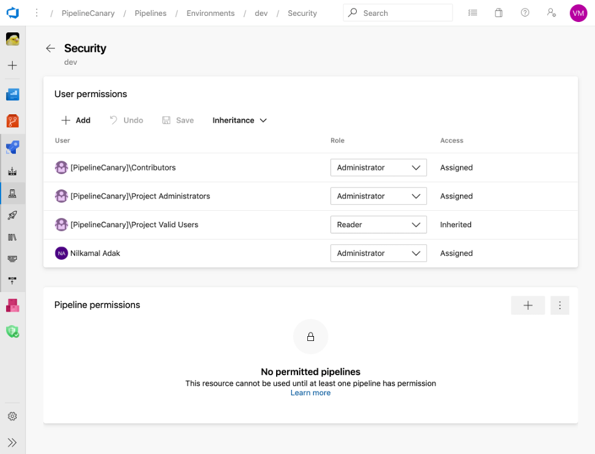
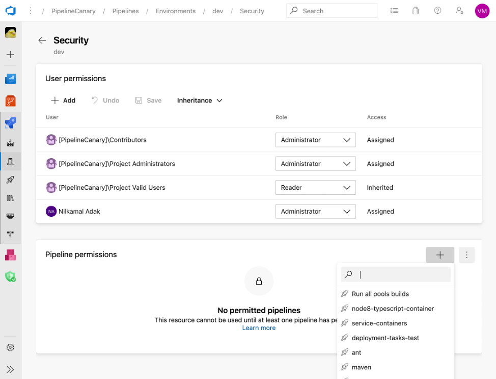
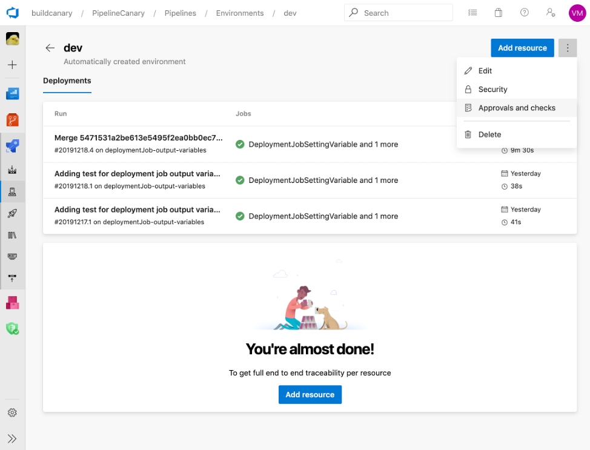

# Pipeline resources

Azure Pipelines offers security mechanisms beyond just protecting the YAML file and source code.
When pipelines run, access to resources goes through a system called [checks](../process/approvals.md).
Checks can suspend or even fail a pipeline run in order to keep resources safe.
A pipeline can access two types of resources, protected and open.

## Protected resources

Your pipelines often have access to secrets.
For instance, to sign your build, you need a signing certificate.
To deploy to a production environment, you need a credential to that environment.
In Azure Pipelines, all of the following are considered *protected* resources:
- [agent pools](../agents/agents.md)
- [variable groups](../library/variable-groups.md)
- [secure files](../library/secure-files.md)
- [service connections](../library/service-endpoints.md)
- [environments](../process/environments.md)

"Protected" means:
- They can be made accessible to specific users and specific pipelines within the project.
They cannot be accessed by users and pipelines outside of a project.
- You can run additional manual or automated checks every time a pipeline uses one of these resources.

## Open resources

All the other resources in a project are considered *open* resources.
Open resources include:
- repositories
- artifacts
- pipelines
- test plans
- work items

You'll learn more about which pipelines can access what resources in the section on [projects](projects.md).

## User permissions

The first line of defense for protected resources is user permissions.
In general, ensure that you only give permissions to users who require them.
All protected resources have a similar security model.
A member of user role for a resource can:
- Remove approvers and checks configured on that resource
- Grant access to other users or pipelines to use that resource

## Pipeline permissions

When you use YAML pipelines, user permissions are not enough to secure your protected resources.
You can easily copy the name of a protected resource (for example, a service connection for your production environment) and include that in a different pipeline.
Pipeline permissions protect against such copying.
For each of the protected resources, ensure that you have disabled the option to grant access to "all pipelines".
Instead, explicitly granted access to specific pipelines that you trust.

## Checks

In YAML, a combination of user and pipeline permissions is not enough to fully secure your protected resources.
Pipeline permissions to resources are granted to the whole pipeline.
Nothing prevents an adversary from creating another branch in your repository, injecting malicious code, and using the same pipeline to access that resource.
Even without malicious intent, most pipelines need a second set of eyes look over changes (especially to the pipeline itself) before deploying to production.
**Checks** allow you to pause the pipeline run until certain conditions are met:
- **Manual approval check**.
Every run that uses a project protected resource is blocked for your manual approval before proceeding.
This gives you the opportunity to review the code and ensure that it is coming from the right branch.
- **Protected branch check**.
If you have manual code review processes in place for some of your branches, you can extend this protection to pipelines.
Configure a protected branch check on each of your resources.
This will automatically stop your pipeline from running on top of any user branches.
<!-- coming Q1 CY20
- **Azure function check**.
If you have some other logic to decide whether a run should be allowed to proceed, create an Azure function with your custom logic and configure that function to be a check on your protected resource.
For instance, your logic could ensure that the code has been reviewed by a certain number of reviewers, that it has been tested on a certain other environment, and that all the tests have passed.
-->

## Next steps

Next, consider how you group resources into a [project structure](projects.md).
