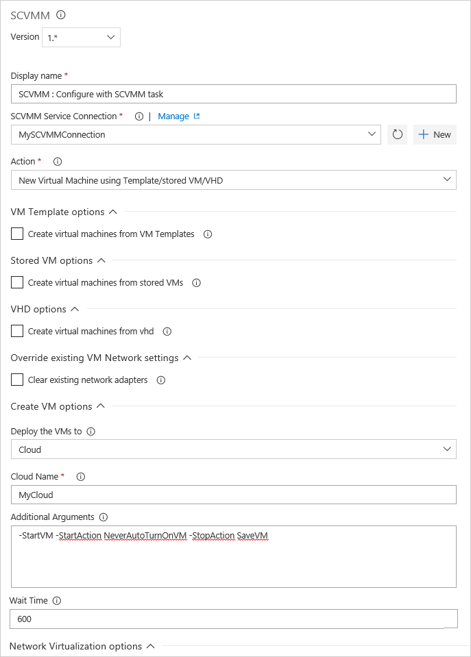
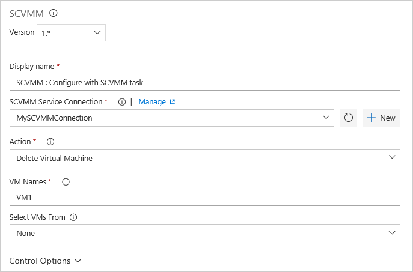
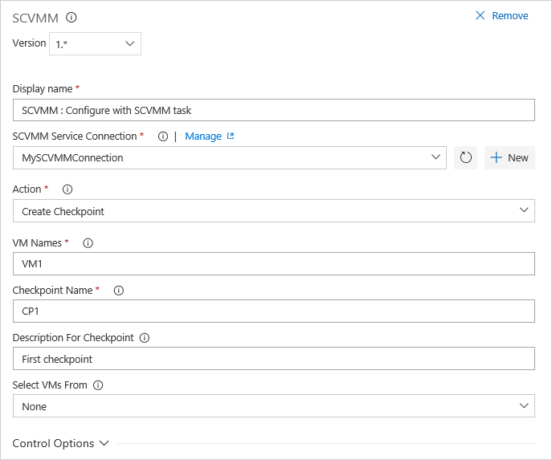
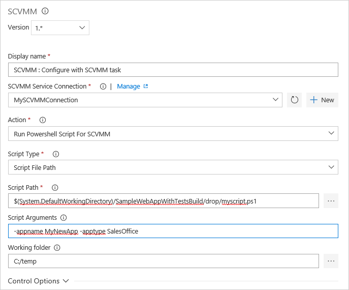

# SCVMM deployment

You can automatically provision new virtual machines in System Center Virtual Machine Manager (SCVMM) and deploy to those virtual machines after every successful build. Before this guidance, read the [web quickstart](../get-started-designer.md).

::: moniker range="<= tfs-2018"
[!INCLUDE [temp](../_shared/concept-rename-note.md)]
::: moniker-end

## SCVMM connection

::: moniker range="vsts"

You need to first configure how VSTS connects to SCVMM. You cannot use Microsoft-hosted agents to run SCVMM tasks since the VMM Console is not installed on hosted agents. You must set up a self-hosted build and release agent on the same network as your SCVMM server.

::: moniker-end

::: moniker range="< vsts"

You need to first configure how TFS connects to SCVMM. You must have a build and release agent that can communicate with the SCVMM server.

::: moniker-end

1. Install the **Virtual Machine Manager** (VMM) console on the agent machine by
   following [these instructions](https://docs.microsoft.com/system-center/vmm/install-console).
   Supported version: [System Center 2012 R2 Virtual Machine Manager](https://technet.microsoft.com/library/hh546785.aspx).

1. Install the **System Center Virtual Machine Manager (SCVMM)** extension
   from Visual Studio Marketplace into TFS or VSTS:

   * If you are using **VSTS**,
     install the extension from [this location](https://marketplace.visualstudio.com/items?itemName=ms-vscs-rm.scvmmapp)
     in Visual Studio Marketplace.
   * If you are using **Team Foundation Server**, download
     the extension from [this location](https://marketplace.visualstudio.com/items?itemName=ms-vscs-rm.scvmmapp)
     in Visual Studio Marketplace, upload it to your
     Team Foundation Server, and install it.

1. Create an SCVMM service connection in your project:

   * In your VSTS or TFS project in your web browser, navigate to the project settings and select **Services**.

   * In the **Services** tab, choose **New service connection**, and select **SCVMM**.

   * In the **Add new SCVMM Connection** 
     dialog, enter the values required to connect to the 
     SCVMM Server:

     - **Connection Name**: Enter a user-friendly name 
       for the service connection such as **MySCVMMServer**.
     - **SCVMM Server Name**: Enter the fully qualified domain 
       name and port number of the SCVMM server, in the form **machine.domain.com:port**.
     - **Username** and **Password**: Enter the credentials
       required to connect to the vCenter Server. Username formats such as **username**, **domain\username**,
       **machine-name\\username**, and **.\\username** are supported.
       UPN formats such as **username@domain.com** and built-in system 
       accounts such as **NT Authority\\System** are not supported.

## Create new virtual machines from a template, VHD, or stored VM

One of the common actions that you can perform with every build is to create a new virtual machine to deploy the build to. You use the SCMVMM task from the extension to do this and configure the properties of the task as follows:

* **Display name**: The name for the task as it appears in the task list. 
* **SCVMM Service Connection**: Select a SCVMM service connection you already defined, or create a new one.
* **Action**: Select **New Virtual Machine using Template/Stored VM/VHD**.
* **Create virtual machines from VM Templates**: Set this option if you want to use a template.
  - **Virtual machine names**: Enter the name of the virtual machine, or a list of the virtual machine names on separate lines. Example `FabrikamDevVM`
  - **VM template names**: Enter the name of the template, or a list of the template names on separate lines.
  - **Set computer name as defined in the VM template**: If not set, the computer name will be the same as the VM name.
* **Create virtual machines from stored VMs**: Set this option if you want to use a stored VM.
  - **Virtual machine names**: Enter the name of the virtual machine, or a list of the virtual machine names on separate lines. Example `FabrikamDevVM`
  - **Stored VMs**: Enter the name of the stored VM, or a list of the VMs on separate lines in the same order as the virtual machine names.
* **Create virtual machines from VHD**: Set this option if you want to use a stored VM.
  - **Virtual machine names**: Enter the name of the virtual machine, or a list of the virtual machine names on separate lines. Example `FabrikamDevVM`
  - **VHDs**: Enter the name of the VHD or VHDX, or a list of names on separate lines in the same order as the virtual machine names.
  - **CPU count**: Specify the number of processor cores required for the virtual machines.
  - **Memory**: Specify the memory in MB required for the virtual machines.
* **Clear existing network adapters**: Set this option if you want to remove the network adapters and specify new ones in the **Network Virtualization** options.
* **Deploy the VMs to**: Choose either **Cloud** or **Host** to select the set of virtual machines to which the action will be applied.
* **Host Name** or **Cloud Name**: Depending on the previous selection, enter either a cloud name or a host machine name.
* **Placement path for VM**: If you selected **Host** as the deployment target, enter the path to be used during virtual machine placement. Example `C:\ProgramData\Microsoft\Windows\Hyper-V`
* **Additional Arguments**: Enter any arguments to pass to the virtual machine creation template. Example `-StartVM -StartAction NeverAutoTurnOnVM -StopAction SaveVM`
* **Wait Time**: The time to wait for the virtual machine to reach ready state.
* **Network Virtualization**: Set this option to enable network virtualization for your virtual machines. For more information, see [Create a virtual network isolated environment](create-virtual-network.md). 
* **Show minimal logs**: Set this option if you don't want to create detailed live logs about the VM provisioning process.

## Delete virtual machines

After validating your build, you would want to delete the virtual machines that you created. You use the SCMVMM task from the extension to do this and configure the properties of the task as follows:

* **Display name**: The name for the task as it appears in the task list. 
* **SCVMM Service Connection**: Select a SCVMM service connection you already defined, or create a new one.
* **Action**: Select **New Virtual Machine using Template/Stored VM/VHD**.
* **VM Names**: Enter the name of the virtual machine, or a comma-separated list of the virtual machine names. Example `FabrikamDevVM,FabrikamTestVM`
* **Select VMs From**: Choose either **Cloud** or **Host** to select the set of virtual machines to which the action will be applied.
* **Host Name** or **Cloud Name**: Depending on the previous selection, enter either a cloud name or a host machine name.

## Start and stop virtual machines

You can start a virtual machine prior to deploying a build, and then stop the virtual machine after running tests. Use the SCVMM task as follows in order to achieve this:

* **Display name**: The name for the task as it appears in the task list. 
* **SCVMM Service Connection**: Select a SCVMM service connection you already defined, or create a new one.
* **Action**: Select **Start Virtual Machine** or **Stop Virtual Machine**.
* **VM Names**: Enter the name of the virtual machine, or a comma-separated list of the virtual machine names. Example `FabrikamDevVM,FabrikamTestVM`
* **Select VMs From**: Choose either **Cloud** or **Host** to select the set of virtual machines to which the action will be applied.
* **Host Name** or **Cloud Name**: Depending on the previous selection, enter either a cloud name or a host machine name.
* **Wait Time**: The time to wait for the virtual machine to reach ready state.
 

## Create, restore, and delete checkpoints

A quick alternative to bringing up a virtual machine in desired state prior to running tests is to restore it to a known checkpoint. Use the SCVMM task as follows in order to do this:

* **Display name**: The name for the task as it appears in the task list. 
* **SCVMM Service Connection**: Select a SCVMM service connection you already defined, or create a new one.
* **Action**: Select one of the checkpoint actions **Create Checkpoint**, **Restore Checkpoint**, or **Delete Checkpoint**.
* **VM Names**: Enter the name of the virtual machine, or a comma-separated list of the virtual machine names. Example `FabrikamDevVM,FabrikamTestVM`
* **Checkpoint Name**: For the **Create Checkpoint** action, enter the name of the checkpoint that will be applied to the virtual machines. For the **Delete Checkpoint** or **Restore Checkpoint** action, enter the name of an existing checkpoint.
* **Description for Checkpoint**: Enter a description for the new checkpoint when creating it. 
* **Select VMs From**: Choose either **Cloud** or **Host** to select the set of virtual machines to which the action will be applied.
* **Host Name** or **Cloud Name**: Depending on the previous selection, enter either a cloud name or a host machine name.

## Run custom PowerShell scripts for SCVMM

For functionality that is not available through the in-built actions, you can run custom SCVMM PowerShell scripts using the task. The task helps you with setting up the connection with SCVMM using the credentials configured in the service connection, and then runs the script.

* **Display name**: The name for the task as it appears in the task list. 
* **SCVMM Service Connection**: Select a SCVMM service connection you already defined, or create a new one.
* **Action**: Select **Run PowerShell Script for SCVMM**.
* **Script Type**: Select either **Script File Path** or **Inline Script**.
* **Script Path**: If you selected **Script File Path**, enter the path of the PowerShell script to execute. It must be a fully-qualified path, or a path relative to the default working directory.
* **Inline Script**: If you selected **Inline Script**, enter the PowerShell script lines to execute.
* **Script Arguments**: Enter any arguments to be passed to the PowerShell script. You can use either ordinal parameters or named parameters.
* **Working folder**: Specify the current working directory for the script when it runs. The default if not provided is the folder containing the script.

## Deploying build to virtual machines

Once you have the virtual machines set up, deploying a build to those virtual machines is no different than deploying to any other machine. For instance, you can:

* Use the [PowerShell on Target Machines](../tasks/deploy/powershell-on-target-machines.md) task to run remote scripts on those machines using Windows Remote Management.
* Use [Deployment groups](../release/deployment-groups/index.md) to run scripts and other tasks on those machines using build and release agent.

## See also

* [Create a virtual network isolated environment for build-deploy-test scenarios](create-virtual-network.md)
