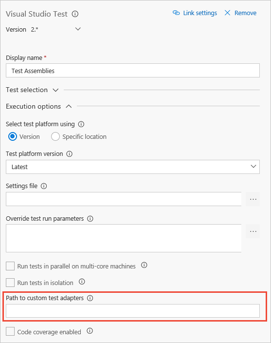
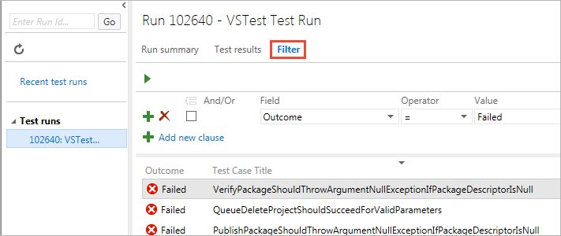
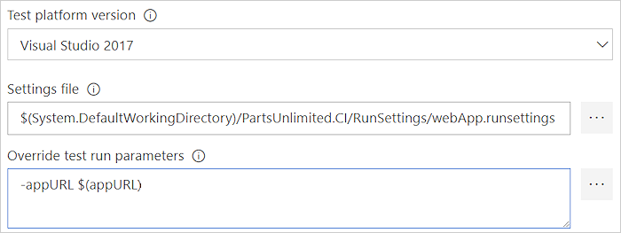

# FAQs for continuous testing and test automation

::: moniker range="<= tfs-2018"
[!INCLUDE [temp](../_shared/concept-rename-note.md)]
::: moniker-end

## General topics

[Go to related topic &gt;](getting-started-with-continuous-testing.md)

### Q: How do I run tests from different unit test frameworks with my build?

**A**: First, set up your test frameworks in your development tool. For example, in Visual Studio:

1. [Set up the plug-in for your test framework](/visualstudio/test/getting-started-with-unit-testing#frameworks), if you haven't already.

1. Create a folder that has the custom binaries for your plug-in. (The plug-in package for your framework is a .vsix file.
   Change the extension to .zip so that you can unzip it.)

1. Add these assemblies to version control and [let the build controller know where to get them](../../pipelines/overview.md).

1. In your build pipeline, provide the path to the test framework in the *Path to Custom Test Adapters** parameter:

   

### Q: I'm having problems using xUnit with .NET Core apps. Where can I get more information?

**A**: See the blog post [Unit Tests with .NET Core and VSTS](http://blogs.perficient.com/microsoft/2016/08/unit-test-with-net-core-and-vsts/).

### Q: I am not using the Visual Studio Test task to run my unit tests. Can I still collect and publish code coverage data?

**A**: Yes, use the [Publish Code Coverage Results task](../tasks/test/publish-code-coverage-results.md).

### Q: I have multiple Publish Code Coverage Results tasks in my pipeline. Do I get a merged code coverage summary?

**A**: Code coverage is automatically merged for only Visual Studio coverage (.coverage) files.
A merged summary is not currently available for coverage files published using multiple Publish Code Coverage Results tasks.

### Q: What are the typical types of tests I can run to validate my app and deployment?

**A**: Testing in a continuous integration and continuous deployment (CI/CD) scenario typically consists of:

1. Run **unit tests** in the CI pipeline, as demonstrated in the example above. The **Visual Studio Test** task
   automatically runs tests included in the app assemblies, but there is a wide range of configuration options
   you can specify, such as running only specific tests. See [Visual Studio Test task](../tasks/test/vstest.md).
 
1. Run **functional tests** in the early stages of the CD pipeline. These are typically 
   [Selenium](continuous-test-selenium.md) (for web apps) and [Coded UI](/visualstudio/test/use-ui-automation-to-test-your-code) tests.
   Use version 2.x or higher of the [Visual Studio Test task](../tasks/test/vstest.md) together with [jobs](../process/phases.md)
   to run unit and functional tests on the universal agent.
   See [Run tests in parallel using the Visual Studio Test task](parallel-testing-vstest.md).
   
1. Run **load tests** after the app is deployed to staging and production, after it passes all functional tests.
   The example shown above is just a simple test that accesses a single page in the web app to validate that 
   deployment succeeded and the app is running successfully. You can perform must more comprehensive load testing
   to validate the entire app by running [cloud-based load tests](../../pipelines/tasks/test/cloud-based-load-test.md)
   and [Apache JMeter load tests](../tasks/test/run-jmeter-load-test.md).

### Q: Can I find a specific test run?

**A**: Yes, type the Run ID into the search box in the left column:

### Q: Can I find specific results from a test run?

**A**: Yes, after you find your test run, create a query in the **Filter** tab to find the test results you want:

### Q: Can I deploy to a staging slot first, and then to production?

**A**: Yes, you can create additional deployment slots in Azure Web Apps,
and specify which slot to deploy your app to. If you do not specify a slot,
the default **Production** slot is used. After you deploy, you can swap an
app to a different slot using the **Azure App Service Manage** task. See
[Azure Web Apps deployment](../../pipelines/targets/webapp.md).

You can use [task jobs](../../pipelines/process/phases.md)
and the [**Manual Intervention**](../../pipelines/tasks/utility/manual-intervention.md) task
in your release pipeline to pause a deployment; for example, to examine test results
after the load tests have run and before the app is swapped from staging to production.

### Q: How do I pass parameters to my test code from a build or release pipeline?

**A**: Use a [runsettings file](/visualstudio/test/configure-unit-tests-by-using-a-dot-runsettings-file)
to pass values as parameters to your test code. For example, in a release that contains
several stages, you can pass the appropriate app URL to each the test tasks in each one.
The runsettings file and matching parameters must be specified in the
[Visual Studio Test task](../tasks/test/vstest.md).  

### Q: Where can I find details about configuring test agents?

**A**: See [Install and configure test agents](/visualstudio/test/lab-management/install-configure-test-agents)

### Q: What if I want to run debug builds of native (.cpp) unit tests on the machine with the test agent?

**A**: Make sure that you have debug versions of the Universal C Runtime (UCRT) on the machine with the test agent,
specifically these libraries: ucrtbased.dll and vcruntime140d.dll. You can include these items with your deployment.
If you're running release builds of .cpp unit tests, make sure that you have Windows Update KB2999226 on your test agent machine.

### Q: Where can I learn more about integrating tests with my build?

**A**: Try these blog posts and videos:

* [Configuring Continuous Integration and Continuous Testing with Visual Studio](http://blogs.msdn.com/b/visualstudioalm/archive/2015/07/17/video-configuring-continuous-integration-and-continuous-testing-with-visual-studio-2015.aspx)
* [Testing in Continuous Integration and Continuous Deployment Workflows](http://blogs.msdn.com/b/visualstudioalm/archive/2015/05/29/testing-in-continuous-integration-and-continuous-deployment-workflows.aspx)
* [Integrating Testing Efforts into the DevOps Process with Build vNext and Visual Studio Release Management](https://channel9.msdn.com/Series/ConnectOn-Demand/234)

---------------------

## Associating tests with test cases

[Go to related topic &gt;](associate-automated-test-with-test-case.md)

### Q: What are the differences if I am still using a XAML build?

**A**: If you are using a XAML build in Azure Pipelines or TFS, you can run tests
that you have associated in a Build-Deploy-Test workflow using a
[Lab environment](/visualstudio/test/lab-management/using-a-lab-environment-for-your-application-lifecycle).
You can also run tests using Microsoft Test Manager (MTM) and a
[Lab environment](/visualstudio/test/lab-management/using-a-lab-environment-for-your-application-lifecycle).

### Q: What types of tests are supported?

**A**: These are the limitations for each type of test:

* Coded UI test, Selenium tests, and unit tests written using
  Version 1 of the MSTest framework **can** be associated with a test case.
* Unit tests that use the.NET Core framework **cannot** be
  associated with a test case.
* Tests that use other test frameworks such as [Version 2 of the MSTest framework](https://blogs.msdn.microsoft.com/devops/2016/06/17/taking-the-mstest-framework-forward-with-mstest-v2/),
  xUnit, nUnit, Chutzpah, and others **cannot** be associated with a test case.
* Associating ordered tests and generic tests **may** work, but running these tests is not supported.

### Q: Can I configure work items to open in Visual Studio?

**A**: Yes, if you want test work items to open inside Visual Studio
instead of the default Azure Pipelines or TFS UI in your web browser,
change the **Work Items | General** setting from the **Tools | Options** menu in Visual Studio.

----------------------------

## Running automated tests from Azure Test Plans

[Go to related topic &gt;](run-automated-tests-from-test-hub.md)

### Q: What permissions do I need to run automated tests from Azure Test Plans?

You must be a Project Contributor, or have the following permissions:

* Create releases
* Manage releases
* Edit release stage
* Manage deployment

For more information, see [Set permissions for release pipelines](../policies/set-permissions.md#set-permissions-for-release-pipelines) and
[Release permissions](../policies/permissions.md#release-permissions).

### Q: Can I override the build or stage set at the test plan level for a specific instance of test run?

**A:** Yes, you can do this using the **Run with options** command.
Open the shortcut menu for the test suite in the left column and choose
**Run with options**.

Enter the following values in the Run with options dialog and then choose **OK**:

* **Test type and runner**: Select **Automated tests using Release Stage**.
  
* **Build**: Select the build that has the test binaries. The test results will be associated this build.
 
* **Release Pipeline**: Select a pipeline from the list of release pipelines that can consume the selected build artifact.
 
* **Release Stage**: Select the name of the stage configured in your release pipeline.

### Q: Why use release stages to run tests? 

**A:** Release Management offers a compelling orchestration workflow
to obtain test binaries as artifacts and run tests. This workflow shares
the same concepts used in the scheduled testing workflow, meaning users
running tests in scheduled workflow will find it easy to adapt; for 
example, by cloning an existing scheduled testing release pipeline.

Another major benefit is the availability of a rich set of tasks in
the task catalog that enable a range of activates to be performed before
and after running tests. Examples include preparing and cleaning test data,
creating and cleaning configuration files, and more.

### Q: How does selecting "Test run" in the Visual Studio Test task version 2 work?

**A:** The Test management sub-system uses the test run object to
pass the list of tests selected for execution. The test task looks
up the test run identifier, extracts the test execution information
such as the container and test method names, runs the tests, updates
the test run results, and sets the test points associated with the
test results in the test run. From an auditing perspective, the 
Visual Studio task provides a trace from the historical releases
and the test run identifiers to the tests that were submitted for
on-demand test execution.

### Q: Should the agent run in interactive mode or as a service?

**A:** If you are running UI tests such as
[coded UI](/visualstudio/test/use-ui-automation-to-test-your-code)
or [Selenium](continuous-test-selenium.md) tests,
the agent on the test machines must be running in interactive mode with auto-logon enabled,
not as a service, to allow the agent to launch a web browser.
If you are using a headless browser such as [PhantomJS](http://phantomjs.org/),
the agent can be run as a service or in interactive mode. See 
[Build and release agents](../../pipelines/agents/agents.md),
[Deploy an agent on Windows](../../pipelines/agents/v2-windows.md),
and [Agent pools](../../pipelines/agents/pools-queues.md).

### Q: Where can I find detailed documentation on how to run Selenium tests?

**A:** See [Get started with Selenium testing](continuous-test-selenium.md).

### Q: What happens if I select multiple configurations for the same test?

**A:** Currently, the on-demand workflow is not configuration-aware.
In future releases, we plan to pass configuration context to the test
method and report the appropriate results.

### Q: What if I need to download product binaries and test binaries from different builds? Or if I need to obtain artifacts from a source such as Jenkins?

**A:** The current capability is optimized for a single team build
to be tested on-demand using a Release Management workflow.
We will evaluate support for multi-artifact releases, including
non-Azure Pipelines artifacts such as Jenkins, based on user feedback.

### Q: I already have a scheduled testing release pipeline. Can I reuse the same pipeline to run test on-demand, or should I create a new pipeline as shown above? 

**A:** We recommend you use a separate release pipeline and stage for on-demand automated testing from Azure Test Plans because:

* You may not want to deploy the app every time you want to run a few on-demand tests.
Scheduled testing stages are typically set up to deploy the product and then run tests.

* New releases are triggered for every on-demand run. If you have many
testers executing a few on-demand test runs every day, your scheduled
testing release pipeline could be overloaded with releases for these
runs, making it difficult to find releases that were triggered for the
pipeline that contains scheduled testing and deployment to production.

* You may want to configure the Visual Studio Test task with a Test run
identifier as an input so that you can trace what triggered the release.
See [How does selecting "Test run (for on-demand runs)" in the Visual Studio Test task work?](#faq-ondemandruns).

### Q: Can I trigger these runs and view the results in Microsoft Test Manager?

**A:** No. MTM will not support running automated tests against Team Foundation
builds. It only works in the web-based interface for Azure Pipelines and TFS.
All new manual and automated testing product development investments will be
in the web-based interface. No further development is planned for MTM. See
[Guidance on Microsoft Test Manager usage](../../test/mtm/guidance-mtm-usage.md).

### Q: I have multiple testers in my team. Can they run tests from different test suites or test plans in parallel using the same release pipeline?

**A:** They can use the same release pipeline to trigger multiple
test runs in parallel if:

* The agent pool associated with the stage has sufficient agents
to cater for parallel requests. If sufficient agents are not available,
runs can still be triggered but releases will be queued for processing
until agents are available.

* You have sufficient jobs to enable parallel jobs.
See [Parallel jobs in Azure Pipelines](../../pipelines/licensing/concurrent-jobs-vsts.md) 
or [Parallel jobs in TFS](../../pipelines/licensing/concurrent-pipelines-tfs.md) for more information.

* Testers do not run the same tests in parallel. Doing so may cause
results to be overwritten depending on the order of execution.

To enable multiple different test runs to execute in parallel, set the Release Management
stage trigger option for
[behavior when multiple releases are waiting to be deployed](../../pipelines/release/triggers.md#env-triggers)
as follows:

* If your application supports tests running in parallel from different
sources, set this option to
**Allow multiple releases to be deployed at the same time**.

* If your application does not support tests running in parallel
from different sources, set this option to
**Allow only one active deployment at a time**.

### Q: What are the typical error scenarios or issues I should look out for if my tests don't run?

**A:** Check and resolve issues as follows:

* The release pipeline and stage in which I want to run tests
  are not shown after I select the build.
   - Make sure the build pipeline that is generating the build is linked
     as the primary artifact in the **Artifacts** tab of the release pipeline.

 
* I get an error that I don't have sufficient permission to trigger a release.
   - Configure **Create releases** and **Manage deployments** permissions for
     the user in the **Security** menu of the release pipeline.
     See [Release permissions](../../pipelines/policies/permissions.md#release-permissions).

   
* I get an error that no automated tests were found.
   - Check the automation status of the selected tests. Do this in the work item
     for the test case, or use the **Column options** link in the **Test Plans**
     page of [!INCLUDE [pipelines-hub-include-nolink](_shared/pipelines-hub-include-nolink.md)] to add the **Automation status** column to the list
     of tests. See the [pre-requisites section](../../test/run-automated-tests-from-test-hub.md#prerequisites) for information
     about automating manual tests.

* My tests didn't execute, and I suspect the release pipeline is incorrect.
   - Use the link in the **Run summary** page to access the release instance
     used to run the tests, and view the release logs.
 

* My tests go into the error state, or remain "in-progress" even after release to the stage is triggered.
   - Check if the release stage that you selected has the correct task
     and version selected. You must use version 2 or higher of the **Visual Studio
     Test** task. Version 1 of the task, and the **Run Functional Tests** task,
     are not supported.
 

