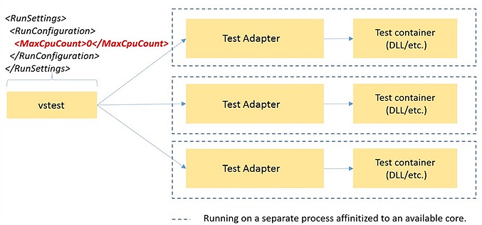
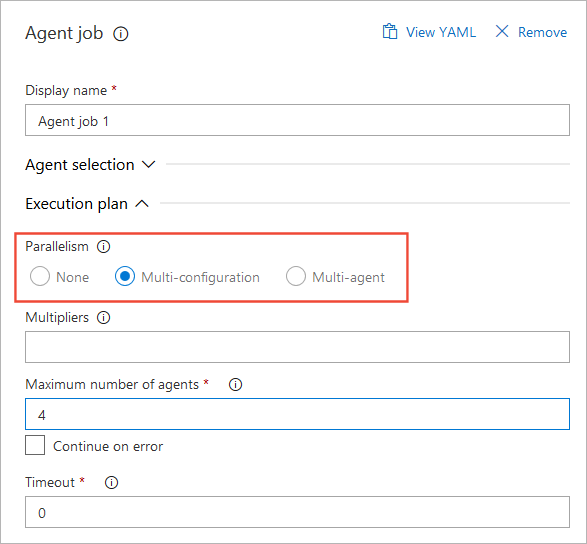
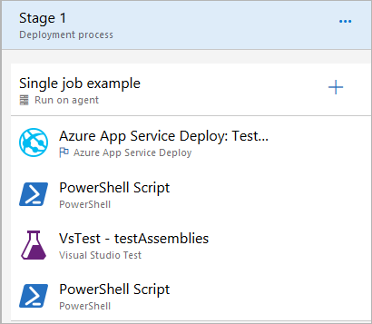
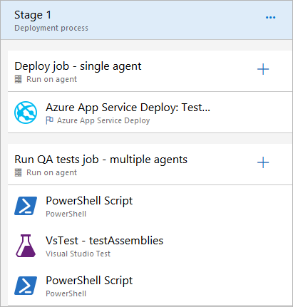
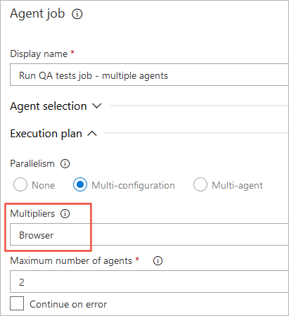
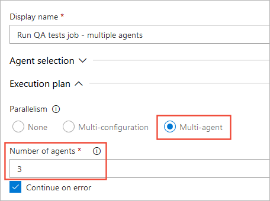

# Set up environments to run continuous test tasks with your build tasks

[!INCLUDE [version-header-ts-tfs](_shared/version-header-ts-tfs.md)]

To test your app using different platforms and configurations using test automation,
set up separate environments to run your app and tests with your
builds in Azure Pipelines or Team Foundation Server (TFS).

::: moniker range="<= tfs-2018"
[!INCLUDE [temp](../_shared/concept-rename-note.md)]
::: moniker-end

## Set up machines to run your app and tests

You'll need to set up physical or virtual machines to run your app and tests, for example:

* Windows Server 2012 R2 or higher with IIS to run your app

* Machines with the necessary browsers to run your tests

With Azure Pipelines, you can define environments that have physical and virtual machines, such as Azure VMs and Azure resource groups.
With TFS, you can define environments using only physical machines.
Alternatively, you can [create a virtual network isolated environment for your build-deploy-test scenarios](../targets/create-virtual-network.md).

If you want to use a PowerShell script to deploy your app, make sure to:

* Include that script in your solution or project.

* Enable PowerShell Remote on all your machines.

You'll need to install the agent that runs your tests on the machines. For more details, see
[Deploy a Windows build agent](../../pipelines/agents/v2-windows.md).
You might decide to [create Azure VMs](/azure/virtual-machines/windows/quick-create-portal)
to install your agents.

## Define a list of machines to run your app and tests

> [!NOTE]
> Previous versions of Azure Pipelines and TFS included the capability to define
> **Machine Groups**. However, this feature is no longer available.

As an alternative, consider:

* If you use version 2.x or higher of the [Visual Studio Test](../tasks/test/vstest.md)
  task you can deploy and run unit and functional tests without requiring the **Deploy Test Agent** and **Run Functional Tests** tasks,
  and run tests on platforms that don't have Visual Studio installed by using the 
  [Visual Studio Test Platform](https://blogs.msdn.microsoft.com/devops/2016/07/25/evolving-the-visual-studio-test-platform-part-1/).
  In this case, you can use [deployment groups](../release/deployment-groups/index.md)
  to define your target machines. For more details, see
  [Testing with unified agents and jobs](test-with-unified-agent-and-phases.md).

* A **comma-delimited list** of machine IP addresses or 
  fully-qualified domain names (FQDNs), together with any port information,
  in all your build or release pipelines. For example: 

  `dbserver.fabrikam.com,dbserver_int.fabrikam.com:5986,192.168.12.34:5986`
 
* A variable that contains the list of machines. For example, a
  [build or release pipeline variable](../../pipelines/release/variables.md)
  or a variable defined within a project-wide 
  [variable group](../../pipelines/library/variable-groups.md). For example, you could define the variable
  named **MyMachines** with the value shown above, then include it in
  your tasks using:

  `$(MyMachines)`

  Using a variable means that you can change the list of machines in one place
  and have the change apply to all the tasks that use the variable.

  >If you don't specify a port number, the default (based on the selected protocol)
  will be used. If you are using HTTPS, the IP address or name of the machine should
  match the CN entry in the certificate. Note that you can set the **Test
  Certificate** option in some build, test, and deploy tasks to omit certificate checks.

## Run tests in parallel

The Visual Studio Test Platform (VSTest) supports running tests in parallel.
Parallel test execution is available:

* To all frameworks and within the IDE, the command line (CLI), and in Azure Pipelines.
* Within the IDE from all launch points (Test Explorer, CodeLens, various **Run** commands, and more).

Parallel test execution:

* Composes with [test adapters](https://visualstudiogallery.msdn.microsoft.com/site/search?query=%22Test%20Adapter%22&f%5B0%5D.Value=%22Test%20Adapter%22&f%5B0%5D.Type=SearchText&ac=4) and frameworks that already support parallel execution such as MSTest, NUnit, and xUnit.net.
* Is easy to implement, it requires no changes to existing test code and does not break existing test runs.
* Works with the test code where it already resides.
* Is OFF by default, users must explicitly opt in.
* Is supported at [assembly level](https://blogs.msdn.microsoft.com/devops/2018/01/30/mstest-v2-in-assembly-parallel-test-execution/).

Not all existing test code might be parallel-safe; for example, tests may assume exclusive use of global resources.
In general, use the following iterative approach to leverage the feature:

Partition tests in terms of a taxonomy as follows:

1. Pure unit tests (typically these can run in parallel).
1. Functional tests that can run in parallel with some modifications (for example, two tests that create or delete the same folder can be adapted to use unique folders).
1. Functional tests that cannot be modified to run in parallel (for example, two Coded UI tests performing mouse actions on the desktop, or two functional tests writing to the Bluetooth or IR port).

Gradually evolve the partitioning as follows:

1. Run the tests in parallel, see which tests fail, and classify them as above.
1. Fix tests in category 2 so that they can run in parallel.
1. Move tests in category 3 into a separate test run where parallel is OFF by default.

Parallel Test Execution is **not** supported in the following cases:

* If the test run is configured using a **.testsettings** file.
* For test code targeting Phone, Store, UWP app platforms.

### Enable parallel tests in Visual Studio 2017 Update 1 and VS Test task v1.x

Configure a [.runsettings file](/visualstudio/test/configure-unit-tests-by-using-a-dot-runsettings-file)
in the app source repository for Visual Studio IDE or the CLI, and in Azure Pipelines when using
version 1.x of the  [Visual Studio Test](../tasks/test/vstest.md)
task.

In the **.runsettings** file add entry for **MaxCpuCount**, and specify or associate the file with the test run.
The value for **MaxCpuCount** has the following semantics:

* **n** where 1 <= n <= number of cores: up to **n** processes will be launched.
* **n** of any other value: The number of processes launched will be as many as the available cores on the machine.
* A value of 0 (zero) indicates that up to all the available free cores may be used.

[!INCLUDE [paralleltest-runsettingsmerge](_shared/paralleltest-runsettingsmerge.md)] 

[More information about test processes for parallel execution](https://blogs.msdn.microsoft.com/devops/2016/10/10/parallel-test-execution/).

### Enable parallel tests in Visual Studio 2017 Update 2 and later

Enable parallel test execution by using the button on the Test Explorer toolbar.
This is an ON/OFF toggle setting.

For the CLI, **vstest.console.exe** supports a **/Parallel** command line switch. Set this to enable parallel test execution.

[!INCLUDE [paralleltest-maxcpucount](_shared/paralleltest-maxcpucount.md)] 

[!INCLUDE [paralleltest-runsettingsmerge](_shared/paralleltest-runsettingsmerge.md)] 

### Enable parallel tests in Azure Pipelines with VS Test task v2.x

Enable parallel test execution by setting the **Run Tests in Parallel...** checkbox
in the settings for the [Visual Studio Test](../tasks/test/vstest.md) task.

[!INCLUDE [paralleltest-maxcpucount](_shared/paralleltest-maxcpucount.md)] 

[!INCLUDE [paralleltest-runsettingsmerge](_shared/paralleltest-runsettingsmerge.md)] 

## Testing with unified agents and jobs

Version 2 of the **Visual Studio Test** task uses the unified Build and Release
agent, instead of a different custom agent as was the case with version 1.
The new version of the task also integrates intelligently with
[task jobs](../../pipelines/process/phases.md).
This topic explores how you can use this task, and explains how
it works in a range of scenarios.  

For more information about the tasks see:

* [Visual Studio Test version 1](https://github.com/Microsoft/vsts-tasks/blob/releases/m109/Tasks/VsTest/README.md)
* [Visual Studio Test version 2](https://github.com/Microsoft/vsts-tasks/blob/master/Tasks/VsTestV2/README.md)

You select the [specific version](../../pipelines/process/tasks.md#task-versions)
of a task you want to use in the **Version** list at the top
of the task properties pane. Use the **i** icon to show more information about the task or
a selected property setting.

### Advantages of using the unified agent

* You no longer need to use dedicated machines for testing (as was required by the **Run Functional Tests** task).
  With the unified agent, you can leverage the common agent pool.
  Administrators can set up a reusable pool of machines, making management much easier.

* You can use the unified agent for single machine as well multi-machine distributed execution.

* You no longer need the **Visual Studio Test Agent Deployment** task.
  This task is based on WinRM, which imposes several limitations.

* You no longer need any "copy files" tasks because all execution is now local to the
  automation agent, and task jobs download the artifacts to the target machines automatically.
  There is no requirement to copy test assemblies and their dependencies when running tests remotely
  using the **Run Functional Tests** task.

### How test tasks run in jobs

You can add [different types of jobs](../../pipelines/process/phases.md)
to a release pipeline. The properties of these jobs include settings for
**Parallelism**.

The following sections describe how this setting affects the operation
of the **Visual Studio Test** and **Run Functional Tests** tasks.
For a full description of the operation for all tasks, see
[Parallel execution using agent jobs](../../pipelines/process/phases.md#parallelexec).

#### No parallelism

A single agent from the specified pool will be allocated to this job.
This is the default, and all tasks in the job will run on that agent.
The **Visual Studio Test** task runs in exactly the same way as version
1 with single agent test execution.

For example, you could deploy an Azure Web App and run a small number
of quick tests on it (for which a single agent is sufficient), along
with some pre- and post-test setup and cleanup activities, using a pipeline configured as follows:

#### Multiple executions

This mode is driven by 'multipliers', in much the same way as a multi-configuration Build or Release.
You define the multipliers as variables. Based on the values for these variables, the various configurations
are run.

In the case of Build, you typically use **BuildPlatform** and **BuildConfiguration** as multipliers.
The same logic applies to testing. For example, you could deploy a web app to Azure and run
cross-browser tests on IE and Firefox by configuring a pipeline to use two jobs - a deploy job and a test job: 

The test job is set up as a multiple executions process using a variable named **Browser**, which
has the values `Edge` and `Firefox`. The job will run twice using these two configurations - one
agent is assigned the value `Edge` for its **Browser** variable, and one with the value `Firefox`.

In the tasks for the pipeline, the **Browser** value could be used to instantiate the appropriate
browser for the tests. For example, you might pass the values as **Test Run Parameters** and access them
using **TestContext** in the test code.

You could also use the values to provide appropriate titles
for your test runs so that, if a test fails in a particular configuration, you can easily tell which run it came from.

#### Multiple agents

Multiple agents will be allocated to the job. You specify the number of agents to be allocated
from the pool, and the set of tasks in that job will be distributed across all these agents.

In this mode, the Visual Studio Test task runs in a special way. It recognizes that it's a multiple agents
job, and runs tests in a distributed manner across all the allocated agents. Because other tasks run
across all agents, any pre- and post-test tasks also run equally on all the agents. Therefore, all the
agents are prepared and cleaned up in a consistent manner.
In addition, test execution does not require all agents to be available at the same time. If some agents
are busy with another release or build, the job can still start with the available number of agents
that match the demand, and test execution starts. As additional agents become available, they can pick
up any remaining tests that have not yet run.

Artifacts are automatically downloaded when the job starts, so the test assemblies and other files
are already located on the agent, and no "copy files" task is required. So, to publish an Azure Web App
and run a large number of tests with fast test execution, you could model the pipeline as two jobs -
one being the deploy job (which runs on a single agent because you don't want multiple agents to deploy
the same app concurrently), and the other a test job that uses multiple agents mode to achieve test distribution.

This also means that you can use different agent pools for the two jobs, allowing you to manage agents
for different purposes separately if required.

### FAQs

#### Q: How do I do this with Build? 

**A**: The jobs capability is currently available only in Azure Pipelines releases. It will become available for builds soon.

#### Q: Does the Visual Studio Test version 1 task behave the same way as the version 2 task?

**A**: No, the version 1 task cannot be used for test distribution. On the single agent (the default,
no parallelism) setting, the task will run in the same way as on the previous test agent. In the
multiple executions and multiple agents modes, it is replicated on the agents, in the same way as all other tasks.

#### Q: Can I run UI tests on the Microsoft-hosted agents?

**A**: Yes, see [UI testing considerations](ui-testing-considerations.md).

#### Q: What is required to run UI tests?

**A**: See [UI testing considerations](ui-testing-considerations.md).

#### Q: What does the 'Test mix contains UI tests' checkbox do?

**A**: Currently, it is there only as a reminder to run agents interactively
if you are running UI tests. If you are using an agent pool with a mix of
interactive and 'running as service' agents, you may also want to add an
'Interactive' capability to your agents demand that in your test job
to ensure the appropriate set of agents that can run UI tests are used.
See [Build and Release agent capabilities](../../pipelines/agents/agents.md#capabilities).

#### Q: In multiple executions mode, do I get distribution of tests as well?

**A**: No, multiple executions mode assigns only one agent per configuration.

#### Q: How do I map the configuration in multiple executions mode to my Test Configurations using tcm.exe?

**A**: Currently this is not possible.

#### Q: How else can I use multiple executions mode?

**A**: This mode can be used whenever you need multiple agents to execute jobs in parallel.
For more examples, see [Parallel execution using agent jobs](../../pipelines/process/phases.md#parallelexec).

#### Q: Has the Run Functional Tests task also changed?

**A**: No, the Run Functional Tests (RFT) task has not changed. If you are using this task
you _do_ need the **Deploy Test Agent** task. Note that, because tasks are replicated
in the multiple agents and multiple executions mode, using the Run Functional Tests task in this
mode will lead to undesirable effects.

#### Q: Do I need to install Visual Studio on all the machines to use the Visual Studio Test version 2 task?

**A**: Currently, yes. An alternate means for running tests without requiring Visual Studio
on the agent machine is under consideration, which will allow you to create a separate pool
of agents for testing purposes.

#### Q: I am using my own test runner (not the Visual Studio Test task) in the pipeline. What happens to it?

**A**: In the multiple agents and multiple executions mode, the task will be replicated on each
of the agents. You can use the multiple executions mode to partition your tests on different
configuration using the configuration variable. For example, if you have a configuration variable
named **Platform** that has values `x86` and `x64`, you can run the two sets of tests on two
agents in parallel by referring to your test assemblies using `**\$(Platform)\*test*.dll`

#### Q: How does the Visual Studio Test version 2 task run on deployment groups?

**A**: Yes, the task can be used to run on [deployment groups](../../pipelines/release/deployment-groups/index.md).

If you have scenarios that necessitate running tests on machines in the deployment group
where the app is deployed, you can use the Visual Studio Test version 2 task.
If multiple machines are selected (using, for example, tags) in a **Run on Deployment Group**
job, the tests will be replicated to each of the machines.

## See Also

* [MSTest V2 in-assembly parallel test execution](https://blogs.msdn.microsoft.com/devops/2018/01/30/mstest-v2-in-assembly-parallel-test-execution/)
* [Parallel Test Execution](https://blogs.msdn.microsoft.com/devops/2016/10/10/parallel-test-execution/)
* [Create a virtual network isolated environment for build-deploy-test scenarios](../targets/create-virtual-network.md)
* [Speed up testing with Test Impact Analysis](test-impact-analysis.md)

[!INCLUDE [help-and-support-footer](_shared/help-and-support-footer.md)] 
