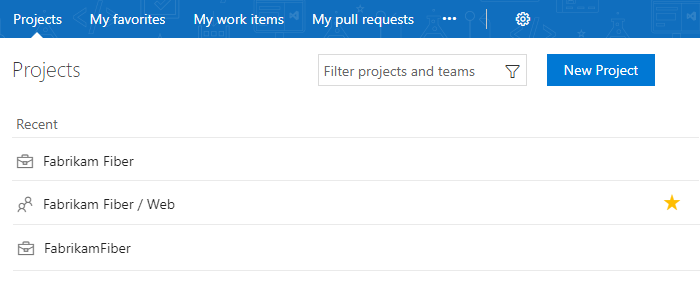
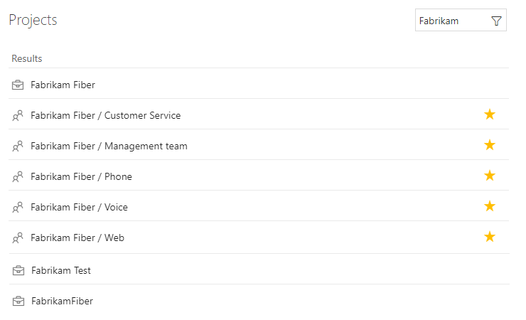
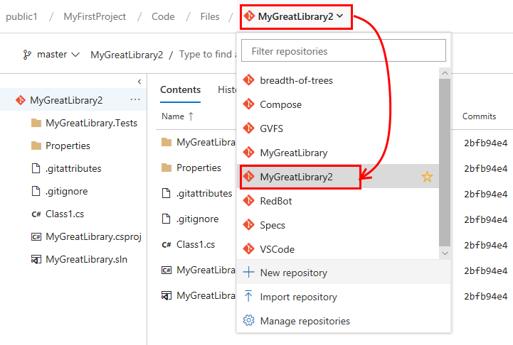
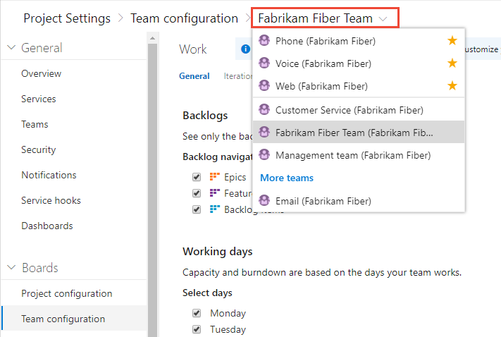
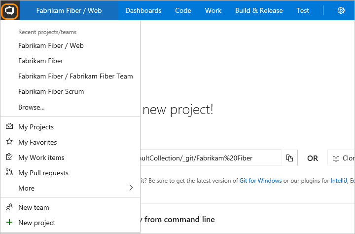
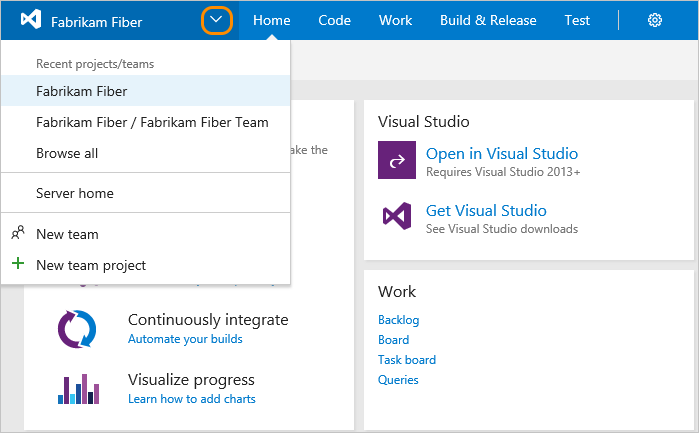

# Switch project, repository, team 

[!INCLUDE [temp](../../includes/version-tfs-2017-through-vsts.md)] 

Several features depend on the project, repository, or team that you have selected. For example, dashboards, backlogs, and board views will change depending on the project and team you select.

Also, when you add a work item, the system references the default area and iteration paths defined for the team context. Work items you add from the team dashboard (new work item widget) and queries page are assigned the team default iteration. Work items you add from a team backlog or board, are assigned the team default backlog iteration. To learn more, see [About teams and Agile tools](../../organizations/settings/about-teams-and-settings.md).  

## View and open a project 
From the **Projects** page you can quickly navigate to a project that you have permissions to view. 

::: moniker range=">= azure-devops-2019"

1. Choose the  Azure DevOps logo to open **Projects**.  

	> [!div class="mx-imgBorder"]  
	> 

	The projects you most recently viewed are displayed, followed by a list of all projects in alphabetic order. 

1. Hover over the dots and you can open the service of interest for that project. 

	> [!div class="mx-imgBorder"]  
	> 

1. You can filter the project and team list using the *Filter projects* search box. Simply type a keyword contained within the name of a project or team. Here we type **Fabrikam** to find all projects or teams with *Fabrikam* in their name. 

	> [!div class="mx-imgBorder"]  
	>  

1. Choose **Create Project** to add a project. You must be an account administrator or a member of the Project Collection Administrators group to [add a project](../../accounts/create-team-project.md).

	> [!div class="mx-imgBorder"]  
	>  

::: moniker-end

::: moniker range=">= tfs-2017 <= tfs-2018"

From the **Projects** page you can quickly navigate to a project or a team that you've accessed or worked in previously. Projects and teams are listed in the order you've last accessed, with the most recent five projects accessed appearing first. All projects you've accessed are listed within the **All** section. 

1. Choose the  Azure DevOps logo to open **Projects**.  

	> [!div class="mx-imgBorder"]  
	> 

	The projects you most recently viewed are displayed, followed by a list of all projects in alphabetic order. 

	> [!div class="mx-imgBorder"]  
	> 

1. As you hover over a project or team, you can choose one of the links to go to **Home** or **Dashboards**, **Code**, **Work**, **Build and Release**, **Test**, or **Wiki** pages. Choose the  star icon to mark the project as a favorite. 

	> [!div class="mx-imgBorder"]  
	>  

2. You can filter the project and team list using the *Filter projects and teams* search box. Simply type a keyword contained within the name of a project or team. Here we type **Fabrikam** to find all projects or teams with *Fabrikam* in their name. 

	> [!div class="mx-imgBorder"]  
	>  

3. Choose **New Project** to add a project. You must be an account administrator or a member of the Project Collection Administrators group to [add a project](../../accounts/create-team-project.md).

	> [!div class="mx-imgBorder"]  
	>  

::: moniker-end

## View and open a repository 

::: moniker range=">= azure-devops-2019"

1. Choose **Repos>Files**.

	> [!div class="mx-imgBorder"]
	>  

1. Select the repository of interest from the repository selector.  
	> [!div class="mx-imgBorder"]
	>  

::: moniker-end

::: moniker range=">= tfs-2017 <= tfs-2018"

1. Choose **Code**.  
 
	> [!div class="mx-imgBorder"]  
	>   

1. Select the repository from the selector.  

	> [!div class="mx-imgBorder"]  
	> 
   ::: moniker-end  

## Switch to a different team 

::: moniker range=">= azure-devops-2019"

From a user page, one under&mdash;**Boards**, **Repos**, **Pipelines**, or **Test Plans**&mdash;you can't switch to a different team, you can [only select team artifacts](use-breadcrumbs-selectors.md). 

From a **Project Settings>Work>Team configuration** page, you select a team from the team selector breadcrumb. 

> [!div class="mx-imgBorder"]  
> 

::: moniker-end

::: moniker range="tfs-2018"
You can switch your team focus to one that you've recently viewed from the project/team selector. If you don't see the team or project you want, choose **Browse&hellip;** or choose the  Azure DevOps logo to [access the **Projects** page](work-across-projects.md).  

::: moniker-end

::: moniker range="tfs-2017" 
<a id="switch-context-tfs-2017-1" /> 
### TFS 2017.1 
To switch your team focus to a project or team you've recently viewed, hover over the  Azure DevOps logo and choose from the drop-down menu of options. If you don't see the team or project you want, choose **Browse&hellip;** to [browse all projects and teams](work-across-projects.md). 

 

### TFS 2017
<a id="tfs-2017-switch-context" /> 

Open the project/team drop-down menu and select the project/team that you've recently visited. If you don't see the team or project you want, choose **Browse all** to browse all projects and teams. 

   

::: moniker-end

## Related articles
- [Work across projects](work-across-projects.md)
- [Add teams](../../organizations/settings/add-teams.md?toc=/azure/devops/project/navigation/toc.json&bc=/azure/devops/project/navigation/breadcrumb/toc.json)