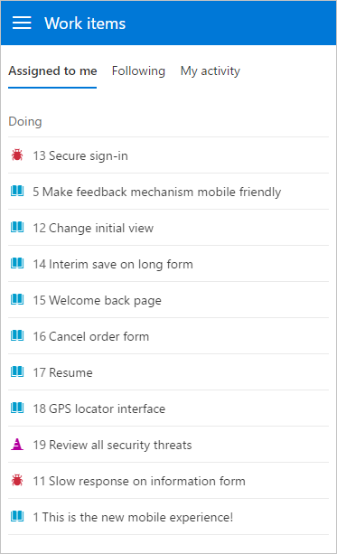

#  View and update work items via the mobile browser   

**VSTS | TFS 2018**

With the mobile browser and work item form, you gain on-the-go features to stay on top of the latest updates made to work tracking. When you click any work item link on your mobile device, it will open a mobile-friendly version of the work item. From there, you can update the work item or access all work items assigned to you or that you're following.   
 
  

::: moniker range="vsts"

> [!NOTE]  
> The mobile browser supports work tracking in VSTS OR TFS 2018 and later versions. To sign up for VSTS, go to [VSTS](https://www.visualstudio.com/team-services/). The mobile browser is not an app, but a mobile view into select features. There is nothing to download. You access the mobile browser by clicking a link from a work item you receive in your mobile email application.      

::: moniker-end

::: moniker range="tfs-2018"

> [!NOTE]  
> The mobile browser is available for TFS 2018 and later versions. To download TFS 2018, see the [TFS 2018 Release Notes](https://www.visualstudio.com/en-us/news/releasenotes/tfs2018-relnotes). The mobile browser is not an app, but a mobile view into select features. There is nothing to download. You access the mobile browser by clicking a link from a work item you receive in your mobile email application. 

::: moniker-end

## Open the mobile work item form  

The mobile work item form will open when you click **View work item** from an email you receive from your mobile device. You'll receive this type of email under these circumstances:  

- Changes were made to a work item you're following
- You were **@mentioned** in a discussion
- A notification is sent based on the work item alerts you've set using [Manage personal notifications](../../notifications/manage-personal-notifications.md). 

  

## Update a work item
Within the mobile form, you can do almost everything you can do from the [web portal form](../../work/backlogs/add-work-items.md). Here are the actions you can take in the order they appear in the mobile form: 

*  Add and remove tags
*  View and add to the discussion, click on the comment to add to the discussion
*  View and update any field within the form (Assign to, State, Area, Iteration, Description, and more) 
*  View and open a link within the Development section 
*  View History 
*  View and open a link from the Links tab
*  Open and add an attachment from the Attachments tab

Actions not available to you: 
*  You can't initiate a development operation 
*  You can't add a link  

### Interact with mobile form controls  

Mobile form controls operate as follows: 

- Click any field to edit it and the form changes to a full-screen experience. For example, some of the most common actions such as changing the state of an item, moving to a different area path, adding an attachment, and creating/removing tags are all supported. 
- When done, click the  return option. 
- Remember to click the  save icon to save your changes!  

### Update status (change State) 
 
To update the state, click the state you want.  
 
  

### Add or remove tags 

To add a tag, type the text you want.  
 
 

### View history
 
Click the History tab to view history. 

  

## View and open work items in your activity lists 

From within the mobile work item form, you can access your work items. The mobile browser allows you to view and open work items which fall into these categories: 
- **Assigned to me**: lists all work items assigned to you 
- **Following**: lists all work items that you have elected to follow 
- **My activity**: lists all work items that you have recently viewed or updated.

The lists available from each page span all team projects that you work in. 

To access a list, first click the list control from the work item form you've opened. 

 

Then, click **Work items**. 

The browser opens to the **Assigned to me** page. From there, you can choose **Following** or **My activity** to access the other pages. To learn more about the **Work Items** view, see [View and add work items](../../work/work-items/view-add-work-items.md). 

  

## Related articles  

Additional experiences are in the works to improve and expand on the mobile experience. For more information, see the blog post: [The mobile work item form (preview)](https://blogs.msdn.microsoft.com/visualstudioalm/2017/01/24/the-mobile-work-item-form/).
  
- [Set personal notifications](../../notifications/manage-personal-notifications.md)  
- [Set team notifications](../../notifications/manage-team-notifications.md)  
- [Follow a work item](../../work/work-items/follow-work-items.md)    

### Provide feedback for the mobile experience  

Help us improve the mobile experience. 

To provide feedback,  click the list control from the work item form and then click **Send Feedback**. To complete the feedback, select either the smile or frown and optionally enter a comment. 

 

