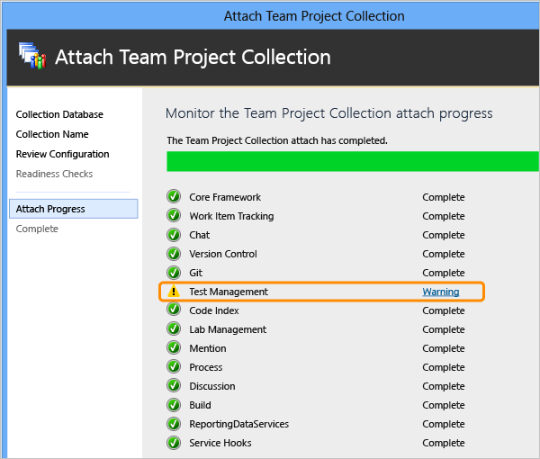

# Update a project manually to support test management

**TFS 2018 | TFS 2017 | TFS 2015 | TFS 2013** 

> [!IMPORTANT]  
>This topic applies to a project that is defined on an on-premises Team Foundation Server (TFS)and was created using a process template that doesn't have test plans and test suites work item types.    

When you upgrade your existing on-premises deployment to Team Foundation Server (TFS) 2013.3, you have the ability to customize test plans and test suites because these objects are now remodeled as work item types (WITs).  
  
 To accomplish this transformation, the TFS Upgrade Wizard automatically updates the projects defined for all collections on the application tier and migrates existing test data and objects. Behind the scenes, it performs two activities:  
  
1.  Imports the WIT definitions for test plan and test suite, and updates the categories definition for projects to include test plan and test suite categories.  
  
2.  Migrates existing test management data. Work items are created from existing test plan and test suites, and links between the other existing test artifacts&mdash;such as test points, test runs, and test results&mdash;are fixed to point to the work item-based test plans and test suites.  
  
 Data migration depends on a successful import of WIT definitions and updates. If the first activity fails, the second one will not occur. In the event that either activity is unsuccessful, the wizard logs one or more warnings or errors.  
  
   
  
 When this occurs, you'll need to manually update your project. You won't be able to access existing test plans and test suites until you perform the manual updates.  
  
 Errors might occur if your project already contains WITs labeled Test Plan or Test Suite, or you've upgraded from TFS 2005 and 2008 and you haven't added the necessary work tracking objects to support test management. See [Update a project based on an MSF v4.2 process template](update-a-team-project-v4-dot-2-process-template.md).  
  
## Manually update your project to support the test experience 

The following steps provide support for the test experience available with TFS 2013.3 or later versions. 
  
1.  **Import the test plan and test suite WIT definitions**.  
  
    0.  If you don't have administrative permissions, [get them](../../organizations/security/set-project-collection-level-permissions.md). To perform all the update steps, you need to be a member of the **Team Foundation Administrators** security group, and an administrator on the application-tier server.  
  
    0.  [Download the latest process template](../../boards/work-items/guidance/manage-process-templates.md).  
  
	[!INCLUDE [temp](../../_shared/witadmin-run-tool-example.md)] 
  
    0.  Import the test plan and test suite WIT definitions.  Specify the *DirectoryPath* to the WorkItem Tracking/TypeDefinitions folder that contains the process template that you downloaded.  
  
        ```  
        witadmin importwitd /collection:"CollectionURL" /p:"ProjectName" /f:"DirectoryPath\TestPlan.xml"  
        witadmin importwitd /collection:"CollectionURL" /p:"ProjectName" /f:"DirectoryPath\TestSuite.xml"  
        ```  
  
         An example of *CollectionURL* is http://MyServer:8080/tfs/DefaultCollection.  
  
         The *DirectoryPath* must follow this structure: *Drive:TemplateFolder*WorkItem TrackingTypeDefinitions. For example:  
  
         `C:Process TemplateMicrosoft Visual Studio Scrum 2013.3WorkItem TrackingTypeDefinitions`  
  
2.  **Update your category definitions**.  
  
    1.  Export your categories definition file.  
  
        ```  
        witadmin exportcategories /collection:CollectionURL /p:ProjectName /f:"DirectoryPath\Categories.xml"  
        ```  
  
    2.  Add the following categories.  
  
		> [!div class="tabbedCodeSnippets"]
		```XML  
        <CATEGORY name="Test Plan Category" refname="Microsoft.TestPlanCategory">  
               <DEFAULTWORKITEMTYPE name="Test Plan" />  
          </CATEGORY>  
          <CATEGORY name="Test Suite Category" refname="Microsoft.TestSuiteCategory">  
               <DEFAULTWORKITEMTYPE name="Test Suite" />  
          </CATEGORY>  
        ```  
  
    3.  Add the new WITs to the hidden categories.  
  
		> [!div class="tabbedCodeSnippets"]
		```XML   
        <CATEGORY name="Hidden Types Category" refname="Microsoft.HiddenCategory">  
            <DEFAULTWORKITEMTYPE name="Code Review Request" />  
            <WORKITEMTYPE name="Code Review Response" />  
            <WORKITEMTYPE name="Feedback Request" />  
            <WORKITEMTYPE name="Feedback Response" />  
            <WORKITEMTYPE name="Shared Steps" />  
            <WORKITEMTYPE name="Shared Parameter" />  
            <WORKITEMTYPE name="Test Plan" />  
            <WORKITEMTYPE name="Test Suite" />  
          </CATEGORY>  
        ```  
  
    4.  Import the updated file.  
  
        ```  
        witadmin importcategories /collection:CollectionURL /p:ProjectName /f:"DirectoryPath\Categories.xml"  
        ```  
  
3.  **Migrate existing test plans and suites to work item based test plans and suites**.  
  
    1.  Open a Command Prompt window on the TFS application-tier server and change the directory. For example:   
  
        ```  
        cd %programfiles%\TFS 15.0\Tools  
        ```  
  
    2.  Run the **TfsConfig TCM** command.  
  
        ```  
        TFSConfig TCM /upgradeTestPlans /CollectionName:CollectionName /TeamProject:TeamProjectName  
        ```  
  
         For example:  
  
         `TFSConfig TCM /upgradeTestPlans /CollectionName:"Fabrikam Fiber Collection"   /TeamProject:"Fabrikam Fiber"`  
  
         Respond to the questions that appear.  
  
        ```  
        Logging sent to file C:\ProgramData\Microsoft\Team Foundation\Server Configuration\Logs\TPC_UPG_AT_0515_143821.log  
        Microsoft (R) TfsConfig - Team Foundation Server Configuration Tool  
        Copyright (c) Microsoft Corporation. All rights reserved.  
  
        Command: tcm  
        Microsoft (R) TfsConfig - Team Foundation Server Configuration Tool  
        Copyright (c) Microsoft Corporation. All rights reserved.  
  
        In order to upgrade the test plans, you have to complete the following steps:  
        1. Import the test plan work item definition into the project. Have you complete  
        d this step? (Yes/No) Yes  
        2. Import the test plan category into the project. Have you completed this step?  
        (Yes/No) Yes  
  
        Test plan migration job successfully scheduled.  
  
        ```  
  
    3.  If you're migrating a large quantity of test plans and test suites, you can run the following command to monitor the progress of data migration.  
  
        ```  
        TFSConfig TCM /upgradeStatus /collectionName:CollectionName /TeamProject:TeamProjectName  
        ```  

 After a successful data migration, all test management data should be available for use. For more information about this utility, see [TFSConfig command, TCM](/tfs/server/ref/command-line/tfsconfig-cmd#tcm).  
  
 For information about how to access the new WIT-based test plans and test suites in the web portal, see [Create a test plan](../../test/create-a-test-plan.md).

## Related articles
- [Manage TFS server configuration with TFSConfig](/tfs/server/ref/command-line/tfsconfig-cmd)
