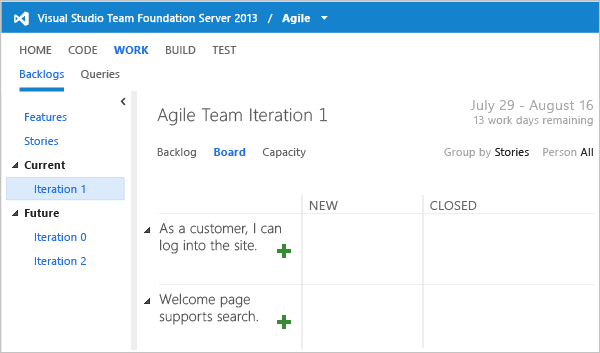
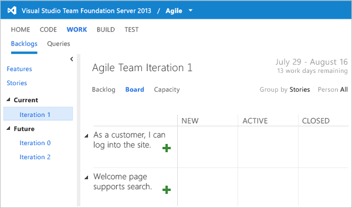

# Update the workflow for agile projects

**TFS 2015 | TFS 2013** 


> [!IMPORTANT]  
> This topic applies to project that was created using a Microsoft Solutions Framework (MSF) version 5.0 process template and is defined on an on-premises Team Foundation Server (TFS).   


After you have configured features for your upgraded project, which was created with a process template based on Microsoft Solutions Framework (MSF) for Agile Software Development v5.0, you should manually update the user story and task workflow assignments. If you don't update the workflow, then the task board provides only two states, **Active** and **Closed**, as shown in the following illustration. This prevents you and your team from distinguishing between tasks that are in progress from those that haven't been started.  
  
  


Task board for an Agile project without the recommended manual updates  
  
 Updates made by the Configure Features wizard were made to match the existing workflow that is defined for your project. For Agile version 5.0, this means the **New** and **Removed** states introduced with the latest version are not present. These states support transitioning user stories from a **New** state to an **Active** state. Without the **New** state defined, a User Story assigned to an iteration remains on the product backlog until it is resolved, which is not the desired or expected behavior.  
  
 In the same way, adding the **New** state to the Task workflow lets users move tasks from **New**, to **Active**, to **Closed** using the task board. In addition, by adding the **Removed** state to both the User Story and Task type definitions you enable users to cut stories and tasks using the planning tools.  
  
 To support the desired behaviors, you must add the **New** and **Removed** states to the user story and task work item types, and update the metastate mappings assigned in the process configuration.  
   
  
**Requirements**  
  
To run the **witadmin** command-line tool, you must be a member of one of the following groups: **Team Foundation Administrators**, **Project Collection Administrators**, or **Project Administrators** group for the project. See [Add administrators, set permissions at the project-level or project collection-level](../../organizations/security/set-project-collection-level-permissions.md).  
  
<a name="agile_updates"></a> 
## Update the workflow and metastates
  
> [!IMPORTANT]  
>  The procedures in this topic were written based on the Agile v6.0 process. To update your project to support the latest workflow defined for Agile v6.1 process, you can adapt these procedures to instead copy the `WORKFLOW` sections of the latest Agile process template. Significant updates were made to the [workflow for several work item types in the TFS 2012.1 update](../../boards/work-items/guidance/changes-to-process-templates.md). These changes support backward transitions so that when you inadvertently drag a work item on the Kanban board or the task board to a resolved or closed state, you can drag it back to an earlier workflow state.  
  
 You will need to perform the following steps:  
  
-   Export the definitions for the User Story and Task types and for process configuration.  
  
-   Insert code snippets to the workflow section for both User Story and Task.  
  
-   Update the metastate mappings for the process configuration.  
  
-   Import the updated definitions for the work item types and process configuration.  
  
-   Verify that the changes appear on the task board.  
  
> [!IMPORTANT]
>  For the following procedures to work, the **Active** state must be specified in the workflow defined for the User Story and Task types of work items.  
  
#### To update the workflow states and transitions for User Story  
  
[!INCLUDE [temp](../../_shared/witadmin-run-tool-example.md)]
  
0. To export the type definition for **User Story**, enter the following command, substituting your data for the arguments that are shown here, where *CollectionURL* specifies the URL of a project collection, *ProjectName* specifies the name of a project defined within the collection, and "*DirectoryPath*\\*FileName*.xml" specifies the name and location for the file to export. Then press Enter.  
  
    ```  
    witadmin exportwitd /collection:CollectionURL /p:"ProjectName" /n:"User Story" /f:"DirectoryPath\FileName.xml"  
    ```  
  
     Use this format for the URL:  **http://**<em>ServerName:Port/VirtualDirectoryName/CollectionName</em>, for example: `http://srvalm:8080/tfs/DefaultCollection`.  
  
1. In a text editor or in Visual Studio, open the file you exported.  
  
2. Add this code snippet between the lines `<STATES>` and `<STATE value="Active">`:  
  
   > [!div class="tabbedCodeSnippets"]
   > ```XML 
   > <STATE value="New">  
   >       <FIELDS>  
   >       <FIELD refname="Microsoft.VSTS.Common.ResolvedDate">  
   >          <EMPTY />  
   >       </FIELD>  
   >       <FIELD refname="Microsoft.VSTS.Common.ResolvedBy">  
   >          <EMPTY />  
   >       </FIELD>  
   >       <FIELD refname="Microsoft.VSTS.Common.ClosedDate">  
   >          <EMPTY />  
   >       </FIELD>  
   >       <FIELD refname="Microsoft.VSTS.Common.ClosedBy">  
   >          <EMPTY />  
   >       </FIELD>  
   >       <FIELD refname="Microsoft.VSTS.Common.ActivatedDate">  
   >          <EMPTY />  
   >       </FIELD>  
   >       <FIELD refname="Microsoft.VSTS.Common.ActivatedBy">  
   >          <EMPTY />  
   >       </FIELD>  
   >       </FIELDS>  
   > </STATE>  
   > <STATE value="Removed" />  
   > ```  

3. Replace the section that begins with `<TRANSITION from=" " to="Active">` and ends with `<TRANSITION>` with this code snippet:  
  
   > [!div class="tabbedCodeSnippets"]
   > ```XML 
   > <TRANSITION from="" to="New">  
   >       <REASONS>  
   >       <DEFAULTREASON value="New" />  
   >       </REASONS>  
   >       <FIELDS>  
   >       <FIELD refname="System.Description">  
   >          <DEFAULT from="value" value="As a &lt;type of user&gt; I want &lt;some goal&gt; so that &lt;some reason&gt;" />  
   >       </FIELD>  
   >       </FIELDS>  
   > </TRANSITION>  
   > <TRANSITION from="New" to="Active">  
   >       <REASONS>  
   >       <DEFAULTREASON value="Implementation started" />  
   >       </REASONS>  
   >       <FIELDS>  
   >       <FIELD refname="Microsoft.VSTS.Common.ActivatedBy">  
   >          <COPY from="currentuser" />  
   >          <VALIDUSER />  
   >          <REQUIRED />  
   >       </FIELD>  
   >       <FIELD refname="Microsoft.VSTS.Common.ActivatedDate">  
   >          <SERVERDEFAULT from="clock" />  
   >       </FIELD>  
   >       <FIELD refname="System.AssignedTo">  
   >          <DEFAULT from="currentuser" />  
   >       </FIELD>  
   >       </FIELDS>  
   > </TRANSITION>  
   > <TRANSITION from="New" to="Removed">  
   >       <REASONS>  
   >       <DEFAULTREASON value="Removed from the backlog" />  
   >       </REASONS>  
   > </TRANSITION>  
   > <TRANSITION from="Active" to="New">  
   >       <REASONS>  
   >       <DEFAULTREASON value="Implementation halted" />  
   >       </REASONS>  
   > </TRANSITION>  
   > <TRANSITION from="Removed" to="New">  
   >       <REASONS>  
   >       <DEFAULTREASON value="Reconsidering the User Story" />  
   >       </REASONS>  
   > </TRANSITION>  
   > ```  
  
4. Save and close the file.  
  
5. Import the file, substituting your data for the arguments that are shown.  
  
   ```  
   witadmin importwitd /collection:CollectionURL /p:"ProjectName" /f:"DirectoryPath\FileName.xml"  
   ```  
  
#### To update the workflow states and transitions for Task  
  
1. Export the type definition for **Task**, substituting your data for the arguments that are shown.  
  
   ```  
   witadmin exportwitd /collection:CollectionURL /p:"ProjectName" /n:"Task" /f:"DirectoryPath\FileName.xml"  
   ```  
  
2. In a text editor or in Visual Studio, open the file you exported.  
  
3. Add this code snippet between the lines `<STATES>` and `<STATE value="Active">`:  
  
   > [!div class="tabbedCodeSnippets"]
   > ```XML 
   > <STATE value="New">  
   >       <FIELDS>  
   >       <FIELD refname="Microsoft.VSTS.Common.ClosedDate">  
   >          <EMPTY />  
   >       </FIELD>  
   >       <FIELD refname="Microsoft.VSTS.Common.ClosedBy">  
   >          <EMPTY />  
   >       </FIELD>  
   >       <FIELD refname="Microsoft.VSTS.Common.ActivatedDate">  
   >          <EMPTY />  
   >       </FIELD>  
   >       <FIELD refname="Microsoft.VSTS.Common.ActivatedBy">  
   >          <EMPTY />  
   >       </FIELD>  
   >       </FIELDS>  
   > </STATE>  
   > <STATE value="Removed" />  
   > ```  
  
4. Replace the first transition block, corresponding to the lines that fall between `<TRANSITION from="" to="Active">` and its closing `</TRANSITION>` tag, with this code snippet:  
  
   > [!div class="tabbedCodeSnippets"]
   > ```XML 
   > <TRANSITION from="" to="New">  
   >       <REASONS>  
   >       <DEFAULTREASON value="New" />  
   >       </REASONS>  
   > </TRANSITION>  
   > <TRANSITION from="New" to="Active">  
   >       <ACTIONS>  
   >       <ACTION value="Microsoft.VSTS.Actions.StartWork" />  
   >       </ACTIONS>  
   >       <REASONS>  
   >       <DEFAULTREASON value="Work started" />  
   >       </REASONS>  
   >       <FIELDS>  
   >       <FIELD refname="Microsoft.VSTS.Common.ActivatedBy">  
   >          <COPY from="currentuser" />  
   >          <VALIDUSER />  
   >          <REQUIRED />  
   >       </FIELD>  
   >       <FIELD refname="Microsoft.VSTS.Common.ActivatedDate">  
   >          <SERVERDEFAULT from="clock" />  
   >       </FIELD>  
   >       <FIELD refname="System.AssignedTo">  
   >          <DEFAULT from="currentuser" />  
   >       </FIELD>  
   >       </FIELDS>  
   > </TRANSITION>  
   > <TRANSITION from="Active" to="New">  
   >       <ACTIONS>  
   >       <ACTION value="Microsoft.VSTS.Actions.StopWork" />  
   >       </ACTIONS>  
   >       <REASONS>  
   >       <DEFAULTREASON value="Work halted" />  
   >       </REASONS>  
   > </TRANSITION>  
   > <TRANSITION from="New" to="Closed">  
   >       <ACTIONS>  
   >       <ACTION value="Microsoft.VSTS.Actions.Checkin" />  
   >       </ACTIONS>  
   >       <REASONS>  
   >       <DEFAULTREASON value="Completed" />  
   >       <REASON value="Cut" />  
   >       <REASON value="Deferred" />  
   >       <REASON value="Obsolete" />  
   >       </REASONS>  
   >       <FIELDS>  
   >       <FIELD refname="Microsoft.VSTS.Common.ActivatedDate">  
   >          <READONLY />  
   >       </FIELD>  
   >       <FIELD refname="Microsoft.VSTS.Common.ActivatedBy">  
   >          <READONLY />  
   >       </FIELD>  
   >       <FIELD refname="Microsoft.VSTS.Common.ClosedDate">  
   >          <SERVERDEFAULT from="clock" />  
   >       </FIELD>  
   >       <FIELD refname="Microsoft.VSTS.Common.ClosedBy">  
   >       <COPY from="currentuser" />  
   >          <VALIDUSER />  
   >          <REQUIRED />  
   >       </FIELD>  
   >       </FIELDS>  
   > </TRANSITION>  
   > <TRANSITION from="Closed" to="New">  
   >       <REASONS>  
   >       <DEFAULTREASON value="Reactivated" />  
   >       </REASONS>  
   >       <FIELDS>  
   >       <FIELD refname="System.AssignedTo">  
   >          <COPY from="field" field="Microsoft.VSTS.Common.ClosedBy" />  
   >       </FIELD>  
   >       </FIELDS>  
   > </TRANSITION>  
   > <TRANSITION from="New" to="Removed">  
   >       <REASONS>  
   >       <DEFAULTREASON value="Removed from the backlog" />  
   >       </REASONS>  
   > </TRANSITION>  
   > <TRANSITION from="Active" to="Removed">  
   >       <REASONS>  
   >       <DEFAULTREASON value="Removed from the backlog" />  
   >       </REASONS>  
   > </TRANSITION>  
   > <TRANSITION from="Removed" to="New">  
   >       <REASONS>  
   >       <DEFAULTREASON value="Reconsidering the Task" />  
   >       </REASONS>  
   > </TRANSITION>  
   > ```  
  
5. Save and close the file.  
  
6. Import the file, substituting your data for the arguments that are shown.  
  
   ```  
   witadmin importwitd /collection:CollectionURL /p:"ProjectName" /f:"DirectoryPath\FileName.xml"  
   ```  
  
#### To update the metastate mappings for process configuration  
  
1. Type the following command to export the ProcessConfiguration file, substituting your data for the arguments that are shown.  
  
   ```  
   witadmin exportprocessconfig /collection:CollectionURL /p:"ProjectName" /f:"DirectoryPath\ ProcessConfiguration.xml"  
   ```  
  
    Where, *CollectionURL* specifies the URL of the project collection and *ProjectName* specifies the name of your project. Use this format for the URL:  **http://**<em>ServerName:Port/VirtualDirectoryName/CollectionName</em>, for example: `http://srvalm:8080/tfs/DefaultCollection`.  
  
2. In Notepad or in another text editor, open the ProcessConfiguration.xml file.  
  
3. Locate the tag `<RequirementWorkItems category="Microsoft.RequirementCategory" plural="Stories">`.  
  
4. Replace the line `<State type="Proposed" value="Active" />` with these lines:  
  
   > [!div class="tabbedCodeSnippets"]
   > ```XML 
   > <State type="Proposed" value="New" />   
   > <State type="InProgress" value="Active" />  
  
   ```  
  
5. Locate the tag `<TaskWorkItems category="Microsoft.TaskCategory">`, and replace the line `<State type="Proposed" value="Active" />` with these lines:  
  
   > [!div class="tabbedCodeSnippets"]
   > ```XML 
   > <State type="Proposed" value="New" />  
   > <State type="InProgress" value="Active" />  
   > ```  
  
6. Verify that you have the following mappings:  
  
   > [!div class="tabbedCodeSnippets"]
   > ```XML  
   > <RequirementWorkItems category="Microsoft.RequirementCategory" plural="Stories">  
   >       <States>  
   >       <State type="Proposed" value="New"/>  
   >       <State type="InProgress value="Active" />  
   >       <State type="InProgress value="Resolved" />  
   >       <State type="Complete" value="Closed" />  
   >       </States>  
   > </RequirementWorkItems>  
   > <TaskWorkItems category="Microsoft.TaskCategory">  
   >       <States>  
   >       <State type="Proposed" value="New" />  
   >       <State type="InProgress" value="Active" />  
   >       <State type="Complete" value="Closed" />  
   >       </States>  
   > </TaskWorkItems>  
   > ```  
  
7. Save and close the file.  
  
8. Import the configuration file.  
  
   ```  
   witadmin importprocessconfig /collection:CollectionURL /p:ProjectName /f:"DirectoryPath\ProcessConfiguration.xml"  
  
   ```  
  
#### To verify that the changes appear on the task board  
  
1.  Open the web portal and then connect to your project using a URL that has the following format:  
  
    ```  
    http://MyServer:8080/tfs/TeamProjectCollectionName/MyProject  
    ```  
  
     If TWA is already open, then refresh your browser to refresh the cache.  
  
2.  Verify that the task board columns now display **New**, **Active**, and **Closed**.  
  
       
Task board for an Agile project with the updated workflow states  
  
     To learn more about using the task board, see [Sprint planning](../../boards/sprints//assign-work-sprint.md).