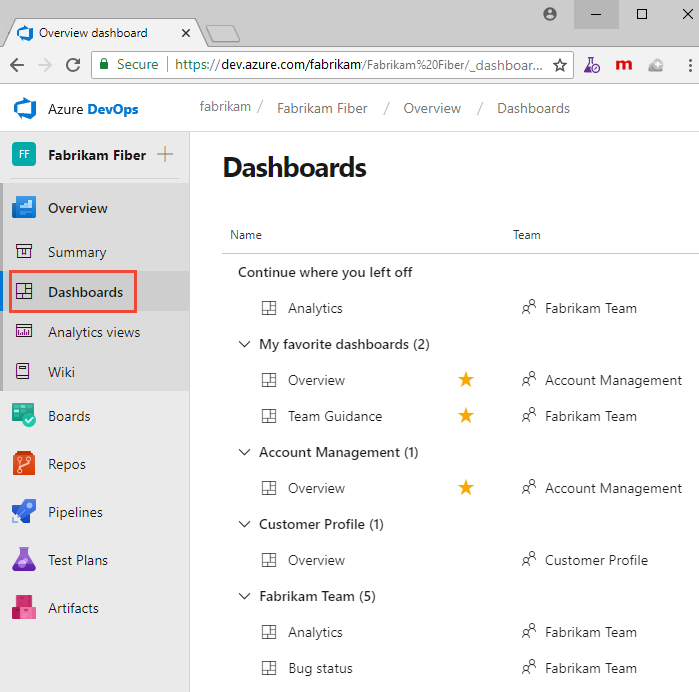
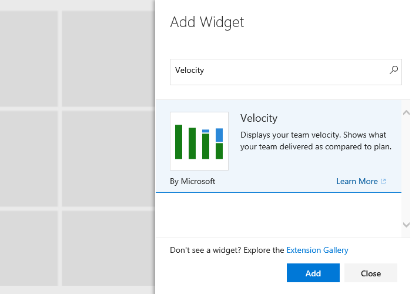

# Add an Analytics widget to a dashboard

[!INCLUDE [temp](../../_shared/version-azure-devops.md)]
 
The [Analytics Service](what-is-analytics.md) is the reporting platform for Azure DevOps. 
Using Analytics, you and your team can gain new insights into the health and status of your work.
Follow this short guide to get started in a few simple steps.

In this topic we walk you through the steps for adding the Analytics-based Velocity widget to a dashboard. For a review of all Analytics-based widgets, see [Widgets based on the Analytics Service](analytics-widgets.md) 

## Prerequisites

::: moniker range="azure-devops"

- You must have a project defined for an organization in Azure DevOps. If you don't have one, see [Sign up for free](../../user-guide/sign-up-invite-teammates.md).  
- You will have to have defined several work items. See [Plan and track work](../../user-guide/plan-track-work.md).
- **Boards** must be enabled. To re-enable it, see [Turn an Azure DevOps service on or off](../../organizations/settings/set-services.md).
- Install the [Analytics Marketplace extension](../analytics/analytics-extension.md). 

::: moniker-end

::: moniker range="azure-devops-2019"

- You must have a project. If you don't have one, [add one now](../../organizations/projects/create-project.md). 
- You must be a member of the project. If you haven't been added yet, [get added now](../../organizations/security/add-users-team-project.md).
- You will have to have defined several work items. See [Plan and track work](../../user-guide/plan-track-work.md). - To add a widget to a dashboard, you must be a team admin, a project admin, or have [dashboard permissions](/azure/devops/report/dashboards/dashboard-permissions).
- The [Analytics Marketplace extension](../analytics/analytics-extension.md) must be installed. 

::: moniker-end

## Add the Velocity widget to your dashboard 

To add a widget to a dashboard, you connect to your project using a [supported web browser](/tfs/server/compatibility#supported-browsers). If you need to add a project, see [Create a project](../../organizations/projects/create-project.md)

0. Connect to the web portal for your project and choose **Overview>Dashboards**. 

	> [!div class="mx-imgBorder"]  
	> 

	If you need to switch to a different project, choose the  Azure DevOps logo to [browse all projects and teams](../../project/navigation/go-to-project-repo.md).  

0. [Choose the dashboard](../dashboards/dashboards.md#choose-dashboard) that you want to modify. 

0. Choose  **Edit** to modify a dashboard. The widget catalog opens.  

0. In the right pane search box, type **Velocity** to quickly locate the Velocity widget within the widget catalog.  

	> [!div class="mx-imgBorder"]  
	> 

0. Choose the widget, then **Add** to add it to the dashboard. Or, you can drag-and-drop it onto the dashboard. Learn more on [adding widgets to dashboard](../dashboards/add-widget-to-dashboard.md)

Congratulations! A new Velocity widget has been added to your dashboard. 

> [!TIP]  
> You'll gain the greatest utility from the Velocity widget by [assigning work to sprints and completing work defined in those sprints](../../boards/sprints/assign-work-sprint.md). To quickly define sprints, see [Schedule sprints](../../boards/sprints/define-sprints.md). 
 

##  Learn about your team's velocity using the Velocity widget 

The Velocity widget will help you learn how much work your team can complete during a sprint. The widget shows the team's velocity by Story Points, work item count, or any custom field. You can also compare the work delivered against your plan and track work completed late. Using the Velocity widget, you will be able to answer questions like:
* On average, what is the velocity of my team?
* Is my team consistently delivering what we planned?
* How much work can we commit to deliver in upcoming sprints? 

**Velocity widget showing 8 sprints of data based on Story Points.**

 

Here, the Velocity widget shows this team has a history of closing stories late. It also shows a discrepancy between planned and completed work in the past 4 sprints. The team can drill into the data to determine the root causes. After implementing new practices, the team can use the Velocity widget to track their effectiveness.

Learn more about the Velocity widget in [Configure and view Velocity charts](../dashboards/team-velocity.md).  

## Try this next
> [!div class="nextstepaction"]
> [Configure and view Velocity charts](../dashboards/team-velocity.md?toc=/azure/devops/report/analytics/toc.json&bc=/azure/devops/report/analytics/breadcrumb/toc.json)
