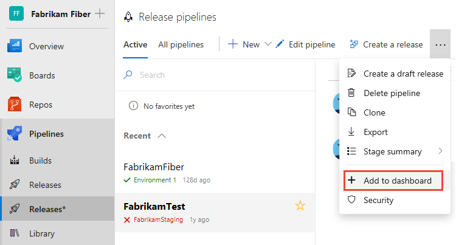
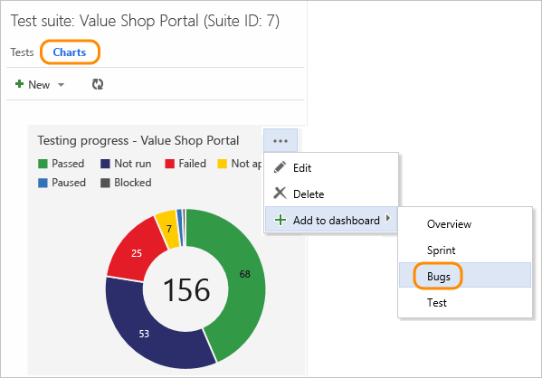
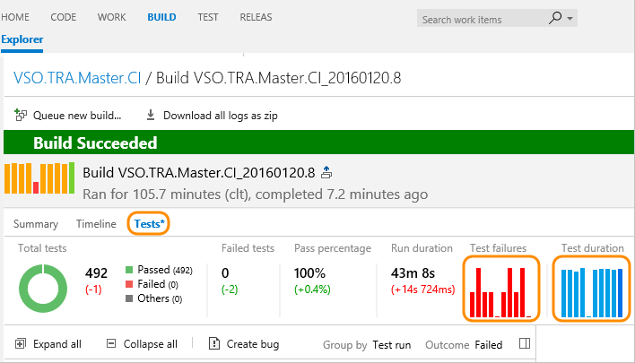

# Add charts to a dashboard

[!INCLUDE [temp](../_shared/version-ts-tfs-2015-2016.md)] 

::: moniker range="tfs-2013"
> [!NOTE]   
> Adding charts to a dashboard is not a supported feature in TFS 2013, instead, you can [pin items to a team homepage](team-dashboard.md).  Consider [upgrading to the latest TFS version](https://visualstudio.microsoft.com/downloads/) to get access to the widget catalog and [multiple team dashboards](dashboards.md).  
::: moniker-end

::: moniker range=">= tfs-2015"

You can add the charts described in this article to a dashboard from their corresponding functional page, such as Builds, Releases, or Queries. 

::: moniker-end

## Prerequisites  

::: moniker range="azure-devops"

- You must be a member of a project. If you don't have a project yet, [create one](/azure/devops/organizations/accounts/set-up-vs). 
- You must have [created the team dashboard](dashboards.md) to which you want to add a chart to.  
- If you haven't been added as a project member, [get added now](/azure/devops/organizations/accounts/add-organization-users-from-user-hub).
- Anyone with access to a project, including [stakeholders](/azure/devops/organizations/security/get-started-stakeholder), can view dashboards.
- To add, edit, or manage a team dashboard, you must have **Basic** access or greater and be a [team admin](/azure/devops/organizations/settings/add-team-administrator), a project admin, or have [dashboard permissions](/azure/devops/report/dashboards/dashboard-permissions). In general, you need to be a member of the team to edit a team dashboard.

::: moniker-end

::: moniker range=">= tfs-2018 <= azure-devops-2019"

- You must be a member of a project. If you don't have a project yet, [create one](/azure/devops/organizations/projects/create-project). 
- You must have [created the team dashboard](dashboards.md) to which you want to add a chart to.  
- If you haven't been added as a project member, [get added now](/azure/devops/organizations/security/add-users-team-project).
- To add, edit, or manage a team dashboard, you must have **Basic** access or greater and be a team admin, a project admin, or have [dashboard permissions](/azure/devops/report/dashboards/dashboard-permissions). In general, you need to be a member of the team to edit a team dashboard.
 Request your current team or project admin to add you as a [team admin](/azure/devops/organizations/settings/add-team-administrator).  

::: moniker-end

::: moniker range="tfs-2015"

> [!NOTE]   
> Adding charts to a dashboard requires TFS 2015.1 or later version. For TFS 2015, you can [pin items to a team homepage](team-dashboard.md).  Consider [upgrading to the latest TFS version](https://visualstudio.microsoft.com/downloads/) to get access to the widget catalog and [multiple team dashboards](dashboards.md).

::: moniker-end

::: moniker range=">= tfs-2015 <= tfs-2017"

- You must be a member of a project. If you don't have a project yet, [create one](/azure/devops/organizations/projects/create-project). 
- You must have [created the team dashboard](dashboards.md) to which you want to add a chart to.  
- If you haven't been added as a project member, [get added now](/azure/devops/organizations/security/add-users-team-project).
- To add, edit, or manage a team dashboard, you must have **Basic** access or greater and be added to the [team administrator role for the team](/azure/devops/organizations/settings/add-team-administrator).  

::: moniker-end

To learn more, see [Default permissions and access for charts and dashboards](charts-dashboard-permissions-access.md).

::: moniker range=">= tfs-2015 <= tfs-2018"

## Add a build history chart

Each time a build is run, it logs information about the build, including the run time, errors and warnings, and whether it successfully completed or failed.   

> [!NOTE]  
> You can also add this chart to a team dashboard from the [widget catalog](widget-catalog.md#build-history-widget).  

1. Select your [team context](../../project/navigation/go-to-project-repo.md?toc=/azure/devops/report/toc.json&bc=/azure/devops/report/breadcrumb/toc.json) and then open **Pipelines>Builds** to add a build history chart to a team dashboard. (Requires TFS 2015.1 or later version).  

	  

	If you aren't a team administrator, [get added as one](../../organizations/settings/add-team-administrator.md). The Add to dashboard menu selection is disabled when you don't have permissions to add it to the dashboards of the selected team context.  

2. Build summary charts look like this:  

	  

	Hover over a bar to view build information and run time. Choose a bar to go to the build summary page.   

::: moniker-end

::: moniker range=">= tfs-2017"  
  
## Add a release summary chart  

Each time a release is deployed, it logs information about the release to each of its environments. You can add a release tile to your team dashboard to monitor release progress and gain quick access to each release. 
::: moniker-end

::: moniker range=">= azure-devops-2019"  

> [!NOTE]  
> You can also add this chart to a team dashboard from the [widget catalog](widget-catalog.md#release-definition-widget).  

1. Open **Pipelines>Releases** to add a release definition chart to a team dashboard.   
 
	> [!div class="mx-imgBorder"]  
	>    

2. Release pipeline charts show the success (green), in progress (blue), cancellation (red), or non-deployment (grey) to an environment for the current and last four releases:  

	  

::: moniker-end

::: moniker range=">= tfs-2017 <= tfs-2018"  

> [!NOTE]  
> You can also add this chart to a team dashboard from the [widget catalog](widget-catalog.md#release-definition-widget). Requires TFS 2017.1 or later versions.   

1. Open **Pipelines>Releases** to add a release definition chart to a team dashboard.   

      

2. Release pipeline charts show the success (green), in progress (blue), cancellation (red), or non-deployment (grey) to an environment for the current and last four releases:  

	  

::: moniker-end

::: moniker range=">= tfs-2015 <= tfs-2018"
  
## Add a manual test status or result chart  

As you create and run tests, you can track your status by defining [lightweight charts of test plans and test results](../../test/track-test-status.md).  

> [!NOTE]  
> You can also add a [Chart for test plans widget](widget-catalog.md#chart-test-plan-widget) to a dashboard. 

1. Select your [team context](../../project/navigation/go-to-project-repo.md?toc=/azure/devops/report/toc.json&bc=/azure/devops/report/breadcrumb/toc.json), make sure you're a [team admin](../../organizations/settings/add-team-administrator.md).  

1. Open **Test>Test Plans** and then **Charts** and select the dashboard to add the test chart to.  

	  
   ::: moniker-end

::: moniker range=">= tfs-2017 <= tfs-2018"
  
## Add a test quality trend chart   

You can add trends to the dashboard of the failures and duration of those [tests that were run as part of a build](../../pipelines/languages/dotnet-core.md#run-your-tests).
::: moniker-end

::: moniker range=">= tfs-2017"
> [!NOTE]  
> You can also add a [test result trend chart widget](widget-catalog.md#test-results-widget) to a dashboard. 
::: moniker-end

::: moniker range="tfs-2017"  
Requires TFS 2017.2 or later version.  
::: moniker-end  

::: moniker range=">= tfs-2017"  

1. Select your [team context](../../project/navigation/go-to-project-repo.md?toc=/azure/devops/report/toc.json&bc=/azure/devops/report/breadcrumb/toc.json), make sure you're a [team admin](../../organizations/settings/add-team-administrator.md).  

2. Open a build summary for a build pipeline to which you've added tests, open the Tests page, and choose the bar chart for either Test failures or Test duration.    

	  

3. Open the  actions menu and choose the dashboard to add the chart to.  

	  

	Learn more about [reviewing automated test results after a build](../../pipelines/test/review-continuous-test-results-after-build.md).  

::: moniker-end

::: moniker range=">= tfs-2015"

## Add a work item query or chart  

You add work item queries and charts to a dashboard from the Queries page. Queries and charts must be associated with queries under the Shared queries folder.  

> [!NOTE]  
> You can also add a [work item query chart widget](widget-catalog.md#build-history-widget) to a team dashboard.  

1. First, make sure you have selected your team context. Only those dashboards created for a team appear in the context menu for each query or chart. [Switch team context](../../project/navigation/go-to-project-repo.md?toc=/azure/devops/report/toc.json&bc=/azure/devops/report/breadcrumb/toc.json) as needed.  

2. If you aren't a team administrator, [get added as one](../../organizations/settings/add-team-administrator.md). Only team and project admins can add and customize team dashboards.  

3. If you haven't yet created the dashboard, [do that now](dashboards.md).  

4. From the charts Actions menu, choose the team dashboard.  

	  

	You can only add charts associated with shared queries. Charts associated with queries under My Queries folder won't display the add to dashboard option.  
::: moniker-end

::: moniker range=">= tfs-2015 <= tfs-2018"

## Add a markdown file to a dashboard  
Open the Markdown file defined in your repository and make sure you are in your team context. 

Choose **Add to dashboard**, and then choose the team dashboard to add the markdown file to. As you update the Markdown file, changes will automatically appear on the dashboard upon refresh. See [Dashboards](dashboards.md) for more info.  
::: moniker-end

::: moniker range="tfs-2015"
Requires TFS 2015.2 or later version. 
::: moniker-end

::: moniker range="> tfs-2015 <= tfs-2018"
<!-- TODO: Update image - I don't think this is supported for latest version-->

::: moniker-end

::: moniker range=">= tfs-2015"
## System-generated work tracking charts 
There are a number of system-generated charts that you can access from the web portal, but can't add to a dashboard. However, you may find a comparable widget listed in the [widget catalog](widget-catalog.md) that tracks the same or similar data which you can add to the dashboard. These include: 

- [Add Markdown to a dashboard](add-markdown-to-dashboard.md)
- [Team velocity](../guidance/team-velocity.md)
- [Sprint burndown chart](../../boards/sprints/sprint-burndown.md), see [Sprint burndown widget](widget-catalog.md#sprint-burndown-widget)
- [Cumulative flow](../guidance/cumulative-flow.md), see [CFD widget](widget-catalog.md#cfd-widget)
::: moniker-end

 
## Related articles

::: moniker range=">= azure-devops-2019"
- [Analyze test results](../../pipelines/test/test-analytics.md)
- [Burndown guidance](burndown-guidance.md)
- [Cumulative flow & lead/cycle time guidance](cumulative-flow-cycle-lead-time-guidance.md)
- [Velocity guidance](velocity-guidance.md)
::: moniker-end

::: moniker range=">= tfs-2015 <= tfs-2018"
- [Burndown guidance](burndown-guidance.md)
- [Cumulative flow & lead/cycle time guidance](cumulative-flow-cycle-lead-time-guidance.md)
- [Velocity guidance](velocity-guidance.md)
::: moniker-end
