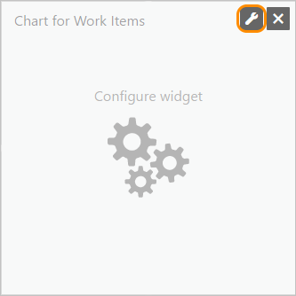

# Add widgets to a dashboard

<b>VSTS | TFS 2018 | TFS 2017</b>  

Widgets smartly format data to provide access to easily consumable data. You add widgets to your team dashboards to gain visibility into the status and trends occurring as you develop your software project. 

Each widget provides access to a chart, user-configurable information, or a set of links that open a feature or function. 

You can add one or more charts or widgets to your dashboard. You add several widgets at a time simply by selecting each one. See [Manage dashboards](dashboards.md#manage) to determine the permissions you need to add and remove widgets from a dashboard.    

## Connect to the web portal for your team project 

To add a widget to a dashboard, you connect to your team project using a [supported web browser](../../tfs-server/requirements.md#supported-browsers).  If you don't have a team project yet, create one in [VSTS](../../accounts/create-account-msa-or-work-student.md)<!--- or set one up in an [on-premises TFS](../../accounts/create-team-project.md)-->.

Open a browser window and click the **Dashboards** hub. If you haven't been added as a team member, [get added now](../../work/scale/multiple-teams.md#add-team-members).

 

If you don't see the team or team project you want, click the  project icon to [browse all team projects and teams](../../user-guide/account-home-pages.md).  

>[!NOTE]  
><b>Feature availability: </b> You can access the [widget catalog](widget-catalog.md) from the web portal for VSTS or TFS 2015.1 or later version. The widget catalog provides widgets for all tiles supported in previous releases of TFS for the team homepage. For on-premises TFS 2015, you can add select charts to the team home page using the [Pin to home page](team-dashboard.md) feature.   
>
>To determine the platform and version you're on, see [Provide product and content feedback, Platforms and version support](../../user-guide/provide-feedback.md#platform-version).   

## Add a widget to a dashboard  
 
Click  to modify a dashboard. Click  to add a widget to the dashboard.  

The [widget catalog](widget-catalog.md) describes all the available widgets, many of which are scoped to the selected team context.  

>[!NOTE]  
><b>Feature availability: </b>For VSTS and TFS 2017 and later versions, you can drag and drop a widget from the catalog onto the dashboard.    
>  
> Widget images may vary depending on which platform you access. This topic shows images that appear in VSTS. However, the widget title and functionality described in this topic are valid for both VSTS and TFS. For example, dashboard edit mode controls shown below are valid for VSTS and TFS 2015.2 and later version. Some functionality differs when you connect to TFS 2015.1 or earlier versions.  

## Configure a widget  

To configure a widget, add the widget to a dashboard and then click the  configure icon. 

  

Click the delete icon to remove the tile from the dashboard. 
 
Once you've configured the widget, you can edit it by opening the actions menu. 

 

## Move or delete a widget from a dashboard  

>[!NOTE]  
>Just as you have to be a team or project admin to add items to a dashboard, you must have admin permissions to remove items.  

Click  to modify your dashboard. You can then drag tiles to reorder their sequence on the dashboard. 

To remove a widget, click the widget's  or  delete icons. 

When you're finished with your changes, click  to exit dashboard editing.

## Copy a widget 

>[!NOTE]  
>**Feature availability:**  This feature is only available from VSTS.    

To copy a configured widget to another team dashboard, click the  actions icon and select **Add to dashboard**. 

  

## Widgets and the Analytics Service (VSTS) 
The Analytics Service is available for VSTS accounts. To learn more, see these topics: 
- [Widgets based on the Analytics Service](../analytics/analytics-widgets-vsts.md)
- [Add an Analytics widget to a dashboard](../analytics/enable-analytics-velocity.md)
- [What is the Analytics Service?](../analytics/what-is-analytics.md)

## Try this next 

> [!div class="nextstepaction"]
> [Review the widget catalog](widget-catalog.md)
> or
> [Review Marketplace widgets](https://marketplace.visualstudio.com/search?term=widget&target=VSTS&category=All%20categories&sortBy=Relevance)

### Extensibility  
In addition to the widgets described in the Widget catalog, you can create your own widgets using the [Widget REST APIs](../../extend/develop/add-dashboard-widget.md). 

### Widget size

Some widgets are pre-sized and can't be changed. Others are configurable through their configuration dialog. 

For example, the Chart for work items widget allows you to select an area size ranging from 2 x 2  to 4 x 4 (tiles).  

  

### Disabled Marketplace widget 

If your account or project collection administrator disables a marketplace widget, you'll see the following image: 

   

To regain access to it, request your admin to reinstate or reinstall the widget.  