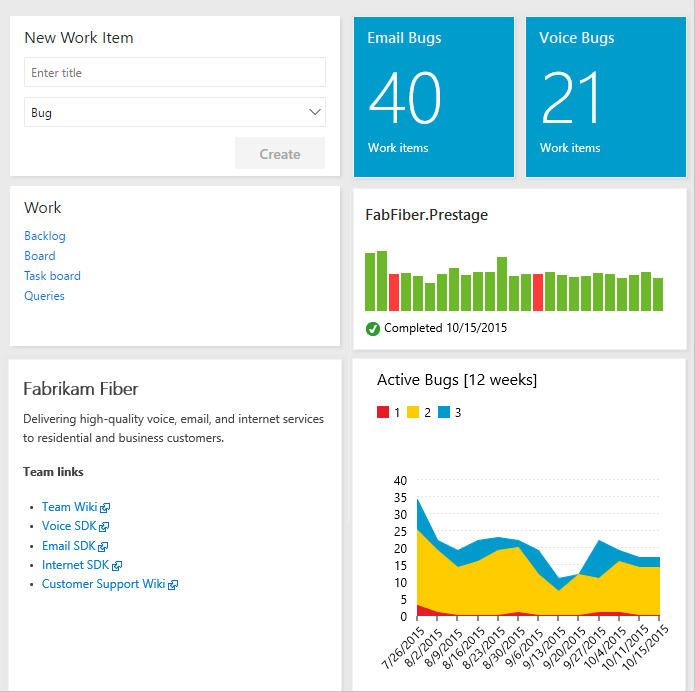
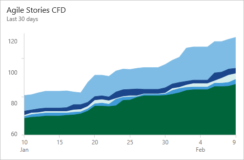
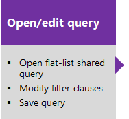
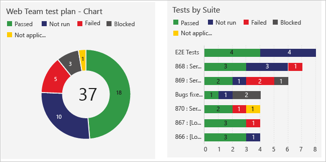
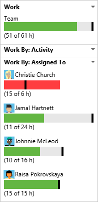

# Dashboards, charts, & widgets    

[!INCLUDE [temp](../../_shared/version-vsts-tfs-all-versions.md)] 

Customizable, highly-configurable dashboards provide you and your teams with the flexibility to share information, monitor progress and trends, and improve your workflow processes. 

::: moniker range=">= tfs-2015"

## Add widgets to your dashboard   

With dashboards, you can configure an array of charts and widgets. 

Each team can [add and configure multiple dashboards](dashboards.md) to share information, view status, progress, and trends, and access quick links and other functions. Easily add and rearrange widgets on the dashboard to show recent changes made to view build status, bug trends, and more. 




**Sample chart widgets**  

    

**Sequence for adding and customizing a dashboard**

[](dashboards.md)[](add-widget-to-dashboard.md) 

::: moniker-end

::: moniker range="vsts"
 
## The Analytics Service and Analytics widgets
The Analytics Service is in preview and available to all Azure DevOps users. To learn more, see these topics: 
- [Widgets based on the Analytics Service](../analytics/analytics-widgets.md)
- [Add an Analytics widget to a dashboard](../analytics/enable-analytics-velocity.md)
- [What is the Analytics Service?](../analytics/what-is-analytics.md)

::: moniker-end

::: moniker range=">= tfs-2015"

### Monitor code activity, build progress and deployment status

With the code tile widgets, you can monitor the activity occuring within a repo or branch folder. Build history displays a histogram of all builds run for a specific build pipeline. Bar color indicates: green-completed, red-failed, and yellow-completed without tests. 

**Code, build, and release chart widgets**  

&nbsp;&nbsp;&nbsp;  
&nbsp;&nbsp;&nbsp;    

::: moniker-end

::: moniker range=">= tfs-2015"

### Marketplace widgets

In addition to the widgets available to your from the widget catalog, you may find additional widgets of interest from the [Marketplace](https://marketplace.visualstudio.com/search?term=webpage%20widget&target=VSTS&sortBy=Relevance).  

::: moniker-end

::: moniker range=">= tfs-2013"

<a id="monitor-progress">  </a>
## Generate status and trend charts from queries  

With flat-list queries, you can create various charts to monitor status, progress, and trends. To get started, you can open a shared query and create a chart based on your tracking interests. Chart types include status&mdash;pie, bar, column, stacked bar, and pivot&mdash;and trend&mdash;stacked area, line, and area&mdash;charts.   


#### Sample Agile tool light-weight charts   

   

**Sequence for adding query-based charts to a dashboard**   

[](../../boards/queries/using-queries.md)[](charts.md)[](add-charts-to-dashboard.md#add-charts)   


Prior to monitoring work progress and trends, you'll need to have [planned your project and made progress on work you're tracking](../../boards/backlogs/create-your-backlog.md). 


## Test progress, results, and trends  

The steps to creating charts that track test progress and results are similar to those for tracking work. The starting point, however, begins with the test plan rather than a query. For example, you can find out how many test cases are ready to run, or how many tests are passing and failing in each test suite. 

#### Sample light-weight test charts   



And, just like work item query-based charts, you can add these charts to a dashboard.  

**Sequence for adding test progress and result charts to a dashboard**  

[](../../test/track-test-status.md)[](charts.md)[](add-charts-to-dashboard.md#add-charts)


## System-generated work tracking charts 

There are a number of system-generated charts that you can access from the web portal, but can't add to a dashboard. However, you may find a comparable widget listed in the [widget catalog](widget-catalog.md) that tracks the same or similar data which you can add to the dashboard. These include: 

- [Cumulative flow](cumulative-flow.md)
- [Team velocity](team-velocity.md)
- [Sprint burndown chart](../../boards/sprints/sprint-burndown.md)  


## Sprint charts     

Each sprint provides access to two charts. The first [tracks capacity](../../boards/sprints/define-sprints.md) for the team, team activities&mdash;such as Development, Test, Design&mdash;and individual team members. The second tracks the [sprint burndown](../../boards/sprints/sprint-burndown.md) in terms of remaining work. 

| Capacity bars | Burndown  |
|-------| ----- |
| |   |


**Sprint chart widgets**  

      


::: moniker-end


::: moniker range=">= tfs-2015"

## Try this next

> [!div class="nextstepaction"]
> [Add a widget to a dashboard](widget-catalog.md) 
> or
> [Review available widgets](widget-catalog.md) 

::: moniker-end

::: moniker range="vsts"
### Add custom fields
  
You can add data to support reporting requirements by [adding a custom field](../../organizations/settings/work/customize-process-field.md).   

::: moniker-end

::: moniker range=">= tfs-2013 <= tfs-2018"

### Add custom fields
  
You can add data to support reporting requirements by [adding a custom field](../../reference/add-modify-field.md).  

::: moniker-end

::: moniker range=">= tfs-2015"
### Extensibility 

Using the REST API service, you can [create a custom widget](../../extend/develop/add-dashboard-widget.md). 
 
::: moniker-end


<!---
<a id="shared-queries">  </a>
#### Predefined shared queries   

| Area| Agile | Scrum | CMMI | 
|-------|-------| ----- | ---- |   
|Project | Product Backlog<br/>Product Planning | Product Backlog | Customer Requirements<br/>Open Requirements<br/>Product Requirements <br/> |  
|Sprint | Iteration Backlog<br/> | Sprint Backlog<br/>Unfinished Work<br/>Work in Progress | none defined <sup>1</sup> |  
|Bug | Active Bugs<br/>Bug Triage<br/>Resolved Bugs | none defined <sup>2</sup>| Active Bugs<br/>Resolved Bugs |  
|Test | Open Test Cases<br/>User Stories without Test Cases | Test Cases | Open Test Cases<br/>Test Tasks |  

1. Create sprint-specific queries by adding a filter clause ```Iteration Path=@CurrentIteration``` to an existing project status query.    
2. The Scrum process treats bugs the same as product backlog items, so no bug-specific queries are predefined. To monitor bugs, add a filter clause with ```Work Item Type=Bug```.   


-->

[excel-adhoc-query-report]: ../excel/create-status-and-trend-excel-reports.md
[add-a-team]: ../../organizations/settings/add-teams.md
[team-assets]: ../../organizations/settings/manage-teams.md
[add-team-members]: ../../organizations/settings/add-teams.md#add-team-members
[add-team-admin]: ../../organizations/settings/add-team-administrator.md
   

